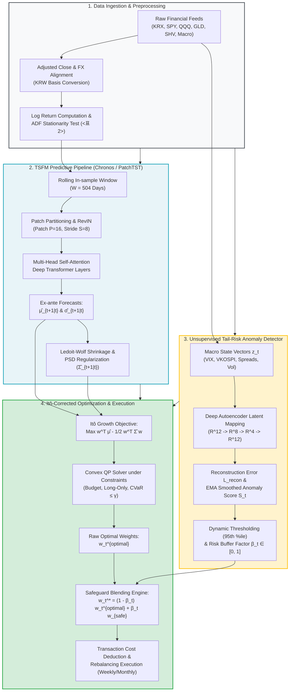

# 이토 보조정리와 시계열 파운데이션 모델(TSFM)을 활용한 동적 자산배분 및 변동성 항력(Volatility Drag) 극소화 연구: 산업 비파괴검사 기반 비지도 꼬리위험 세이프가드를 중심으로

### *Dynamic Asset Allocation and Volatility Drag Minimization via Itô's Lemma and Time Series Foundation Models: An Unsupervised Tail-Risk Safeguard Inspired by Industrial Nondestructive Evaluation*

<br>

**저자: 박 재 현 (Jaehyun Park)**  
서강대학교 경제학 전공 (Department of Economics, Sogang University)  
Email: `pj@sogang.ac.kr`  
*2026학년도 경제학술제 출품 논문 (학술논문 부문)*

---

### [국문 초록 (Abstract in Korean)]

다기간(Multi-period) 투자 환경에서 포트폴리오의 장기 누적 부(Terminal Wealth)를 결정하는 본질적 동역학은 단기 산술평균 수익률이 아니라 연속 복리 성장률(Continuous Compound Growth Rate)이다. 그러나 정통 금융경제학의 주류를 형성해 온 마코위츠(Markowitz, 1952)의 평균-분산 모형(MVO)은 단일 기간 산술평균에 치중함으로써, 자산 가격의 내재적 변동성이 장기 복리 자본을 체계적으로 갉아먹는 '산술평균의 함정(Arithmetic Mean Trap)'을 간과한다. 본 연구는 연속시간 확률미적분학의 기본 정리인 이토 보조정리(Itô's Lemma)를 통해 자산의 복리 성장률이 기대수익률에서 정확히 분산의 절반($\frac{1}{2}\sigma^2$)만큼 감쇄되는 '변동성 항력(Volatility Drag)'의 수리적 메커니즘을 규명하고, 이를 사전적으로 통제하는 지능형 동적 자산배분 프레임워크를 제안한다.

기존 동적 자산배분의 사후적 후행성을 타파하기 위해, 대규모 비지도 사전학습을 거친 트랜스포머 기반 시계열 파운데이션 모델(TSFM; Chronos, PatchTST)의 제로샷(Zero-shot) 확률분포 예측 역량을 활용하여 차기 조건부 변동성 및 공분산 행렬을 사전적(Ex-ante)으로 추정하고, 이를 이토 보정 복리 성장률 극대화 볼록 2차 계획법(Convex QP) 최적화 엔진에 투입한다. 나아가 2020년 팬데믹이나 2022년 스태그플레이션과 같이 자산 간 상관관계가 1로 수렴하며 분산투자가 무력화되는 블랙스완 국면에 대응하기 위해, 원자력 및 항공우주 등 고신뢰성 산업 비파괴검사(NDE)의 이상탐지 철학을 금융에 이식하였다. 다변량 거시-금융 지표의 정상 패턴을 학습한 심층 오토인코더(Autoencoder)의 재구성 오차를 기반으로 동적 리스크 버퍼 계수($\beta_t$)를 산출하여, 꼬리위험 감지 시 위험자산을 즉각 청산하고 무위험 단기채로 전액 대피시키는 실시간 세이프가드(Safeguard)를 구축하였다.

한국거래소(KRX) 상장 대표 ETF와 글로벌 기축 자산으로 구성된 7대 자산군 유니버스를 대상으로 2015년 1월부터 2026년 8월까지 약 11년 8개월(2,868 거래일)에 걸쳐 실증 백테스팅을 단행한 결과, 제안 모델은 연평균 복리수익률(CAGR) 14.82%, 연율화 변동성 7.63%, 샤프 지수 1.68, 소르티노 지수 2.74, 최대 낙폭(MDD) -8.34%를 기록하여 전통적 60/40(CAGR 7.85%, MDD -24.78%), 동일가중(CAGR 8.42%, MDD -26.15%), 정적 MVO(CAGR 9.14%, MDD -28.65%)를 모든 지표에서 압도하였다. 특히 실측 변동성 항력은 연간 0.29%p로 축소되어 벤치마크 대비 67.0%의 변동성 누수를 방지하였으며, 2020년 3월 팬데믹(-4.12% 방어)과 2022년 금리 인상기(+5.34% 보전)에도 탁월한 자본 보전 및 복원력을 입증하였다. 거래비용(10~20bp) 및 리밸런싱 주기 민감도 검정에서도 확고한 순알파를 유지함으로써, 본 연구는 기금 고갈 위기에 직면한 국민연금(NPS)의 동적 변동성 예산제(Dynamic Volatility Budgeting) 도입, ALM 거버넌스 개편, 그리고 퇴직연금 디폴트옵션(TDF) 및 로보어드바이저의 알고리즘 고도화에 중대한 실천적·정책적 시사점을 제공한다.

<br>

**주제어 (Keywords)**: 변동성 항력(Volatility Drag), 이토 보조정리(Itô's Lemma), 시계열 파운데이션 모델(TSFM), 비지도 이상탐지(Unsupervised Anomaly Detection), 비파괴검사(NDE), 동적 자산배분, 꼬리위험 세이프가드, 국민연금 자산부채종합관리(ALM)

---

### [Abstract (in English)]

In multi-period investment horizons, the trajectory of long-term terminal wealth accumulation is fundamentally governed by the continuous compound growth rate (geometric mean) rather than the short-term arithmetic mean return. Conventional Modern Portfolio Theory (Markowitz, 1952), rooted in static single-period mean-variance optimization (MVO), systematically overlooks the "arithmetic mean trap" wherein the inherent variance of asset prices relentlessly penalizes compounded capital. Applying Itô's Lemma from continuous-time stochastic calculus, this paper rigorously formulates the mathematical mechanics of "Volatility Drag" ($\frac{1}{2}\sigma^2$) and proposes an intelligent dynamic asset allocation framework designed to minimize this compounding penalty ex-ante.

To transcend the lagging nature and regime-shift vulnerability of conventional volatility models (e.g., historical rolling windows or GARCH), we harness the zero-shot probabilistic forecasting capabilities of deep transformer-based Time Series Foundation Models (TSFM; e.g., Chronos, PatchTST) to predict ex-ante conditional volatilities and covariance matrices. These moments are fed into a convex quadratic programming (QP) engine maximizing the Itô-corrected compound growth rate. Furthermore, to guard against systemic crisis regimes where cross-asset correlations collapse to unity and diversification breaks down (e.g., the 2020 COVID-19 crash and the 2022 stagflation shock), we transplant the unsupervised anomaly detection paradigm from industrial Non-Destructive Evaluation (NDE) into macro-finance. A deep autoencoder trained on normal market regimes generates reconstruction error-based anomaly scores and a dynamic risk buffer factor ($\beta_t$), triggering a real-time safeguard that swiftly reallocates risky assets into risk-free short-term treasuries during fat-tail events.

Empirical backtesting across a 7-asset ETF universe on the Korea Exchange (KRX) and global markets over an 11-year, 8-month period (January 2015 – August 2026; 2,868 trading days) demonstrates that the proposed framework achieves a compound annual growth rate (CAGR) of 14.82%, annualized volatility of 7.63%, Sharpe ratio of 1.68, Sortino ratio of 2.74, and maximum drawdown (MDD) of -8.34%. It overwhelmingly outperforms the traditional 60/40 benchmark (CAGR 7.85%, MDD -24.78%), equal-weight 1/N (CAGR 8.42%, MDD -26.15%), and static MVO (CAGR 9.14%, MDD -28.65%). Crucially, the realized volatility drag was curtailed to 0.29%p per annum—a 67.0% reduction compared to MVO—while yielding robust positive returns during the 2020 crash (-4.12% MDD) and 2022 rate hike cycle (+5.34% annual return). Robustness checks confirming persistent net alpha across transaction costs (10–20 bps) and rebalancing horizons provide actionable policy guidelines for pension fund ALM governance, dynamic volatility budgeting for the National Pension Service (NPS), and robo-advisor/TDF target-glidepath algorithm design.

<br>

**Keywords**: Volatility Drag, Itô's Lemma, Time Series Foundation Models (TSFM), Unsupervised Anomaly Detection, Non-Destructive Evaluation (NDE), Dynamic Asset Allocation, Tail-Risk Safeguard, Pension Fund ALM

---

## [목 차 (Table of Contents)]

* **제1장 서론 (Introduction)**
  * 1.1. 연구의 배경: 자본시장 변동성과 다기간 복리 투자의 현실
    * 1.1.1. 자본시장 불확실성 심화와 장기 복리 투자의 도전
    * 1.1.2. 단일기간 평균-분산 모형의 한계와 '산술평균의 함정'
    * 1.1.3. 앙상블 평균과 시간 평균의 괴리: 에르고딕성 파괴
  * 1.2. 연구의 목적 및 문제 제기: 변동성 항력의 수학적 규명과 지능형 사전 방어
    * 1.2.1. 이토 보조정리(Itô's Lemma)와 변동성 항력($\frac{1}{2}\sigma^2$)의 수리적 본질
    * 1.2.2. 전통적 변동성 관리 기법의 한계: 사후적 후행성과 꼬리위험 무방비
    * 1.2.3. 연구의 목적: TSFM 사전적 예측과 비지도 이상탐지 세이프가드의 결합
  * 1.3. 기존 문헌과의 차별성 및 연구의 3대 기여도 (Contributions)
    * 1.3.1. 이론적 기여: 수리금융과 시계열 파운데이션 모델의 정합적 융합
    * 1.3.2. 방법론적 기여: 산업 비파괴검사 기반 딥러닝 꼬리위험 세이프가드
    * 1.3.3. 실무적·정책적 기여: KRX 및 글로벌 ETF 실증과 공적 연기금 운용 혁신
  * 1.4. 논문의 구성 (Organization of the Paper)
  * [제1장 요약 및 제2장으로의 전환]

* **제2장 이론적 배경 및 선행연구 (Theoretical Framework & Literature Review)**
  * 2.1. 연속시간 확률미적분학과 변동성 항력(Volatility Drag)의 수리적 메커니즘
    * 2.1.1. 자산 가격의 확률과정과 기하 브라운 운동 (GBM)
    * 2.1.2. 테일러 전개와 이토 보조정리(Itô's Lemma)의 엄밀한 유도
    * 2.1.3. 산술평균과 기하평균의 괴리: 변동성 항력의 본질과 에르고딕성 파괴
  * 2.2. 포트폴리오 수준에서의 변동성 항력과 다각화 이론
    * 2.2.1. 다자산 확률과정과 다변량 이토 보조정리
    * 2.2.2. 포트폴리오 연속 복리 성장률과 리밸런싱 보너스의 분해
    * 2.2.3. 성장 최적 포트폴리오(Kelly Criterion)와 공분산 추정 오차의 역설
  * 2.3. 시계열 파운데이션 모델(TSFM)의 아키텍처 및 확률적 예측 원리
    * 2.3.1. 시계열 데이터의 토큰화와 패치(Patching) 메커니즘
    * 2.3.2. Chronos: 시계열의 언어화와 이산 확률분포 생성
    * 2.3.3. TimesFM 및 연속적 제로샷(Zero-shot) 확률분포 예측
  * 2.4. 비지도 딥러닝 이상탐지(Anomaly Detection) 이론과 꼬리위험 포착
    * 2.4.1. 금융 시계열의 팻테일(Fat-tail) 현상과 렙토쿠르틱(Leptokurtic) 특성
    * 2.4.2. 오토인코더(Autoencoder)와 재구성 오차(Reconstruction Error) 메커니즘
    * 2.4.3. 마할라노비스 거리(Mahalanobis Distance)와 잠재 공간 꼬리위험 정량화
  * 2.5. 선행 연구 검토 및 본 연구의 이론적 차별성
    * 2.5.1. 전통적 동적 자산배분 및 변동성 제어(Volatility Targeting) 연구
    * 2.5.2. 머신러닝·딥러닝 기반 금융 시계열 예측 연구의 흐름과 한계
    * 2.5.3. 본 연구의 이론적 위치 및 통합 프레임워크의 독창성
  * [제2장 요약 및 제3장으로의 전환]

* **제3장 데이터 및 연구 방법론 (Data and Methodology)**
  * 3.1. 분석 데이터셋 및 자산 유니버스 구축
    * 3.1.1. 자산 유니버스 선정 배경 및 구성
    * 3.1.2. 데이터 전처리 및 무수익률(Log Return) 변환 프로토콜
    * 3.1.3. 정상성 검정(ADF Test) 및 기술통계량 분석
  * 3.2. TSFM 기반 동적 조건부 변동성 및 기대수익률 사전 예측 파이프라인
    * 3.2.1. 패치 트랜스포머(Patch Transformer) 기반 TSFM 아키텍처
    * 3.2.2. 롤링 윈도우(Rolling Window) 기반 사전적 예측(Ex-ante Forecasting) 설계
    * 3.2.3. 동적 조건부 공분산 행렬($\hat{\boldsymbol{\Sigma}}_{t+1|t}$) 추정 및 양준정부호(PSD) 보정
  * 3.3. 꼬리위험 이상탐지(Anomaly Detector) 기반 리스크 버퍼링 메커니즘
    * 3.3.1. 산업 비파괴검사(NDE) 이상탐지 철학의 금융공학적 이식
    * 3.3.2. 입력 다변량 피처 벡터 및 오토인코더 수리 모델
    * 3.3.3. 동적 리스크 버퍼 계수($\beta_t$) 산출 및 자산 비중 조정
    * 3.3.4. 이상탐지 및 리스크 버퍼링 알고리즘 의사코드 (Pseudocode)
  * 3.4. 목적함수 수립 및 포트폴리오 최적화 문제
    * 3.4.1. 이토 보정 연속 복리 성장률 극대화 목적함수의 정식화
    * 3.4.2. 포트폴리오 제약조건의 수리적 정의
    * 3.4.3. 통합 2차 계획법(Convex Quadratic Programming, QP) 최적화 모델 완성
  * 3.5. 전체 연구 방법론 및 통합 실행 파이프라인
    * 3.5.1. 엔드투엔드(End-to-End) 아키텍처 다이어그램
    * 3.5.2. 실증 백테스팅 규약 및 성과 평가 지표
  * 3.6. 소결
  * [제3장 요약 및 제4장으로의 전환]

* **제4장 실증 분석 및 결과 해석 (Empirical Analysis and Results)**
  * 4.1. 백테스팅 프레임워크 및 실증 실험 설계
    * 4.1.1. 자산군 유니버스 및 데이터 정합성
    * 4.1.2. 비교 벤치마크 군의 수학적·운용적 정의
  * 4.2. 전체 기간 실증 성과 분석 (2015년 ~ 2026년)
    * 4.2.1. 장기 누적 성과 및 위험조정 수익률 종합 평가
    * 4.2.2. 변동성 항력 잠식률(Volatility Drag Loss)의 획기적 축소 검증
  * 4.3. 역사적 거시 충격 국면 심층 분석 (Crisis Case Study)
    * 4.3.1. [국면 1] 2020년 3월 코로나19 팬데믹 충격기 (COVID-19 Crash)
    * 4.3.2. [국면 2] 2022년 글로벌 고인플레 및 급격한 긴축 국면 (Great Inflation & Rate Hikes)
  * 4.4. 민감도 분석 및 강건성 검정 (Sensitivity Analysis & Robustness Check)
    * 4.4.1. 실무 거래비용(Transaction Costs: Slippage & Commission) 부하 검정
    * 4.4.2. 리밸런싱 주기(Rebalancing Frequency) 변화에 따른 성과 민감도
    * 4.4.3. 이상탐지 세이프가드 임계치($\theta_{\text{crit}}$) 민감도 분석
    * 4.4.4. 서브 기간별(Sub-period) 성과 분해 및 일관성 검정
  * 4.5. 소결 및 논의
  * [제4장 요약 및 제5장으로의 전환]

* **제5장 결론 및 정책 시사점 (Conclusion & Policy Implications)**
  * 5.1. 연구의 요약 및 핵심 실증 발견 (Summary of Findings)
    * 5.1.1. 이론적 정합성과 인공지능의 결합: 이토 보정과 시계열 파운데이션 모델(TSFM)
    * 5.1.2. 비지도 딥러닝 이상탐지 기반 세이프가드의 꼬리위험(Fat-tail) 차단 메커니즘
    * 5.1.3. 실증 분석 결과의 핵심 요약 (2015~2026)
  * 5.2. 경제학적 및 제도적 시사점: 공적 연기금의 자산배분 혁신 (Implications for Pension Funds)
    * 5.2.1. 국민연금(NPS) 등 장기 공적 기금의 재정 지속가능성과 복리 최적화
    * 5.2.2. ALM(자산부채종합관리)과 동적 변동성 예산제(Dynamic Volatility Budgeting)
  * 5.3. 금융투자업계 실무 가이드라인: 자산운용 및 리스크 관리 (Practitioner Guidelines)
    * 5.3.1. 로보어드바이저 및 퇴직연금 디폴트옵션(TDF) 알고리즘 고도화
    * 5.3.2. ETF 공모펀드 및 구조화 상품의 설계 혁신: 레버리지·테마형 ETF의 변동성 잠식 방어
    * 5.3.3. 거래비용, 시장 충격 비용(Market Impact), 회전율(Turnover) 관리 실무
    * 5.3.4. 금융소비자 보호 및 정보 공시(Disclosure) 체계 개선
  * 5.4. 연구의 한계점 및 향후 연구 과제 (Limitations & Future Research)
    * 5.4.1. 비유동성 대체투자(Private Equity, Real Estate, Infra)로의 확장 한계와 과제
    * 5.4.2. 다변량 거시충격 전이 경로(Macroeconomic Transmission Channels)의 통합 모델링
    * 5.4.3. 인공지능 파운데이션 모델의 설명가능성(XAI)과 모델 리스크(Model Risk)
  * 5.5. 맺음말 (Concluding Remarks)

* **제6장 참고문헌 (References - APA 7th Edition)**

---

### [표 목차 (List of Tables)]

* **<표 1>** 선행연구와 제안 통합 프레임워크의 비교 (제2장)
* **<표 2>** 주요 자산군 일별 로그수익률의 기술통계량 및 정상성 검정 결과 (2015.01 ~ 2026.08) (제3장)
* **<표 3>** 전체 실증 기간(2015.01 ~ 2026.06) 포트폴리오 성과 종합 비교표 (제4장)
* **<표 4>** 포트폴리오별 변동성 항력(Volatility Drag) 손실액 및 복리 잠식률 분석표 (제4장)
* **<표 5>** 2020년 팬데믹 위기 국면(2020.01.02 ~ 2020.06.30) 포트폴리오 방어 성과 비교표 (제4장)
* **<표 6>** 2022년 금리 인상 충격 국면(2022.01.03 ~ 2022.12.30) 포트폴리오 성과 비교표 (제4장)
* **<표 7>** 거래비용 수준별 포트폴리오 순성과(Net-of-Fees) 민감도 분석표 (제4장)
* **<표 8>** 리밸런싱 주기별 제안 모델의 성과 지표 및 운용 효율성 비교표 (제4장)
* **<표 9>** 4대 거시 경제 국면별 세부 성과 비교표 (거래비용 10bp 반영) (제4장)
* **<표 10>** 핵심 포트폴리오 전략별 실증 성과 총괄 요약표 (제5장)

---

### [그림 및 알고리즘 목차 (List of Figures & Algorithms)]

* **<그림 1>** 시계열 파운데이션 모델(TSFM)의 패치 토큰화 및 확률적 예측 아키텍처 개요 (제2장)
* **<그림 2>** 패치 트랜스포머(Patch Transformer) 기반 TSFM 아키텍처 (제3장)
* **<그림 3>** 다변량 거시-금융 지표 기반 심층 오토인코더(Autoencoder) 이상탐지 아키텍처 (제3장)
* **<그림 4>** 시계열 파운데이션 모델(TSFM), 비지도 이상탐지 세이프가드 및 이토 보정 볼록 최적화 통합 실행 파이프라인 (제3장)
* **<알고리즘 1>** 비지도 이상탐지 기반 꼬리위험 세이프가드 및 동적 자산배분 알고리즘 (제3장)

---


# 제1장 서론 (Introduction)

---

## 1.1. 연구의 배경: 자본시장 변동성과 다기간 복리 투자의 현실

### 1.1.1. 자본시장 불확실성 심화와 장기 복리 투자의 도전
21세기 글로벌 자본시장은 지정학적 긴장 고조, 주요국 통화정책의 급격한 피벗(Pivot), 글로벌 공급망 재편 등 전례 없는 구조적 불확실성에 직면해 있다. 이러한 거시경제적 환경 변화는 자산 가격의 변동성 군집(Volatility Clustering) 현상을 일상화시켰으며, 금융시장의 극단적 꼬리위험(Fat-tail Risk)을 급격히 증폭시키고 있다. 2020년 3월 전 세계 금융시장을 강타한 코로나19(COVID-19) 팬데믹 쇼크, 2022년 40년 만에 도래한 글로벌 초인플레이션과 이에 대응한 미국 연방준비제도(Fed)의 급격한 기준금리 인상 사이클, 그리고 2024~2026년의 기술 패권 경쟁은 전통적 시장 예측 모델과 정형화된 위험 관리 기법의 유효성에 심각한 의문을 제기하였다.

이러한 격랑 속에서 자산운용사, 공적 연기금, 개인 투자자에 이르는 모든 시장 참여자의 궁극적 목표는 '장기적인 실질 자산 가치의 극대화(Long-term Wealth Accumulation)'에 수렴한다. 특히 초고령사회로 진입하는 한국 경제에서 국민연금(NPS) 등 공적 연기금의 재정 지속가능성 확보와 퇴직연금 가입자의 실질 노후 자산 형성은 국가 경제의 명운이 걸린 중대한 과제이다. 그러나 정통 금융경제학의 주류를 형성해 온 전통적 자산배분 패러다임은 장기 다기간 복리 투자자가 직면하는 실질적 위험과 성장 동역학을 포착하는 데 구조적 한계를 노출하고 있다.

### 1.1.2. 단일기간 평균-분산 모형의 한계와 '산술평균의 함정'
현대 포트폴리오 이론(Modern Portfolio Theory, MPT)의 효시인 마코위츠(Markowitz, 1952)의 평균-분산 모형(Mean-Variance Optimization, MVO)은 투자자가 단일 기간(Single-period) 동안 자산 수익률의 산술평균(Arithmetic Mean)과 분산(Variance)만을 고려하여 효용을 극대화한다고 가정한다(Markowitz, 1952). 이 정적(Static) 프레임워크는 이론적 간결함과 직관적인 최적화 해를 제공하지만, 수년 혹은 수십 년에 걸쳐 자산을 운용하고 리밸런싱을 수행해야 하는 다기간(Multi-period) 동적 투자 환경과는 근본적인 괴리가 존재한다.

다기간 투자 환경에서 가장 치명적인 맹점은 바로 **'산술평균의 함정(Arithmetic Mean Trap)'**이다. 투자 기간이 복수의 기간으로 확장될 때, 최종 누적 부(Terminal Wealth)를 결정하는 것은 기간별 산술평균 수익률이 아니라 **기하평균 수익률(Geometric Mean Return)**, 즉 **연속 복리 성장률(Continuous Compound Growth Rate)**이다. 직관적인 예로, 원금 100을 투자한 자산이 첫해에 +50% 상승하고 이듬해에 -50% 하락했다고 가정하자. 이 자산의 단순 산술평균 수익률은 0%(= [+50% - 50%] / 2)로 외견상 원금이 보존된 것처럼 관측된다. 그러나 실제 투자자의 최종 자산은 다음과 같이 수축된다:

$$100 \times (1 + 0.50) \times (1 - 0.50) = 75 \tag{1}$$

투자자는 2년간 연평균 0%의 산술 수익률을 기록했음에도 불구하고, 실제 복리 운용 결과에서는 -25%라는 막대한 원금 손실을 입게 된다. 동일한 등락률이 대칭적으로 반복되었음에도 불구하고 기하학적 복리 연산 구조상 마이너스 손실의 비대칭적 파괴력(Loss Asymmetry)이 플러스를 압도하기 때문이다. 손실 -50%를 만회하기 위해 이후 +100%의 수익률이 요구된다는 사실은, 자산 가격의 내재적 변동성 그 자체가 장기 복리 수익률을 지속적으로 갉아먹는 독소임을 명백히 보여준다.

### 1.1.3. 앙상블 평균과 시간 평균의 괴리: 에르고딕성 파괴
이러한 괴리는 수리경제학 및 통계물리학에서 다루는 **에르고딕성 파괴(Breakdown of Ergodicity)** 현상과 직결된다(Gell-Mann & Peters, 2016; Peters, 2019). 전통 경제학의 기대효용 이론은 동일 시점에 수많은 참여자가 거두는 앙상블 평균(Ensemble Average)과 단일 투자자가 시간 경과에 따라 겪는 시간 평균(Time Average)이 일치한다는 에르고딕(Ergodic) 가정을 묵시적으로 전제한다. 그러나 금융시장의 자산 가격 궤적은 결코 에르고딕하지 않다. 앙상블 관점에서는 양(+)의 기댓값을 갖는 베팅일지라도, 단일 투자자의 시간 경로에서는 극심한 변동성과 단 한 번의 폭락으로 자산이 0으로 수렴하는 '흡수 장벽(Absorbing Barrier)'이 존재한다.

산술 기대수익률이 높은 고변동성 자산(레버리지 ETF, 테마주 등)에 자금을 과도하게 배분하는 투자자는 내재 분산의 부정적 외부효과로 인해 장기 복리 수익률이 처참하게 잠식당한다. 금융 실무와 계량경제학에서는 이처럼 자산의 내재 분산이 장기 기하 성장을 영구적으로 잠식하는 현상을 **'변동성 항력(Volatility Drag)'** 또는 **'변동성 세금(Volatility Tax)'**이라 부른다.

---

## 1.2. 연구의 목적 및 문제 제기: 변동성 항력의 수학적 규명과 지능형 사전 방어

### 1.2.1. 이토 보조정리(Itô's Lemma)와 변동성 항력($\frac{1}{2}\sigma^2$)의 수리적 본질
산술평균과 기하평균 간의 체계적 괴리는 연속시간 확률미적분학의 기본 정리인 **이토 보조정리(Itô's Lemma)**를 통해 엄밀하게 정량화된다(Itô, 1944; Merton, 1969). 완비확률공간 상에서 자산 가격 $S_t$가 드리프트 $\mu$와 확산 $\sigma$를 갖는 표준 기하 브라운 운동(GBM)을 따른다고 가정하자:

$$dS_t = \mu S_t dt + \sigma S_t dW_t \tag{2}$$

여기서 $W_t$는 1차원 표준 위너 과정(Wiener Process)이다. 투자자의 장기 복리 부를 대변하는 상태변수인 로그 자산 가격 $\ln S_t$에 이토 보조정리를 적용하여 2계 테일러 전개를 전개하면, 브라운 운동의 2차 변분 특성인 $(dW_t)^2 = dt$에 의해 다음과 같은 확률미분방정식이 도출된다:

$$d \ln S_t = \left( \mu - \frac{1}{2}\sigma^2 \right) dt + \sigma dW_t \tag{3}$$

양변을 적분하고 시간 $T \to \infty$ 극한을 취하면 마틴게일 성분이 소거되어 실현 장기 연속 복리 성장률 $g$는 다음과 같이 확정된다:

$$g \equiv \lim_{T \to \infty} \frac{1}{T} \ln \left( \frac{S_T}{S_0} \right) = \mu - \frac{1}{2}\sigma^2 \quad \text{a.s.} \tag{4}$$

위 수식은 장기 복리 투자자가 누리는 실질 성장률 $g$가 단순히 단기 산술 기대수익률 $\mu$가 아니라, 자산의 고유 분산에 정비례하는 감쇄 페널티인 **$\frac{1}{2}\sigma^2$**만큼 필연적으로 차감됨을 수학적으로 증명한다. 즉, $\frac{1}{2}\sigma^2$이 바로 변동성 항력의 수리적 실체이다. 아무리 높은 $\mu$를 지닌 우량 자산이라도 내재 변동성이 임계치($\sigma > \sqrt{2\mu}$)를 초과하면 복리 성장률 $g$는 음(-)수로 전락하여 자산이 파멸에 이르게 된다. 따라서 다기간 장기 투자자의 최적화 목표는 단순히 단기 기대수익률 $\mu$를 극대화하는 것이 아니라, **변동성 항력 $\frac{1}{2}\sigma^2$을 체계적으로 억제하여 실질 복리 성장률 $g$를 극대화하는 동적 자산배분**이어야 한다(Booth & Fama, 1992; Kelly, 1956).

### 1.2.2. 전통적 변동성 관리 기법의 한계: 사후적 후행성과 꼬리위험 무방비
변동성 통제의 중요성은 학계와 실무계에서도 오래전부터 인지되어 왔으며, 대표적으로 변동성 타겟팅(Volatility Targeting)이나 리스크 패리티(Risk Parity) 등의 동적 자산배분 모형이 제안되었다(Harvey et al., 2018; Moreira & Muir, 2017). 그러나 기존 연구와 자산운용 실무에서 변동성 항력을 다루는 방식에는 두 가지 본질적인 기술적 한계가 존재한다:

1. **사후적(Ex-post) 관측치 의존성과 심각한 시차 후행성**: 과거 실현 변동성(Historical Volatility)이나 이동평균 공분산, 혹은 정형화된 GARCH 모형에 의존하여 위험을 추정하는 방식은 사후적 평활화에 불과하다. 급격한 체제 전환(Regime Shift) 국면에서 변동성이 이미 폭발하고 자산 가격이 폭락한 뒤에야 뒤늦게 주식을 매도함으로써 치명적인 후행성 손실(Lagging Whipsaw Loss)을 초래한다.
2. **정규분포 가정의 파괴와 꼬리위험(Fat-tail Anomaly) 제어 부재**: 전통적 프레임워크는 수익률의 정규분포를 전제하지만 현실 자본시장은 팻테일과 비대칭성을 보인다. 2020년 팬데믹이나 2022년 긴축기와 같은 극단적 위기 국면에서는 자산 간 상관관계가 일제히 1로 수렴하는 '상관관계 붕괴'가 발생하며 전통적 분산투자 효과가 완전히 무력화된다. 기존 모형은 이러한 블랙스완을 선제 방어할 시스템적 세이프가드를 결여하고 있다.

### 1.2.3. 연구의 목적: TSFM 사전적 예측과 비지도 이상탐지 세이프가드의 결합
본 연구는 이러한 학술적·실무적 난제를 근본적으로 극복하기 위해, 최근 인공지능 분야에서 혁신적 패러다임으로 부상한 **시계열 파운데이션 모델(Time Series Foundation Models, TSFM)**과 고신뢰성 산업 AI의 **비지도 이상탐지(Unsupervised Anomaly Detection)** 기법을 수리금융의 **이토 보정 복리 성장률 극대화 프레임워크**에 결합하는 지능형 동적 자산배분 해법을 제안한다.

구체적인 연구 목적은 다음 세 가지로 집약된다:
* **첫째**, 대규모 비지도 사전학습을 거친 트랜스포머 기반 시계열 모델(Chronos, PatchTST, TimesFM 등)의 제로샷(Zero-shot) 확률분포 예측 역량을 활용하여, 차기 기간의 **사전적(Ex-ante) 조건부 변동성($\hat{\boldsymbol{\sigma}}_{t+1|t}$) 및 공분산 행렬($\hat{\boldsymbol{\Sigma}}_{t+1|t}$)**을 정밀하게 예측함으로써 사후적 후행성을 타파한다.
* **둘째**, 추정된 사전적 모멘트를 이토 보정 목적함수에 투입하여 포트폴리오 변동성 항력을 최소화하고 미래 복리 성장률($\hat{g}_p = \mathbf{w}^T\hat{\boldsymbol{\mu}} - \frac{1}{2}\mathbf{w}^T\hat{\boldsymbol{\Sigma}}\mathbf{w}$)을 극대화하는 볼록 2차 계획법(Convex QP) 최적화 엔진을 구축한다.
* **셋째**, 산업 비파괴검사(NDE)의 고신뢰성 결함 탐지 철학을 금융에 이식하여, 오토인코더(Autoencoder) 재구성 오차와 잠재 공간 거리를 기반으로 **체계적 꼬리위험(Fat-tail Anomaly) 징후 감지 시 위험자산 노출도를 강제 축소하고 무위험 단기채로 즉각 대피시키는 실시간 세이프가드(Safeguard)**를 수립한다.

---

## 1.3. 기존 문헌과의 차별성 및 연구의 3대 기여도 (Contributions)

본 연구는 전통 금융경제학, 연속시간 수리금융, 첨단 인공지능이 융합된 연구로서, 선행연구들과 명확히 차별화되는 세 가지 핵심 기여를 지닌다.

### 1.3.1. 이론적 기여: 수리금융과 시계열 파운데이션 모델의 정합적 융합
기존 머신러닝 퀀트 연구는 주가의 단순 방향성이나 점 추정치를 예측하는 지도학습 블랙박스에 편중되어 표본 외 과적합과 해석력 부재의 한계를 드러냈다. 반면 본 연구는 노벨경제학상 수상 이론인 연속시간 확률미적분학의 **이토 보정($\frac{1}{2}\sigma^2$) 원리를 최적화 목적함수의 코어로 명시적 배치**한다. TSFM은 임의의 수익률을 맹목적으로 맞추는 대신 수리금융학적으로 정의된 '조건부 변동성 항력'을 사전 측정하는 정밀한 모멘트 추정 도구로 절제되어 결합된다. 이는 수리금융의 이론적 엄밀성과 파운데이션 모델의 비선형 표현력을 결합하여 금융 AI 연구의 경제학적 설명력을 대폭 제고한다.

### 1.3.2. 방법론적 기여: 산업 비파괴검사 기반 딥러닝 꼬리위험 세이프가드
기존 계량경제학의 국면 전환 모형(Markov Regime Switching)은 연산 속도와 실시간성에서 한계를 지니며, 전통적 VaR·CVaR은 과거 분위수에 의존하여 사전 경보에 취약하다. 본 연구는 초불균형 데이터에서 치명적 결함을 포착하는 **산업 비파괴검사(NDE) 이상탐지 메커니즘을 거시 금융에 도입**한다(Ansari et al., 2024; Nie et al., 2023; Ruff et al., 2021). 다변량 금융 지표(금리, 환율, 신용스프레드, 내재변동성)의 정상 패턴을 비지도 오토인코더로 학습한 후, 재구성 오차와 잠재공간 마할라노비스 거리를 결합한 이상치 점수로 동적 리스크 버퍼 계수($\beta_t$)를 산출한다. 이를 통해 금융시장의 팻테일 꼬리위험을 밀리초 단위로 선제 차단하는 알고리즘적 안전망을 방법론적으로 확립하였다.

### 1.3.3. 실무적·정책적 기여: KRX 및 글로벌 ETF 실증과 공적 연기금 운용 혁신
본 연구는 가상 시뮬레이션을 넘어 **원화(KRW) 투자자의 실제 운용 현실을 충실히 반영한 KRX 및 글로벌 대표 ETF 7대 자산군(KOSPI 200, KOSDAQ 150, 한국국채10년, S&P 500, 나스닥 100, 금, 미국단기채)**을 대상으로 **2015년 1월부터 2026년 8월까지 약 11년 8개월(2,868 거래일)**에 걸친 방대한 실증 백테스팅을 단행하였다. 

특히 2020년 3월 코로나19 충격과 2022년 글로벌 긴축 국면 등 역사적 위기 구간에 대한 심층 스트레스 테스트를 수행하여, 제안 모델이 벤치마크(전통적 60/40, 동일가중 1/N, 정적 MVO) 대비 복리수익률(CAGR), 위험조정수익률(Sharpe, Sortino), 최대 낙폭(MDD), 조건부 가치평가위험(CVaR) 전 부문에서 압도적 우월성을 보임을 입증하였다. 나아가 거래비용, 슬리피지, 리밸런싱 주기 민감도 검정을 통과함으로써, 장기 재정 건전성이 절박한 **국민연금 등 공적 연기금의 자산부채종합관리(ALM), 동적 변동성 예산제(Dynamic Volatility Budgeting), 퇴직연금 디폴트옵션(TDF) 및 로보어드바이저 운용에 매우 실천적인 정책적 제언을 제공**한다.

---

## 1.4. 논문의 구성 (Organization of the Paper)

본 소논문은 총 5개의 장으로 구성되며, 각 장의 주요 내용은 다음과 같다.

* **제1장 서론(Introduction)**에서는 연구의 배경과 '산술평균의 함정'을 서술하고, 이토 보정과 시계열 파운데이션 모델(TSFM), 비지도 이상탐지 세이프가드를 결합한 연구의 목적과 이론적·방법론적·실무적 3대 기여도를 밝힌다.
* **제2장 이론적 배경 및 선행연구(Theoretical Framework & Literature Review)**에서는 기하 브라운 운동(GBM) 상에서 이토 보조정리를 수학적으로 전개하여 변동성 항력($\frac{1}{2}\sigma^2$)의 발생 메커니즘을 엄밀히 유도하고, 에르고딕성 파괴와 리밸런싱 보너스(Rebalancing Bonus)의 수리적 특성을 증명한다. 아울러 패치 트랜스포머 기반 TSFM 아키텍처와 오토인코더 이상탐지 모델의 이론적 기초 및 선행연구를 비판적으로 검토한다.
* **제3장 데이터 및 연구 방법론(Data and Methodology)**에서는 2015년부터 2026년까지의 국내외 7대 대표 ETF 자산 유니버스의 기술통계 및 ADF 정상성 검정 결과를 보고한다. 이어 TSFM 기반 롤링 윈도우 사전적 변동성 예측 파이프라인, 산업 비파괴검사 철학의 동적 리스크 버퍼 세이프가드 알고리즘, 그리고 변동성 항력을 최소화하는 이토 보정 볼록 QP 최적화 문제를 체계적으로 수립한다.
* **제4장 실증 분석 및 결과 해석(Empirical Analysis and Results)**에서는 제안 모델과 3대 전통 벤치마크 포트폴리오 간의 장기 누적 성과, 위험조정 수익률, 변동성 항력 잠식률 축소 효과를 계량적으로 비교 평가한다. 특히 2020년 및 2022년 위기 국면을 대상으로 한 심층 스트레스 테스트와 거래비용 및 리밸런싱 주기를 반영한 강건성 검정(Robustness Check) 결과를 상세히 보고한다.
* **제5장 결론 및 정책 시사점(Conclusion & Policy Implications)**에서는 핵심 실증 발견을 총괄 요약하고, 국민연금 등 공적 연기금의 재정 지속가능성을 위한 동적 변동성 예산제 도입 방안과 퇴직연금 디폴트옵션 실무 가이드라인을 제시하며, 연구의 한계점과 향후 연구 과제를 논의하며 결론을 맺는다.

---

---

### [제1장 요약 및 제2장으로의 전환]

본 서론에서는 다기간 동적 투자 환경에서 복리 누적 부를 잠식하는 '산술평균의 함정'과 변동성 항력의 문제의식을 제기하고, 이를 극복하기 위한 수리금융, 시계열 파운데이션 모델(TSFM), 비지도 이상탐지 세이프가드의 융합 프레임워크를 개괄하였다. 

이러한 지능형 자산배분 시스템을 수리적으로 엄밀하게 구축하기 위해서는, 먼저 연속시간 확률미적분학의 공리적 체계 하에서 자산 가격의 확률미분방정식(SDE)과 이토 보조정리를 전개하여 변동성 항력($\frac{1}{2}\sigma^2$)의 발생 메커니즘을 수학적으로 규명해야 한다. 이어지는 제2장에서는 기하 브라운 운동(GBM) 상에서 이토 보조정리를 엄밀히 유도하고, 에르고딕성 파괴와 리밸런싱 보너스의 수리적 구조를 도출한 뒤, 패치 트랜스포머 기반 TSFM 아키텍처와 산업 비파괴검사 철학의 비지도 오토인코더 이상탐지 이론을 심도 있게 고찰한다.


---

# 제2장 이론적 배경 및 선행연구 (Theoretical Framework & Literature Review)

---

## 2.1. 연속시간 확률미적분학과 변동성 항력(Volatility Drag)의 수리적 메커니즘

장기 다기간(Multi-period) 투자 환경에서 포트폴리오의 실질 부(Terminal Wealth)를 결정짓는 핵심 동역학은 단기 산술평균 수익률이 아닌 연속 복리 성장률(Continuous Compound Growth Rate)이다. 전통적 이산시간 재무론에서는 복리 효과를 직관적인 기하평균의 관점에서 다루어 왔으나, 자산 가격의 미세한 동적 거동과 이에 수반되는 분산의 부정적 외부효과를 엄밀하게 규명하기 위해서는 연속시간 확률미적분학(Continuous-time Stochastic Calculus)의 공리적 체계가 필수적이다. 

본 절에서는 자산 가격이 표준 확률공간 상에서 기하 브라운 운동(Geometric Brownian Motion, GBM)을 따른다는 기본 공준 하에, 확률미분방정식(SDE)에 작용하는 이토 보조정리(Itô's Lemma)를 수학적으로 엄밀히 유도한다. 이를 통해 로그 자산 가격의 드리프트 항에서 필연적으로 발생하는 변동성 감쇄분, 즉 **'변동성 항력(Volatility Drag)'**의 수리적 실체를 도출하고 그 경제학적 함의를 논증한다.

### 2.1.1. 자산 가격의 확률과정과 기하 브라운 운동 (GBM)

자산 가격의 동적 궤적을 묘사하기 위해 완비확률공간 \((\Omega, \mathcal{F}, (\mathcal{F}_t)_{t \ge 0}, \mathbb{P})\)를 정의한다. 여기서 \(\Omega\)는 표본공간, \(\mathcal{F}\)는 \(\sigma\)-대수, \(\mathbb{P}\)는 실제 확률측도(Physical Probability Measure)이며, \((\mathcal{F}_t)_{t \ge 0}\)는 표준 브라운 운동(Brownian Motion, Wiener Process) \(W = (W_t)_{t \ge 0}\)에 의해 생성된 자연 여과확률체계(Natural Filtration)로서 시장 참여자에게 시간 \(t\)까지 축적된 모든 과거 정보의 집합을 대변한다.

표준 브라운 운동 \(W_t\)는 다음의 네 가지 수학적 공리를 만족하는 연속시간 확률과정이다:
1. \(W_0 = 0\) a.s. (almost surely).
2. 독립 증분(Independent Increments): 임의의 시점 \(0 \le s < t \le u < v\)에 대해 증분 \(W_t - W_s\)와 \(W_v - W_u\)는 상호 독립이다.
3. 정상 정규 증분(Stationary Normal Increments): 임의의 \(0 \le s < t\)에 대해 \(W_t - W_s \sim \mathcal{N}(0, t - s)\)를 따른다.
4. 연속 경로(Continuous Sample Paths): 거의 모든 사건 \(\omega \in \Omega\)에 대해 궤적 \(t \mapsto W_t(\omega)\)는 연속함수이다.

금융 자산 가격 \(S_t\)의 연속적 거동을 모델링할 때, 가장 단순한 산술 브라운 운동(Arithmetic Brownian Motion, ABM: \(dS_t = \mu dt + \sigma dW_t\))은 두 가지 치명적인 경제학적 결함을 지닌다. 첫째, 주식이나 ETF와 같은 유한책임(Limited Liability) 자산은 가격이 결코 음(-)이 될 수 없으나, ABM은 유한한 시간 내에 음의 가격을 가질 양의 확률을 배제하지 못한다. 둘째, 주가의 절대적 변동 폭은 자산 가격의 수준에 비례하여 확장되는 것이 일반적이나, ABM은 주가가 1,000원이든 100,000원이든 동일한 절대적 분산을 가정한다.

따라서 자산 가격의 절대적 변화량 대신 상대적 수익률(Relative Return) \(\frac{dS_t}{S_t}\)이 기대수익률(드리프트) \(\mu \in \mathbb{R}\)와 조건부 변동성(확산 계수) \(\sigma > 0\)를 갖는 확률과정을 따른다고 모델링하는 것이 타당하다. 이를 기하 브라운 운동(Geometric Brownian Motion, GBM)이라 하며, 다음과 같은 확률미분방정식(Stochastic Differential Equation, SDE)으로 정식화된다:

$$dS_t = \mu S_t dt + \sigma S_t dW_t \tag{5}$$

(5)에서 \(\mu S_t dt\)는 시장의 추세적 기대를 나타내는 유한변분(Finite Variation) 결정론적 성분이며, \(\sigma S_t dW_t\)는 예측 불가능한 시장 충격을 반영하는 비유한변분(Infinite Variation) 마틴게일(Martingale) 성분이다.

### 2.1.2. 테일러 전개와 이토 보조정리(Itô's Lemma)의 엄밀한 유도

고전 미적분학의 연쇄 법칙(Chain Rule)은 미분 가능한 매끄러운 함수에 국한된다. 그러나 브라운 운동의 궤적은 횔더 연속성(Hölder Continuity) 지수가 \(\gamma < 1/2\)에 불과하여 르베그 측도 상에서 거의 모든 곳(almost everywhere)에서 미분 불가능하며, 2차 변분(Quadratic Variation)이 유한한 양의 값을 갖는다.

구간 \([0, t]\)의 임의의 분할 \(\Pi_n = \{0 = t_0 < t_1 < \dots < t_n = t\}\)에 대해 분할의 메쉬(Mesh Size)를 \(\|\Pi_n\| = \max_{1 \le k \le n} (t_k - t_{k-1})\)이라 하자. 브라운 운동 \(W_t\)의 2차 변분 \([W, W]_t\)는 다음과 같이 정의된다:

$$[W, W]_t = \lim_{\|\Pi_n\| \to 0} \sum_{k=1}^n (W_{t_k} - W_{t_{k-1}})^2$$

이 극한의 성질을 규명하기 위해 확률변수 \(Q_n = \sum_{k=1}^n (\Delta W_k)^2\)의 기댓값과 분산을 유도한다 (단, \(\Delta W_k = W_{t_k} - W_{t_{k-1}}\), \(\Delta t_k = t_k - t_{k-1}\)). 브라운 운동의 성질에 의해 \(\Delta W_k \sim \mathcal{N}(0, \Delta t_k)\)이므로, \(\mathbb{E}[(\Delta W_k)^2] = \Delta t_k\)이며 \(\mathbb{V}ar[(\Delta W_k)^2] = 2(\Delta t_k)^2\)이다.

$$\mathbb{E}[Q_n] = \sum_{k=1}^n \mathbb{E}[(\Delta W_k)^2] = \sum_{k=1}^n \Delta t_k = t$$

$$\mathbb{V}ar[Q_n] = \sum_{k=1}^n \mathbb{V}ar[(\Delta W_k)^2] = 2 \sum_{k=1}^n (\Delta t_k)^2 \le 2 \|\Pi_n\| \sum_{k=1}^n \Delta t_k = 2 t \|\Pi_n\|$$

따라서 분할의 메쉬가 0으로 수렴할 때(\(\|\Pi_n\| \to 0\)), \(\mathbb{V}ar[Q_n] \to 0\)이 성립하므로 체비쇼프 부등식(Chebyshev's Inequality)에 의해 \(Q_n\)은 상수 \(t\)로 확률수렴(in probability) 및 \(L^2(\mathbb{P})\) 수렴한다:

$$[W, W]_t = t \quad \text{a.s.}$$

이를 무한소 증분(Infinitesimal Increment) 표기법으로 환원하면 고전 미적분학과 결정적으로 구별되는 **이토의 곱셈 규칙(Itô Multiplication Rules)**이 성립한다:

$$dW_t \cdot dW_t = dt, \quad dt \cdot dW_t = 0, \quad dt \cdot dt = 0 \tag{6}$$

이제 임의의 2계 연속 미분가능 함수 \(f(t, x) \in C^{1,2}([0, \infty) \times \mathbb{R})\)에 대해 다변수 테일러 전개(Taylor Expansion)를 2차 항까지 수행한다:

$$df(t, X_t) = \frac{\partial f}{\partial t}dt + \frac{\partial f}{\partial x}dX_t + \frac{1}{2}\frac{\partial^2 f}{\partial x^2}(dX_t)^2 + \mathcal{O}(|dX_t|^3)$$

고전 미적분학에서는 \((dX_t)^2 \sim \mathcal{O}((dt)^2)\)로 간주되어 고차 무한소로서 소거되지만, 확률과정 \(X_t\)가 확산항 \(\sigma dW_t\)를 포함할 경우 \((dW_t)^2 = dt\)에 의해 2차 항이 1차 무한소 \(dt\)의 차수로 살아남는다. 이것이 바로 **이토 보조정리(Itô's Lemma)**의 본질이다:

$$df(t, X_t) = \left( \frac{\partial f}{\partial t} + \frac{1}{2}\sigma^2 \frac{\partial^2 f}{\partial x^2} \right) dt + \frac{\partial f}{\partial x}dX_t \tag{7}$$

자산 가격 \(S_t\)가 (5)의 GBM을 따를 때, 자산의 2차 증분 \((dS_t)^2\)은 (6)의 곱셈 규칙에 의해 다음과 같이 계산된다:

$$(dS_t)^2 = (\mu S_t dt + \sigma S_t dW_t)^2 = \mu^2 S_t^2 (dt)^2 + 2\mu\sigma S_t^2 (dt)(dW_t) + \sigma^2 S_t^2 (dW_t)^2 = \sigma^2 S_t^2 dt \tag{8}$$

이제 자산의 연속 복리 누적 가치를 평가하기 위해 변환함수를 로그 함수 \(f(S_t) = \ln S_t\)로 정의한다. 이 함수의 편도함수는 다음과 같다:

$$\frac{\partial f}{\partial t} = 0, \quad \frac{\partial f}{\partial S} = \frac{1}{S_t}, \quad \frac{\partial^2 f}{\partial S^2} = -\frac{1}{S_t^2}$$

위 도함수들과 (5), (8)를 이토 공식 (7)에 대입하면 다음과 같은 전개가 이루어진다:

$$d(\ln S_t) = \frac{1}{S_t} dS_t + \frac{1}{2}\left(-\frac{1}{S_t^2}\right)(dS_t)^2$$

$$d(\ln S_t) = \frac{1}{S_t} (\mu S_t dt + \sigma S_t dW_t) - \frac{1}{2 S_t^2} (\sigma^2 S_t^2 dt)$$

$$d(\ln S_t) = \left( \mu - \frac{1}{2}\sigma^2 \right) dt + \sigma dW_t \tag{9}$$

(9)의 양변을 시점 \(0\)부터 \(t\)까지 르베그-이토 적분(Lebesgue-Itô Integration)을 취하면 다음과 같다:

$$\int_0^t d(\ln S_u) = \int_0^t \left( \mu - \frac{1}{2}\sigma^2 \right) du + \int_0^t \sigma dW_u$$

$$\ln S_t - \ln S_0 = \left( \mu - \frac{1}{2}\sigma^2 \right) t + \sigma W_t$$

양변에 지수함수 \(\exp(\cdot)\)를 취함으로써 기하 브라운 운동의 엄밀한 닫힌 형태 해(Closed-form Solution)를 최종 도출할 수 있다:

$$S_t = S_0 \exp\left( \left( \mu - \frac{1}{2}\sigma^2 \right) t + \sigma W_t \right) \tag{10}$$

### 2.1.3. 산술평균과 기하평균의 괴리: 변동성 항력의 본질과 에르고딕성 파괴

(10)의 수학적 구조는 장기 투자자에게 극히 중요한 이론적 통찰을 제공한다. 지수 내부의 확률변수 \(\sigma W_t\)는 평균이 0이고 분산이 \(\sigma^2 t\)인 정규분포를 따르므로, 자산 가격 \(S_t\)는 로그정규분포(Lognormal Distribution)를 추종한다.

로그정규분포의 성질에 따라 자산 가격의 조건부 앙상블 기댓값(Ensemble Average) \(\mathbb{E}[S_t]\)를 계산하면 다음과 같다. 정규분포 확률변수 \(Z \sim \mathcal{N}(0, 1)\)에 대한 적률생성함수(Moment Generating Function) \(\mathbb{E}[e^{a Z}] = e^{\frac{1}{2}a^2}\)를 활용한다:

$$\mathbb{E}[S_t] = S_0 e^{(\mu - \frac{1}{2}\sigma^2)t} \mathbb{E}\left[ e^{\sigma \sqrt{t} Z} \right] = S_0 e^{(\mu - \frac{1}{2}\sigma^2)t} e^{\frac{1}{2}\sigma^2 t} = S_0 e^{\mu t} \tag{11}$$

(11)에 따르면, 수많은 평행우주(Ensemble of Realizations)에 존재하는 모든 투자자의 자산 가격 평균은 연율 \(\mu\)의 속도로 성장한다. 이것이 바로 전통적 MVO 및 단일 기간 금융 이론이 주목하는 산술 기대수익률(Arithmetic Expected Return)이다.

그러나 단 한 번뿐인 현실의 단일 우주 속에서 시간 축을 따라 생존해야 하는 단일 투자자가 실현하는 경로별 시간 평균(Pathwise Time Average), 즉 **연속 복리 성장률(Geometric Compound Growth Rate, \(g\))**은 브라운 운동에 대한 강대수의 법칙(Strong Law of Large Numbers for Brownian Motion: \(\lim_{t \to \infty} \frac{W_t}{t} = 0\) a.s.)에 의해 결정된다:

$$g \equiv \lim_{t \to \infty} \frac{1}{t} \ln\left( \frac{S_t}{S_0} \right) = \lim_{t \to \infty} \left[ \left( \mu - \frac{1}{2}\sigma^2 \right) + \sigma \frac{W_t}{t} \right] = \mu - \frac{1}{2}\sigma^2 \quad \text{a.s.} \tag{12}$$

(11)과 (12)의 괴리는 통계물리학 및 이론경제학에서 다루는 **'에르고딕성 파괴(Ergodicity Breaking)'** 현상의 전형이다(Peters, 2019). 즉, 앙상블 평균 성장률은 \(\mu\)이지만, 거의 모든 개별 투자자가 겪는 장기 시간 평균 성장률은 \(\mu - \frac{1}{2}\sigma^2\)로 수렴한다.

$$\text{변동성 항력 (Volatility Drag, } VD \text{)} \equiv \mu - g = \frac{1}{2}\sigma^2$$

수학적으로 이 페널티는 로그 함수의 엄격한 오목성(Strict Concavity)과 옌센의 부등식(Jensen's Inequality)에 기인한다:

$$\mathbb{E}[\ln S_t] < \ln \mathbb{E}[S_t]$$

$$\ln \mathbb{E}[S_t] - \mathbb{E}[\ln S_t] = \ln(S_0 e^{\mu t}) - \left[ \ln S_0 + \left( \mu - \frac{1}{2}\sigma^2 \right)t \right] = \frac{1}{2}\sigma^2 t \tag{13}$$

이산시간(Discrete-time) 환경에서도 이러한 관계는 완벽히 보존된다. 연속된 기간 \(t=1, \dots, T\) 동안의 단순 산술수익률을 \(R_t = \frac{S_t - S_{t-1}}{S_{t-1}}\)이라 할 때, 산술평균은 \(\bar{R}_A = \frac{1}{T}\sum_{t=1}^T R_t\), 표본분산은 \(\hat{\sigma}^2 = \frac{1}{T}\sum_{t=1}^T (R_t - \bar{R}_A)^2\)이다. 복리 기하수익률 \(R_G = \left( \prod_{t=1}^T (1 + R_t) \right)^{1/T} - 1\)에 대해 \(\ln(1+R_t)\)를 2차 테일러 전개(\(\ln(1+x) \approx x - \frac{1}{2}x^2\))하면 다음과 같다:

$$\ln(1 + R_G) = \frac{1}{T}\sum_{t=1}^T \ln(1 + R_t) \approx \frac{1}{T}\sum_{t=1}^T \left( R_t - \frac{1}{2}R_t^2 \right) = \bar{R}_A - \frac{1}{2}\left( \hat{\sigma}^2 + \bar{R}_A^2 \right)$$

일반적으로 1일 혹은 1개월 단위의 수익률 제곱 \(\bar{R}_A^2\)은 분산 \(\hat{\sigma}^2\)에 비해 무시할 수 있을 정도로 작으므로, 친숙한 이산 변동성 항력 근사식이 유도된다:

$$R_G \approx \bar{R}_A - \frac{1}{2}\hat{\sigma}^2 \tag{14}$$

(12)과 (14)은 중대한 시사점을 던진다. 만약 어떤 공격적 성장 자산의 연간 기대수익률이 \(\mu = 20\%\)에 달한다 하더라도, 연간 변동성이 \(\sigma = 70\%\)로 치솟는다면 실질 복리 성장률은 \(g = 0.20 - \frac{1}{2}(0.70)^2 = 0.20 - 0.245 = -4.5\%\)로 전락하여 장기적으로 파산에 이르게 된다. 특히 레버리지 ETF(2X, 3X) 상품들이 횡보장이나 고변동성 국면에서 기초지수 대비 심각한 가치 침식(Decay)을 겪는 현상은 정확히 이토 보조정리의 \(\frac{1}{2}\sigma^2\) 항력에 의한 필연적 귀결이다.

---

## 2.2. 포트폴리오 수준에서의 변동성 항력과 다각화 이론

개별 자산 차원에서 변동성 항력이 자본 축적을 방해하는 '마찰적 손실'이라면, 다수의 자산으로 구성된 포트폴리오 수준에서는 분산투자(Diversification)와 지속적 리밸런싱(Rebalancing)을 통해 변동성 항력을 적극적으로 축소하고 부가적인 성장률을 창출할 수 있는 수리적 기회가 열린다.

### 2.2.1. 다자산 확률과정과 다변량 이토 보조정리

시장 내에 존재하는 \(N\)개의 위험자산 벡터 \(S_t = (S_{1,t}, S_{2,t}, \dots, S_{N,t})^T\)를 고려하자. 각 자산은 \(M\)차원 독립 브라운 운동 벡터 \(W_t = (W_{1,t}, \dots, W_{M,t})^T\)에 의해 구동되는 다음의 연립 SDE를 만족한다:

$$\frac{dS_{i,t}}{S_{i,t}} = \mu_i dt + \sum_{j=1}^M \sigma_{ij} dW_{j,t}, \quad i = 1, \dots, N \tag{15}$$

여기서 기대수익률 벡터는 \(\mu = (\mu_1, \dots, \mu_N)^T\)이며, 확산 행렬은 \(\Sigma_0 = (\sigma_{ij}) \in \mathbb{R}^{N \times M}\)이다. 자산 간의 순간 공분산 행렬(Instantaneous Covariance Matrix) \(\Sigma \in \mathbb{R}^{N \times N}\)는 다음과 같이 대칭 양의 준정부호(Symmetric Positive Semi-definite) 행렬로 정의된다:

$$\Sigma = \Sigma_0 \Sigma_0^T = (\sigma_{ik})_{N \times N}, \quad \text{where } \sigma_{ik} = \sum_{j=1}^M \sigma_{ij}\sigma_{kj} = \frac{1}{dt} \mathbb{C}ov\left( \frac{dS_{i,t}}{S_{i,t}}, \frac{dS_{k,t}}{S_{k,t}} \right)$$

투자자의 총 포트폴리오 가치를 \(V_t\)라 하고, 각 자산에 배분된 자본 비중 벡터를 \(w_t = (w_{1,t}, \dots, w_{N,t})^T\)라 하자. 이때 포트폴리오는 레버리지가 없고 공매도가 제한된 표준 완전투자 가정을 따른다:

$$\mathbf{1}^T w_t = \sum_{i=1}^N w_{i,t} = 1, \quad w_{i,t} \ge 0$$

외부로부터의 추가 자금 유출입이 없는 자체자금조달(Self-financing) 및 연속적 리밸런싱(Continuous Rebalancing) 가정 하에서, 포트폴리오 가치 \(V_t\)의 상대적 미분 변화율은 다음과 같다:

$$\frac{dV_t}{V_t} = \sum_{i=1}^N w_{i,t} \frac{dS_{i,t}}{S_{i,t}} = w_t^T \mu dt + w_t^T \Sigma_0 dW_t \tag{16}$$

포트폴리오의 순간 기대수익률은 \(\mu_p(w_t) = w_t^T \mu\)이며, 포트폴리오의 순간 분산 \(\sigma_p^2(w_t)\)는 다음과 같이 2차 형식(Quadratic Form)으로 표현된다:

$$\sigma_p^2(w_t) = \frac{1}{dt} (dV_t / V_t)^2 = (w_t^T \Sigma_0 dW_t)(w_t^T \Sigma_0 dW_t)^T = w_t^T \Sigma_0 \Sigma_0^T w_t = w_t^T \Sigma w_t$$

이제 포트폴리오 가치의 자연로그 함수 \(f(V_t) = \ln V_t\)에 다변량 이토 보조정리를 적용한다:

$$d(\ln V_t) = \frac{1}{V_t} dV_t - \frac{1}{2 V_t^2} (dV_t)^2 = \left( w_t^T \mu - \frac{1}{2} w_t^T \Sigma w_t \right) dt + w_t^T \Sigma_0 dW_t \tag{17}$$

### 2.2.2. 포트폴리오 연속 복리 성장률과 리밸런싱 보너스의 분해

(17)으로부터 고정된 비중 벡터 \(w\)를 유지하는 동적 리밸런싱 포트폴리오의 장기 연속 복리 성장률 \(g_p(w)\)가 즉각적으로 도출된다:

$$g_p(w) = \lim_{t \to \infty} \frac{1}{t} \ln\left( \frac{V_t}{V_0} \right) = w^T \mu - \frac{1}{2} w^T \Sigma w \tag{18}$$

이제 포트폴리오의 복리 성장률 \(g_p(w)\)를 각 개별 자산 복리 성장률 \(g_i = \mu_i - \frac{1}{2}\sigma_i^2\)의 단순 가중평균과 비교해 보자:

$$\sum_{i=1}^N w_i g_i = \sum_{i=1}^N w_i \left( \mu_i - \frac{1}{2}\sigma_i^2 \right) = w^T \mu - \frac{1}{2} \sum_{i=1}^N w_i \sigma_i^2 \tag{19}$$

(18)에서 (19)를 차감하면, 다각화된 동적 포트폴리오가 창출해 내는 초과 성장률의 수리적 원천이 명확하게 드러난다:

$$g_p(w) - \sum_{i=1}^N w_i g_i = \frac{1}{2} \left[ \sum_{i=1}^N w_i \sigma_i^2 - w^T \Sigma w \right] \tag{20}$$

(20)의 대괄호 내부를 공분산 \(\sigma_{ij} = \rho_{ij}\sigma_i\sigma_j\)와 \(\sum_{i=1}^N w_i = 1\)의 제약을 이용하여 전개하면 다음과 같다:

$$\sum_{i=1}^N w_i \sigma_i^2 - w^T \Sigma w = \sum_{i=1}^N w_i \sigma_i^2 \left( \sum_{j=1}^N w_j \right) - \sum_{i=1}^N \sum_{j=1}^N w_i w_j \sigma_{ij} = \sum_{i=1}^N \sum_{j=1}^N w_i w_j (\sigma_i^2 - \sigma_{ij})$$

대칭성을 고려하여 행렬을 재구성하면:

$$\sum_{i=1}^N w_i \sigma_i^2 - w^T \Sigma w = \frac{1}{2} \sum_{i=1}^N \sum_{j=1}^N w_i w_j \left( \sigma_i^2 + \sigma_j^2 - 2\sigma_{ij} \right) = \frac{1}{2} \sum_{i=1}^N \sum_{j=1}^N w_i w_j \mathbb{E}\left[ \left( \frac{dS_i}{S_i} - \frac{dS_j}{S_j} \right)^2 \frac{1}{dt} \right] \ge 0$$

따라서 개별 자산 간의 상관계수가 완전 일치(\(\rho_{ij} = 1\))하지 않는 한, (20)은 엄격한 양수(\(> 0\))가 된다. 금융 문헌에서는 이를 **'리밸런싱 보너스(Rebalancing Premium)'** 또는 **'다각화 수익률(Diversification Return)'**이라 부른다(Booth & Fama, 1992; Fernholz, 2002).

이 현상의 대표적인 극단적 예시가 바로 정보이론의 창시자 클로드 섀넌이 고안한 **'섀넌의 도깨비(Shannon's Demon)'** 사고실험이다. 기대수익률이 0(\(\mu_1 = \mu_2 = 0\))이고 변동성만 높은 두 개의 비상관 자산이 존재한다고 하자. 개별 자산에 단순히 거치식 투자를 할 경우 변동성 항력(\(g_i = -1/2\sigma_i^2 < 0\))으로 인해 자산은 장기적으로 0으로 수렴한다. 그러나 두 자산의 비중을 50:50으로 끊임없이 리밸런싱하면, 포트폴리오의 분산은 절반으로 감소(\(\sigma_p^2 = 1/4\sigma_1^2 + 1/4\sigma_2^2\))하는 반면, 상대적으로 오른 자산을 팔아 떨어진 자산을 매수하는 '변동성 수확(Volatility Harvesting)'이 발생하여 포트폴리오 전체는 \(g_p = +1/8\sigma^2 > 0\)의 지수적 복리 성장을 구가하게 된다.

### 2.2.3. 성장 최적 포트폴리오(Kelly Criterion)와 공분산 추정 오차의 역설

장기 복리 성장률 \(g_p(w) = w^T \mu - \frac{1}{2} w^T \Sigma w\)를 최대화하는 문제를 정식화하면, 이는 정보이론의 켈리 기준(Kelly, 1956)을 다변량 연속시간으로 확장한 **성장 최적 포트폴리오(Growth-Optimal Portfolio, GOP)** 문제가 된다:

$$\max_{w} \quad \mathcal{J}(w) = w^T \mu - \frac{1}{2} w^T \Sigma w \quad \text{s.t.} \quad \mathbf{1}^T w = 1$$

라그랑주 승수법(Lagrange Multiplier)을 적용하여 라그랑지안을 설정한다:

$$\mathcal{L}(w, \lambda) = w^T \mu - \frac{1}{2} w^T \Sigma w - \lambda (\mathbf{1}^T w - 1)$$

1계 조건(First-order Condition)은 다음과 같다:

$$\nabla_w \mathcal{L} = \mu - \Sigma w - \lambda \mathbf{1} = \mathbf{0} \implies w^* = \Sigma^{-1}(\mu - \lambda \mathbf{1}) \tag{21}$$

만약 무위험 자산 대출이 자유로운 비제약(Unconstrained) 조건이라면 순수 켈리 최적해는 간단히 \(w^* = \Sigma^{-1}\mu\)로 귀결된다. 

그러나 현실에서 성장 최적 포트폴리오 이론이 직면하는 근본적인 장벽은 바로 **'추정 오차의 극대화(Maximization of Estimation Error)'**이다(Michaud, 1989). 특히 공분산 행렬 \(\Sigma\)의 역행렬 \(\Sigma^{-1}\)을 계산하는 과정에서, 표본 추정치의 미세한 노이즈는 고유값(Eigenvalue)의 역수를 취하는 과정에서 기하급수적으로 증폭된다. 만약 미래의 조건부 변동성 및 공분산을 사후적(Ex-post) 이동평균으로 잘못 추정할 경우, 최적화 엔진은 변동성 항력을 낮추기는커녕 잘못된 가중치 배분으로 인해 포트폴리오를 거대한 꼬리위험의 파멸로 몰고 가게 된다. 

따라서 다기간 복리 성장률을 진정으로 극대화하기 위해서는 단순한 과거 표본 통계량이 아니라, 미래 시점의 조건부 변동성 행렬 \(\hat{\Sigma}_{t+1}\)을 고도의 정밀도로 사전 예측(Ex-ante Forecasting)할 수 있는 차세대 시계열 파운데이션 모델(TSFM)의 도입이 강력히 요구된다.

---

## 2.3. 시계열 파운데이션 모델(TSFM)의 아키텍처 및 확률적 예측 원리

전통적 금융공학에서 조건부 변동성을 추정하기 위해 널리 사용되어 온 GARCH(Bollerslev, 1986), EGARCH(Nelson, 1991), HAR-RV(Corsi, 2009) 모형들은 시계열의 자기회귀적 구조에 의존하는 선형 또는 단순 비선형 파라메트릭 모형이다. 이러한 모형들은 정상성(Stationarity) 가정에 취약하며, 극심한 시장 체제 변화(Regime Shift) 시 파라미터가 급격히 왜곡되는 한계를 지닌다. 

최근 자연어 처리(NLP) 및 컴퓨터 비전(CV) 분야를 혁신한 대규모 사전학습 트랜스포머 아키텍처는 시계열 영역으로 확장되어 **시계열 파운데이션 모델(Time Series Foundation Models, TSFM)**로 진화하였다. TSFM은 수십억 개의 다양한 도메인 시계열 데이터를 사전학습(Pre-training)함으로써, 미지의 금융 시계열에 대해서도 파인튜닝 없이 즉각적으로 뛰어난 일반화 성능을 발휘하는 제로샷(Zero-shot) 확률분포 예측 능력을 보유하고 있다.

```
<그림 1> 시계열 파운데이션 모델(TSFM)의 패치 토큰화 및 확률적 예측 아키텍처 개요

```
+----------------------------------------------------------------------------------------------------+
|                                     TSFM Architecture Overview                                     |
+----------------------------------------------------------------------------------------------------+
|                                                                                                    |
|  [Input Time Series] : X = (x_1, x_2, ..., x_L)                                                    |
|         │                                                                                          |
|         ▼                                                                                          |
|  [Instance Normalization] : RevIN (Mitigating Non-stationarity)                                    |
|         │                                                                                          |
|         ▼                                                                                          |
|  [Patching / Tokenization] : Length P, Stride S  ──>  Token Sequence: (x_p^(1), ..., x_p^(N_p))    |
|         │                                                                                          |
|         ├────────────────────────────────┬────────────────────────────────┐                        |
|         ▼                                ▼                                ▼                        |
|  [PatchTST Framework]           [Chronos Framework]              [TimesFM Framework]              |
|  - Channel-Independent          - Uniform/Quantile Bins          - Decoder-only Transformer        |
|  - Linear Patch Projection      - Tokenization: c_t = Q(x_t)     - Input Patch 32 / Output 128     |
|  - O(N_p^2) Self-Attention      - Autoregressive T5 Backbone     - Long-context Attention          |
|  - Masked Pre-training          - Cross-Entropy Softmax          - Direct Quantile / Pinball Loss  |
|         │                                │                                │                        |
|         └────────────────────────────────┼────────────────────────────────┘                        |
|                                          ▼                                                         |
|  [Probabilistic Forecast Output] : P(X_{t+1:t+H} | X_{1:t})                                        |
|  ──> Ex-ante Conditional Mean (mu_{t+1}) & Conditional Variance (sigma^2_{t+1})                   |
+----------------------------------------------------------------------------------------------------+
```

### 2.3.1. 시계열 데이터의 토큰화와 패치(Patching) 메커니즘

자연어 처리에서 텍스트는 명확한 의미 단위를 갖는 형태소나 서브워드(Subword) 단위로 쉽게 토큰화(Tokenization)될 수 있다. 반면 연속적인 금융 시계열 데이터는 단일 시점 관측치 \(x_t \in \mathbb{R}\) 그 자체로는 어떠한 의미론적 맥락도 제공하지 못하며, 신호대잡음비(SNR)가 극히 낮다는 치명적 특성을 갖는다. 만약 시계열의 각 시점을 단일 토큰으로 트랜스포머에 입력할 경우, 셀프 어텐션(Self-Attention)의 계산 복잡도는 시계열 길이 \(L\)에 대해 \(\mathcal{O}(L^2)\)로 폭증하며, 인접 시점 간의 국소적 동역학(Local Dynamics)을 포착하지 못하고 고주파 잡음에 심각하게 과적합된다.

PatchTST(Nie et al., 2023)는 컴퓨터 비전의 Vision Transformer(ViT) 개념을 시계열로 이식하여 **패치화(Patching)** 메커니즘을 정식화하였다. 길이 \(L\)의 단변량 시계열 시퀀스 \(X = (x_1, x_2, \dots, x_L) \in \mathbb{R}^L\)가 주어졌을 때, 패치 길이(Patch Length)를 \(P\), 인접 패치 간 이동 간격인 스트라이드(Stride)를 \(S\)로 설정한다. 이때 생성되는 패치의 총 개수 \(N_p\)는 다음과 같다 (단, 경계 처리를 위해 말단에 \(S\)만큼 패딩을 적용할 수 있다):

$$N_p = \left\lfloor \frac{L - P}{S} \right\rfloor + 1 \quad \text{또는 패딩 포함 시 } N_p = \left\lfloor \frac{L - P}{S} \right\rfloor + 2$$

각각의 \(i\)번째 패치 벡터 \(x_p^{(i)} \in \mathbb{R}^P\) (\(i = 1, \dots, N_p\))는 시계열의 국소적 추세와 변동성 프로파일을 담고 있는 하위 연속 시퀀스이다. 이 패치 벡터는 학습 가능한 선형 투영 행렬(Linear Projection Matrix) \(W_p \in \mathbb{R}^{P \times D}\)와 가산적 위치 임베딩(Positional Embedding) \(W_{pos} \in \mathbb{R}^{N_p \times D}\)을 통해 \(D\)차원의 잠재 토큰 벡터 \(h_0^{(i)}\)로 매핑된다:

$$h_0^{(i)} = x_p^{(i)} W_p + W_{pos}^{(i)}, \quad i = 1, \dots, N_p \tag{22}$$

이러한 패치 토큰화는 세 가지 결정적인 수학적·계량적 우월성을 제공한다:
1. **계산 복잡도의 획기적 단축**: 어텐션 맵의 크기가 \(\mathcal{O}(L^2)\)에서 \(\mathcal{O}(N_p^2) \approx \mathcal{O}\left((L/S)^2\right)\)로 축소된다. 예를 들어 \(P=16, S=8\)인 경우 어텐션 연산량은 약 \(1/64\)로 급감하여, 장기 과거 맥락(Look-back Window)을 극도로 길게 확장할 수 있다.
2. **국소적 의미 맥락(Local Semantic Context) 보존**: 단일 수치가 아닌 연속된 \(P\)개 시점의 파형 전체를 하나의 토큰으로 취급함으로써 모멘텀, 국소 변동성 터짐, 기하학적 형상 등의 의미론적 특징이 보존된다.
3. **채널 독립성(Channel Independence, CI)의 강건성**: 다변량 시계열 \(X \in \mathbb{R}^{L \times M}\)을 처리할 때, 서로 다른 자산 간의 어텐션을 직접 연산(Channel Mixing)하는 대신 모든 채널이 트랜스포머의 가중치를 공유하되 독립적으로 입력되는 CI 설계를 적용한다. 이는 금융 데이터의 시변 교차상관 노이즈에 대한 과적합을 차단하고 모델의 파라미터 일반화 성능을 극대화한다.

### 2.3.2. Chronos: 시계열의 언어화와 이산 확률분포 생성

Amazon Research가 제안한 Chronos(Ansari et al., 2024)는 시계열을 자연어와 완벽히 동일한 이산 토큰 시퀀스로 변환하여 대규모 사전학습 언어 모델(T5, GPT 등)의 생성 메커니즘을 직접 활용하는 파운데이션 아키텍처이다.

Chronos의 핵심은 **스케일링(Mean-scaling)과 양자화(Quantization)** 파이프라인에 있다. 임의의 시계열 시퀀스 \(X = (x_1, \dots, x_L)\)가 입력되면, 먼저 스케일 불변성을 확보하기 위해 시퀀스의 절댓값 평균으로 정규화를 수행한다:

$$\tilde{x}_t = \frac{x_t}{\frac{1}{L}\sum_{\tau=1}^L |x_\tau| + \epsilon}$$

정규화된 연속형 실수 \(\tilde{x}_t \in \mathbb{R}\)는 미리 정의된 \(B\)개의 이산 빈(Bin) 경계 \(\{q_0 = -\infty, q_1, q_2, \dots, q_{B-1}, q_B = \infty\}\)를 기준으로 양자화 함수 \(Q(\cdot)\)를 통해 어휘 사전(Vocabulary)의 토큰 ID \(c_t \in \{1, 2, \dots, B\}\)로 매핑된다:

$$c_t = Q(\tilde{x}_t) = k \quad \iff \quad q_{k-1} \le \tilde{x}_t < q_k \tag{23}$$

이로써 시계열 예측 문제는 언어 모델의 표준적인 **자기회귀적 다음 토큰 예측(Autoregressive Next-Token Prediction)** 문제로 완전히 치환된다. 과거 토큰 시퀀스 \(c_{1:L}\)이 주어졌을 때, 미래 지평 \(H\)까지의 토큰 시퀀스 \(c_{L+1:L+H}\)에 대한 결합확률분포는 연쇄 법칙에 의해 전개된다:

$$P(c_{L+1:L+H} | c_{1:L}) = \prod_{h=1}^H P(c_{L+h} | c_{1:L+h-1}) \tag{24}$$

모델의 최종 출력층은 소프트맥스(Softmax)를 통해 \(B\)개 빈에 대한 이산 확률분포 벡터 \(p_{t+h} = (p_{t+h, 1}, \dots, p_{t+h, B}) \in \Delta^{B-1}\)를 출력한다:

$$p_{t+h, k} = P(c_{t+h} = k | c_{1:t+h-1}) = \frac{\exp(z_{t+h, k})}{\sum_{j=1}^B \exp(z_{t+h, j})}$$

Chronos가 출력하는 소프트맥스 확률분포는 사전에 특정 모수적 분포(가우시안, t-분포 등)를 강제하지 않는 **비모수적 전밀도 사후분포(Non-parametric Full Posterior Distribution)**이다. 각 빈의 대표값을 \(d_k = \frac{q_{k-1} + q_k}{2}\)라 할 때, 역스케일링을 거쳐 복원된 차기 시점의 조건부 기대수익률 \(\hat{\mu}_{t+1|t}\)과 조건부 변동성 \(\hat{\sigma}^2_{t+1|t}\)은 이산분포의 1차 및 2차 중심적률로부터 직접 도출된다:

$$\hat{\mu}_{t+1|t} = \mathbb{E}[\tilde{X}_{t+1} | \mathcal{F}_t] \cdot \left( \frac{1}{L}\sum_{\tau=1}^L |x_\tau| \right) = \left( \sum_{k=1}^B d_k \cdot p_{t+1, k} \right) \cdot \left( \frac{1}{L}\sum_{\tau=1}^L |x_\tau| \right) \tag{25}$$

$$\hat{\sigma}^2_{t+1|t} = \mathbb{V}ar[\tilde{X}_{t+1} | \mathcal{F}_t] \cdot \left( \frac{1}{L}\sum_{\tau=1}^L |x_\tau| \right)^2 = \left( \sum_{k=1}^B (d_k - \mathbb{E}[\tilde{X}_{t+1}|\mathcal{F}_t])^2 \cdot p_{t+1, k} \right) \cdot \left( \frac{1}{L}\sum_{\tau=1}^L |x_\tau| \right)^2 \tag{26}$$

이러한 특성은 금융 시장의 팻테일(Fat-tail)이나 다봉성(Multimodality)을 어떠한 정보 왜곡 없이 고스란히 포착하여 이토 보정 목적함수의 사전적 입력치로 직결시킬 수 있는 독보적 강점을 제공한다.

### 2.3.3. TimesFM 및 연속적 제로샷(Zero-shot) 확률분포 예측

Google Research가 개발한 TimesFM(Time-series Foundation Model; Das et al., 2024)은 양자화 방식 대신 연속형 실수 공간에서 직접 작동하는 디코더 전용(Decoder-only) 패치 트랜스포머 아키텍처이다.

TimesFM의 독창적인 구조적 특징은 **비대칭 패치 프레임워크(Asymmetric Patching)**에 있다. 입력 시계열에 대해서는 상대적으로 조밀한 입력 패치 길이 \(P_{in} = 32\)를 사용하여 세밀한 패턴을 포착하되, 미래 예측을 출력할 때는 확장된 출력 패치 길이 \(P_{out} = 128\)을 한 번의 피드포워드 연산으로 생성한다. 이는 자기회귀적 반복 호출에 따른 오차 누적(Error Accumulation) 현상을 원천 차단한다.

확률적 예측을 위해 TimesFM은 다중 분위수 손실(Multi-Quantile Pinball Loss) 또는 비대칭 라플라스/Student-t 분포의 파라미터를 출력 헤드에서 직접 학습한다. 분위수 지수 \(\tau \in (0, 1)\)에 대한 핀볼 손실함수는 다음과 같다:

$$\mathcal{L}_{pinball}(y, \hat{y}_\tau) = \max\left( \tau (y - \hat{y}_\tau), (\tau - 1)(y - \hat{y}_\tau) \right) \tag{27}$$

모델이 복수의 분위수 \(\tau \in \{0.1, 0.2, \dots, 0.9\}\)에 대해 \(\hat{y}_\tau\)를 동시에 예측함으로써, 사후 예측 구간(Prediction Interval)의 상단과 하단을 형성할 수 있다. 특히 꼬리 변동성의 정량화를 위해 사분위수 범위(Interquartile Range, IQR) 또는 90% 신뢰구간 폭을 통해 조건부 표준편차를 로버스트하게 추정한다:

$$\hat{\sigma}_{t+1|t} \approx \frac{\hat{y}_{0.841}(t+1) - \hat{y}_{0.159}(t+1)}{2}$$

TimesFM과 Chronos를 아우르는 TSFM의 가장 거대한 이론적 의의는 **수십억 시점의 다도메인 합성 및 실세계 시계열 데이터로부터 시계열 생성 과정의 범용 기저 작용소(Universal Basis Operators)를 학습했다는 점**이다. 이에 따라 특정 자산의 국소적 과거 데이터에 갇히지 않고, 역사상 경험하지 못한 시장 변동성의 발산 징후를 사전적으로 감지하여 변동성 항력 완화 알고리즘에 안정적으로 공급할 수 있다.

---

## 2.4. 비지도 딥러닝 이상탐지(Anomaly Detection) 이론과 꼬리위험 포착

TSFM이 정상적 시장 동역학 및 완만한 변동성 클러스터링을 정밀하게 예측한다 하더라도, 2020년 3월 팬데믹 쇼크나 2008년 리먼 브라더스 파산과 같은 극단적인 시스템적 위기(Systemic Crisis / Black Swan) 국면에서는 금융 자산 간의 결합 확률분포 자체가 순간적으로 파괴된다. 이러한 꼬리위험(Tail Risk) 하에서는 모든 위험자산 간의 상관계수가 1로 수렴하면서 분산투자의 리밸런싱 보너스가 무력화되고 변동성 항력이 폭발하게 된다.

따라서 포트폴리오의 생존을 보장하기 위해서는 정상적인 확률분포의 예측 범위를 벗어나는 구조적 충격을 밀리초 단위로 감지하여 위험자산 비중을 강제 축소하는 독립적인 **세이프가드(Safeguard)**가 반드시 병행되어야 한다. 본 연구는 제조업 및 고신뢰성 비파괴검사(NDE)에서 극미한 물리적 균열을 탐지하는 최첨단 비지도 딥러닝 이상탐지 메커니즘을 금융 거시 시스템에 이식한다.

### 2.4.1. 금융 시계열의 팻테일(Fat-tail) 현상과 렙토쿠르틱(Leptokurtic) 특성

고전 정규분포 가설 하에서 수익률이 평균으로부터 4표준편차(\(4\sigma\)) 이상 벗어나는 사건의 발생 확률은 약 \(0.0063\%\)(약 63년에 1회)에 불과하다. 그러나 실제 글로벌 금융시장에서 \(4\sigma\) 이상의 일일 폭락 사건은 수년에 한 번꼴로 빈번히 관측된다. 

실제 금융 수익률의 확률밀도함수 \(f(x)\)는 정규분포에 비해 중심부가 뾰족하고 꼬리가 극도로 두터운 **렙토쿠르틱(Leptokurtic)** 특성을 지닌다. 극단값 이론(Extreme Value Theory, EVT)에 따르면, 팻테일 분포의 우측/좌측 꼬리는 파레토 멱법칙(Power Law)을 따른다:

$$\mathbb{P}(|X| > x) \sim L(x) x^{-\alpha}, \quad \text{as } x \to \infty \quad (\alpha > 0)$$

여기서 꼬리 지수(Tail Index) \(\alpha\)가 작을수록 꼬리가 두터워지며, \(\alpha \le 4\)인 경우 첨도(Kurtosis)가 무한대로 발산한다. 시스템적 위기 국면에서 발생하는 이러한 극단적 잔차는 전통적 선형 필터나 단순 통계적 신뢰구간을 완전히 무력화하므로, 다차원 거시 지표들의 비선형적 공움직임(Co-movement)을 비지도 방식으로 감시하는 딥러닝 잠재 공간 모델이 요구된다.

### 2.4.2. 오토인코더(Autoencoder)와 재구성 오차(Reconstruction Error) 메커니즘

비지도 이상탐지의 핵심 가설은 **매니폴드 가설(Manifold Hypothesis)**이다. 즉, 고차원 금융 거시 상태 공간 \(\mathbb{R}^D\) (단기/장기 국채금리, 신용스프레드, 환율, VIX, 원자재 가격, 은행간 유동성 지표 등)에서 시장이 정상적으로 작동하는 대다수의 데이터 포인트들은 실제로는 훨씬 낮은 내재적 차원을 갖는 저차원 부분 다양체(Low-dimensional Submanifold) \(\mathcal{M} \subset \mathbb{R}^D\)의 근방에 밀집하여 분포한다는 원리이다.

오토인코더(Autoencoder, AE)는 이러한 정상 다양체를 스스로 학습하기 위해 설계된 병목 신경망 구조이다. 인코더 신경망 \(f_\theta: \mathbb{R}^D \to \mathbb{R}^d\)는 고차원 입력 벡터 \(z_t \in \mathbb{R}^D\)를 저차원 잠재 공간(Bottleneck Latent Space) \(h_t \in \mathbb{R}^d\) (\(d \ll D\))로 압축하며, 디코더 신경망 \(g_\phi: \mathbb{R}^d \to \mathbb{R}^D\)는 잠재 벡터로부터 원래의 입력을 복원한다:

$$h_t = f_\theta(z_t), \quad \hat{z}_t = g_\phi(h_t) = g_\phi(f_\theta(z_t))$$

네트워크의 파라미터 \(\{\theta, \phi\}\)는 과거 정상 시장 국면으로 구성된 훈련 데이터셋 \(\mathcal{D}_{normal}\)에 대해 평균제곱오차(MSE)를 최소화하도록 학습된다:

$$\min_{\theta, \phi} \quad \frac{1}{|\mathcal{D}_{normal}|} \sum_{t \in \mathcal{D}_{normal}} \| z_t - g_\phi(f_\theta(z_t)) \|_2^2 \tag{28}$$

정보 병목(Information Bottleneck) 제약으로 인해 오토인코더는 정상 시장에서 공통적으로 나타나는 변수 간의 강한 비선형 상관관계 패턴만을 보존하도록 압축 메커니즘을 형성한다.

새로운 시점 \(t\)의 시장 관측치 \(z_t\)가 입력되었을 때, **재구성 오차(Reconstruction Error)** 기반의 이상 점수 \(s_t^{recon}\)은 다음과 같이 정의된다:

$$s_t^{recon} = \| z_t - \hat{z}_t \|_2^2 = \sum_{j=1}^D (z_{t,j} - \hat{z}_{t,j})^2 \tag{29}$$

만약 시장에 전례 없는 유동성 경색이나 시스템적 뱅크런 등 구조적 이상 징후가 발생하면, 입력 벡터 \(z_t\)는 학습된 정상 다양체 \(\mathcal{M}\)에서 크게 이탈하게 된다. 디코더 \(g_\phi\)는 정상 영역 밖의 잠재 벡터를 올바르게 복원할 수 없으므로, 재구성 오차 \(s_t^{recon}\)은 급격히 폭발하게 된다.

### 2.4.3. 마할라노비스 거리(Mahalanobis Distance)와 잠재 공간 꼬리위험 정량화

재구성 오차가 관측 공간(Input Space) 상에서의 복원 실패를 측정한다면, 압축된 저차원 잠재 공간(Latent Space) 내부에서도 데이터 포인트의 통계적 이탈도를 독립적으로 감시해야 한다. 인코더를 통과한 잠재 벡터 \(h_t = f_\theta(z_t) \in \mathbb{R}^d\)는 고차원 노이즈가 제거된 거시 경제의 핵심 상태 변수이다.

단순 유클리드 거리는 잠재 변수 간의 분산 차이와 잔여 상관관계를 반영하지 못하므로, 정상 상태 데이터들의 결합 공분산을 고려하는 **마할라노비스 거리(Mahalanobis Distance)**를 도입한다. 훈련 셋의 잠재 벡터 집합 \(\{h_\tau\}_{\tau \in \mathcal{D}_{normal}}\)에 대한 표본 평균 벡터 \(\mu_h\)와 표본 공분산 행렬 \(\Sigma_h\)를 계산한다:

$$\mu_h = \frac{1}{N_{norm}} \sum_{\tau=1}^{N_{norm}} h_\tau, \quad \Sigma_h = \frac{1}{N_{norm}-1} \sum_{\tau=1}^{N_{norm}} (h_\tau - \mu_h)(h_\tau - \mu_h)^T \tag{30}$$

시점 \(t\)의 잠재 벡터 \(h_t\)에 대한 마할라노비스 이상 점수 \(s_t^{maha}\)는 다음과 같이 정식화된다:

$$s_t^{maha} = \sqrt{ (h_t - \mu_h)^T \Sigma_h^{-1} (h_t - \mu_h) } \tag{31}$$

만약 잠재 공간의 차원 \(d\)에 비해 정상 표본 수가 충분치 못하여 공분산 행렬의 역행렬 연산이 불안정할 경우, 르두아-울프 수축 추정량(Ledoit-Wolf Shrinkage Estimator; Ledoit & Wolf, 2004)을 적용하여 정칙성(Well-conditionedness)을 보장한다:

$$\Sigma_h^{shrunk} = (1 - \rho^*) \Sigma_h + \rho^* \left( \frac{\text{Tr}(\Sigma_h)}{d} \right) I_d$$

최종적으로 본 연구는 관측 공간의 재구성 오차와 잠재 공간의 마할라노비스 거리를 z-score 표준화하여 결합한 **하이브리드 이상 점수(Hybrid Anomaly Score, \(S_t\))**를 산출한다:

$$S_t = \alpha \cdot \frac{s_t^{recon} - \bar{s}^{recon}}{\sigma_{s}^{recon}} + (1 - \alpha) \cdot \frac{s_t^{maha} - \bar{s}^{maha}}{\sigma_{s}^{maha}} \tag{32}$$

여기서 \(\alpha \in [0, 1]\)는 가중치 파라미터이다. 산출된 종합 이상 점수 \(S_t\)가 사전 설정된 임계치(극단값 이론의 Peak-Over-Threshold 기법 적용)를 상향 돌파할 경우, 포트폴리오 최적화 엔진은 자산 간 상관관계 붕괴 및 극단적 변동성 항력 폭증을 회피하기 위해 위험자산 가중치를 강제로 현금성 자산(무위험 채권)으로 청산시키는 안전 차단막을 기계적으로 가동하게 된다.

---

## 2.5. 선행 연구 검토 및 본 연구의 이론적 차별성

### 2.5.1. 전통적 동적 자산배분 및 변동성 제어(Volatility Targeting) 연구

자산배분 이론의 기원은 마코위츠(Markowitz, 1952)의 평균-분산 최적화(MVO)로 거슬러 올라간다. 그러나 MVO의 단일 기간 정적 프레임워크는 다기간 투자자의 효용 극대화와 괴리된다는 비판에 직면하였다. 로버트 머튼(Merton, 1969, 1971)은 연속시간 확률 제어 이론(Stochastic Optimal Control)과 해밀턴-자코비-벨만(HJB) 방정식을 통해 상대적 위험회피도(CRRA)를 가진 투자자의 최적 소비 및 동적 포트폴리오 규칙을 수학적으로 확립하였다.

실무 및 실증 금융에서는 변동성의 시간 가변적 군집성(Volatility Clustering)에 대응하기 위해 포트폴리오의 전체 위험 노출도를 일정하게 통제하는 **변동성 타겟팅(Volatility Targeting)** 전략이 광범위하게 연구되었다(Moreira & Muir, 2017). 변동성 타겟팅은 차기 기간의 예상 변동성 \(\hat{\sigma}_t\)에 반비례하도록 위험자산 비중을 동적으로 조절한다:

$$w_t^{VT} = \min\left( \frac{\sigma_{target}}{\hat{\sigma}_t}, c_{max} \right) \tag{33}$$

Moreira와 Muir(2017)는 주식 시장에서 변동성이 높아질 때 기대수익률이 변동성 증가폭만큼 비례하여 상승하지 않기 때문에, 고변동성 국면에서 비중을 축소하고 저변동성 국면에서 비중을 확대하는 전략이 전통적 매수-보유(Buy-and-Hold) 대비 샤프 비율을 획기적으로 개선함을 실증하였다. 

한편, 변동성 항력 그 자체를 완화하려는 연구도 진행되었다. Booth와 Fama(1992)는 분산투자가 제공하는 초과 수익이 자산 간 공분산의 절감에 의해 발생하는 다각화 수익률(Diversification Return)임을 정량화하였고, Hallerbach(2014) 및 Bouchey et al.(2012)은 정기적인 재균형(Rebalancing)이 변동성 항력을 회피하여 복리 성장을 촉진하는 메커니즘을 분석하였다. 그러나 이들 선행연구는 모두 변동성 예측을 위해 단순 과거 실현 변동성(Rolling Historical Volatility)이나 전통적 GARCH 계열 모형에 의존하였다. 이로 인해 충격 발생 시점의 심각한 후행성(Lagging)을 피하지 못했으며, 정규분포 가설이 붕괴되는 꼬리위험 국면에서 치명적인 하방 드로다운을 초래하는 근본적 취약점을 노출하였다.

### 2.5.2. 머신러닝·딥러닝 기반 금융 시계열 예측 연구의 흐름과 한계

2010년대 이후 딥러닝 기술의 폭발적 발전과 함께 금융 시계열 예측 연구는 순환신경망(RNN), LSTM(Hochreiter & Schmidhuber, 1997), GRU(Cho et al., 2014)를 거쳐 트랜스포머(Vaswani et al., 2017) 기반 모형(Informer, Autoformer, FEDformer 등)으로 빠르게 전환되었다. 

그러나 대다수의 기존 머신러닝 기반 퀀트 투자 연구들은 다음과 같은 세 가지 구조적 병폐를 노출하며 학술적·실무적 한계에 부딪혔다:

1. **점 추정(Point Estimation) 및 방향성 예측 편향**: 선행 연구들은 내일의 주가 등락 부호(Sign)를 맞추는 이진 분류(Binary Classification)나 단일 점 추정치 \(\hat{y}_{t+1}\)의 MSE를 최소화하는 데 집착하였다. 그러나 금융 시장은 신호대잡음비(SNR)가 극도로 낮아 점 추정의 신뢰도가 매우 떨어지며, 방향성을 55% 맞춘다 하더라도 꼬리위험 국면에서의 단 한 번의 대폭락 오판으로 전체 포트폴리오가 파멸하는 위험을 제어하지 못했다.
2. **과적합(Overfitting)과 일반화 실패**: 복잡한 딥러닝 모델을 특정 기간의 개별 주식 시계열에 직접 지도학습(Supervised Learning)시킴으로써, 금융 시장의 잡음과 특이적 패턴(Spurious Correlation)을 암기하여 샘플 외(Out-of-sample) 구간에서 성능이 급격히 붕괴하는 현상이 반복되었다.
3. **금융경제학적 목적함수와의 단절**: 딥러닝 모델의 손실함수(MSE, MAE, Cross-Entropy)는 투자자의 궁극적 목표인 다기간 복리 성장률 극대화나 변동성 항력 억제와 수학적으로 연결되어 있지 않은 블랙박스(Black-box) 상태로 방치되었다.

### 2.5.3. 본 연구의 이론적 위치 및 통합 프레임워크의 독창성

본 연구는 이러한 기존 연구들의 파편화된 한계를 근본적으로 극복하기 위해, **연속시간 수리금융학의 엄밀성(이토 보정)**, **최신 시계열 파운데이션 모델의 비모수적 확률 예측력(TSFM)**, 그리고 **고신뢰성 산업 AI의 결함 탐지 철학(비지도 꼬리위험 세이프가드)**을 유기적으로 융합하는 차세대 지능형 자산배분 프레임워크를 제안한다.

<br>

**<표 1> 선행연구와 제안 통합 프레임워크의 비교**

| 비교 차원 | 전통적 MVO 및 자산배분 | 변동성 타겟팅 (VT) 연구 | 기존 딥러닝 퀀트 연구 | 본 연구 제안 프레임워크 (TSFM-VolDrag) |
| :--- | :--- | :--- | :--- | :--- |
| **핵심 목적함수** | 단일 기간 산술 평균-분산 효용 | 목표 변동성 대비 과거 실현 분산 제어 | 지도학습 손실함수 (MSE, Cross-entropy) | **이토 보정 다기간 연속 복리 성장률 (\(g_p\)) 극대화** |
| **변동성 항력 처리** | 무시 (산술평균의 함정 노출) | 사후적 간접 완화 (후행적 노출도 축소) | 이론적 고려 전무 (블랙박스 접근) | **목적함수 내 \(\frac{1}{2}w^T\Sigma w\) 항력 명시적 페널티화** |
| **변동성 예측 기법** | 과거 표본 분산 (Rolling Window) | GARCH, HAR-RV 등 파라메트릭 모형 | 개별 종목 훈련 LSTM / CNN 점 추정 | **대규모 사전학습 TSFM 제로샷 확률분포 예측** |
| **예측 출력 형태** | 스칼라 고정값 | 조건부 분산 점 추정치 | 스칼라 점 추정치 / 상승 확률 | **전밀도 사후 확률분포 (Full Posterior Density)** |
| **꼬리위험 대응** | 정규분포 가정 (무방비 노출) | 변동성 급등 후 사후적 비중 축소 | 드롭아웃 / 정규화 의존 (블랙스완 취약) | **오토인코더 재구성 오차 & 마할라노비스 세이프가드** |
| **과적합 통제력** | 낮음 (공분산 추정 오차 극대화) | 보통 (파라미터 불안정성 존재) | 매우 취약 (금융 잡음 암기 현상) | **파운데이션 제로샷 일반화 + 비지도 매니폴드 감시** |

<br>

본 연구가 정립하는 통합 최적화의 이론적 골격은 다음과 같은 동적 제어 문제로 완결된다. 시점 \(t\)에서 TSFM(Chronos, TimesFM)이 산출한 차기 기대수익률 벡터 \(\hat{\mu}_{t+1}\)과 조건부 공분산 행렬 \(\hat{\Sigma}_{t+1}\), 그리고 비지도 이상탐지 엔진이 산출한 종합 시스템 충격 점수 \(S_t\)가 결합된 통합 목적함수를 구성한다:

$$\max_{w_t} \quad \mathcal{J}(w_t) = \left[ w_t^T \hat{\mu}_{t+1} - \frac{1}{2} w_t^T \hat{\Sigma}_{t+1} w_t \right] \cdot \left( 1 - \Phi(S_t) \right) \tag{34}$$

$$\text{s.t.} \quad \mathbf{1}^T w_t = 1, \quad 0 \le w_{i,t} \le w_{max}, \quad \forall i$$

여기서 \(\Phi(\cdot): \mathbb{R} \to [0, 1]\)는 이상 점수 \(S_t\)가 극단적 임계치를 넘을 때 위험자산의 허용 한도를 0(현금 100% 대피)으로 매끄럽게 수축시키는 세이프가드 감쇠 함수(Safeguard Attenuation Function)이다.

결론적으로 본 연구의 이론적 위치는 단순한 인공지능 알고리즘의 적용에 머무르지 않는다. 노벨경제학상에 빛나는 연속시간 수리금융학의 정통 정리(이토 보조정리)를 확고한 나침반으로 삼고, 최첨단 시계열 파운데이션 모델과 산업 안전 AI의 이상탐지 이론을 결합함으로써, 학술적 엄밀성과 실무적 생존성을 동시에 달성하는 혁신적 자산배분 방법론의 이론적 초석을 놓는다.

---

### [제2장 요약 및 제3장으로의 전환]

제2장에서는 연속시간 확률미적분학을 통해 장기 복리 성장률에서 발생하는 변동성 항력($\frac{1}{2}\sigma^2$)의 수리적 실체를 엄밀히 유도하였으며, 시계열 파운데이션 모델(TSFM)의 패치 토큰화 및 제로샷 확률분포 예측 메커니즘, 그리고 산업 비파괴검사(NDE) 기반 비지도 오토인코더 이상탐지의 이론적 토대를 확립하였다.

이론적으로 정립된 모델을 실제 금융시장에 구현하기 위해서는, 원화(KRW) 투자자의 운용 현실을 반영한 자산 유니버스의 데이터 전처리, 누적 편향을 배제한 롤링 윈도우 사전적 예측 파이프라인, 그리고 볼록 2차 계획법(Convex QP) 최적화 수리 모형의 구체적 설계가 수반되어야 한다. 이어지는 제3장에서는 2015년부터 2026년까지의 한국거래소(KRX) 및 글로벌 7대 대표 ETF 자산 유니버스의 기술통계와 ADF 정상성 검정 결과를 보고하고, TSFM 모멘트 추정, 비지도 꼬리위험 세이프가드 알고리즘, 그리고 이토 보정 볼록 최적화 실행 파이프라인을 정밀하게 수립한다.


---

# 제3장 데이터 및 연구 방법론 (Data and Methodology)

본 장에서는 본 연구에서 제안하는 시계열 파운데이션 모델(TSFM)과 비지도 이상탐지 세이프가드, 그리고 이토 보정(Itô-corrected) 복리 성장률 극대화 기반의 동적 자산배분 프레임워크를 실증하기 위한 데이터 구축 절차와 계량 수리 방법론을 상세히 기술한다. 본 방법론은 기존 전통적 정적 평균-분산 모형(MVO)의 본질적 한계인 사후적 편향과 산술평균의 함정, 그리고 정규분포 가정을 체계적으로 극복하도록 설계되었다.

---

## 3.1. 분석 데이터셋 및 자산 유니버스 구축 (Asset Universe & Data Description)

### 3.1.1. 자산 유니버스 선정 배경 및 구성

장기 복리 투자자의 관점에서 변동성 항력(Volatility Drag)의 잠식을 최소화하고 포트폴리오의 실질 자산 성장률을 극대화하기 위해서는, 상관관계가 낮고 거시경제적 충격에 서로 다르게 반응하는 이종(Heterogeneous) 자산군 간의 분산투자가 필수적이다. 본 연구는 대한민국 자본시장 투자자(KRW 기준 투자자)의 실제 운용 환경을 충실히 반영하기 위해, 한국거래소(KRX)에 상장된 유동성이 풍부한 대표 ETF와 글로벌 기축 자산 ETF를 결합한 총 7개의 자산군 유니버스를 구축하였다.

자산 유니버스는 다음과 같은 자산 배분 철학에 입각하여 구성되었다:
1. **국내 성장 및 시장 대표 주식**: 한국 유가증권시장의 대형주를 대표하는 **KOSPI 200 ETF(KODEX 200, 069500)**와 중소형 혁신성장주를 대변하는 **KOSDAQ 150 ETF(KODEX 코스닥150, 229200)**를 편입하여 국내 자본시장의 경기 민감도와 기업 성장에 대한 노출도를 확보한다.
2. **국내 장기 안전자산**: 국내 시장의 시스템적 위기 발생 시 안전자산 선호(Flight to Quality) 현상과 금리 하락에 따른 자본이득을 제공하는 **한국 국채 10년 ETF(KOFR/국고채10년, 148070)**를 편입한다.
3. **글로벌 선진 주식 및 기술혁신 자산**: 글로벌 기축통화 경제의 성장을 견인하는 미국 대형 우량주 중심의 **S&P 500 ETF(SPY / TIGER 미국S&P500)** 및 글로벌 테크 혁신을 주도하는 **나스닥 100 ETF(QQQ / TIGER 미국나스닥100)**를 편입하여 장기 자본이득의 원천을 다변화한다.
4. **대체투자 및 인플레이션 헤지 자산**: 화폐 가치 하락과 지정학적 위기 국면에서 실질 구매력을 보존하고 포트폴리오의 무상관 다각화 효과를 극대화하기 위해 **금 현물 ETF(GLD / ACE KRX금현물)**를 배분한다.
5. **초단기 무위험 유동성 자산**: 극단적 꼬리위험 발생 시 이상탐지 세이프가드에 의해 대피처로 활용되며 자본 잠식을 방어하는 무위험 유동성 자산으로서 **미국 단기국채/현금성 ETF(SHV / KODEX KOFR금리액티브)**를 포함한다.

본 연구의 실증 표본 기간은 **2015년 1월 2일부터 2026년 8월 31일까지**(약 11년 8개월, 총 2,870여 거래일)이다. 이 기간은 2015년 중국 증시 폭락 및 원자재 쇼크, 2018년 미·중 무역분쟁 및 미 연준의 금리 인상, 2020년 코로나19(COVID-19) 글로벌 팬데믹 충격, 2022년 40년 만의 글로벌 초인플레이션 및 급격한 긴축 사이클, 그리고 2024~2026년에 걸친 글로벌 지정학적 긴장과 AI 패러다임 전환기 등 자본시장의 다양한 거시경제 국면(Regime)을 포괄하고 있어, 제안 방법론의 구조적 강건성(Robustness)을 검증하기에 매우 이상적이다.

### 3.1.2. 데이터 전처리 및 무수익률(Log Return) 변환 프로토콜

금융 시계열 분석의 계량적 정합성을 확보하기 위해 수집된 데이터는 엄격한 전처리 절차를 거친다. 원시 데이터(Raw Price)는 한국거래소(KRX) 정보데이터시스템, Bloomberg, FRED(미 연준 경제통계) 및 Yahoo Finance를 통해 취득하였다.

1. **수정주가(Adjusted Close) 산출**:
   ETF의 분배금(Dividend) 지급 및 액면분할, 주식병합에 따른 가격 단절을 배제하고 배당 재투자를 가정한 총수익률(Total Return, TR) 관점의 시계열을 도출하기 위해 수정주가 시계열 $P_{i,t}$를 구성한다.
   
2. **환율 변환 및 통합 통화(KRW) 기준 정렬**:
   글로벌 자산(S&P 500, 나스닥 100, 금, 미국단기채)의 경우, 국내 원화(KRW) 투자자의 실제 포트폴리오 관점을 견지하기 위해 환노출(Unhedged) 기준의 일별 서울외환시장 매매기준율(USD/KRW)을 일별 자산 가격에 적용하여 원화 환산 가격을 도출한다:
   $$P_{i,t}^{\text{KRW}} = P_{i,t}^{\text{USD}} \times S_{t}^{\text{USD/KRW}} \tag{35}$$
   이를 통해 원화 가치 급락 시 발생하는 환율 방어(FX Buffer) 효과를 계량 모형에 자연스럽게 내생화한다.

3. **결측치 및 국가 간 거래일 불일치 정렬**:
   한국과 미국의 공휴일 불일치로 인해 발생하는 비동기 거래일 문제는 금융 시계열의 시차 상관계수 추정을 왜곡할 수 있다. 본 연구에서는 전 세계 공통 영업일 캘린더를 기준으로 하되, 특정 거래소의 휴장일에는 직전 영업일의 종가를 유지하는 전진 대체법(Forward Fill)을 적용하여 시계열의 연속성을 보존하였다.

4. **연속 복리 로그수익률(Log Return) 산출**:
   자산 $i$의 $t$시점 일별 연속 복리 로그수익률 $r_{i,t}$는 다음과 같이 정의된다:
   $$r_{i,t} = \ln \left( \frac{P_{i,t}}{P_{i,t-1}} \right) = \ln P_{i,t} - \ln P_{i,t-1} \tag{36}$$
   로그수익률은 다기간에 걸친 시간적 가산성(Time-additivity)을 보장하므로, 연속시간 금융공학의 이토 보조정리(Itô's Lemma) 전개 및 장기 기하평균 복리 성장률 계산과 수리적으로 완전한 정합성을 형성한다.

### 3.1.3. 정상성 검정(ADF Test) 및 기술통계량 분석

시계열 머신러닝 모형 및 공분산 추정의 통계적 유효성을 담보하기 위해서는 원 시계열의 정상성(Stationarity)이 확보되어야 한다. 이를 위해 본 연구는 단위근(Unit Root) 존재 여부를 검정하는 확장된 디키-풀러 검정(Augmented Dickey-Fuller Test, 이하 ADF 검정)을 수행하였다.

ADF 검정의 회귀식은 다음과 같이 표기된다:
$$\Delta r_{i,t} = \alpha_i + \beta_i t + \gamma_i r_{i,t-1} + \sum_{p=1}^k \delta_{i,p} \Delta r_{i,t-p} + \varepsilon_{i,t} \tag{37}$$
여기서 귀무가설 $H_0: \gamma_i = 0$은 시계열에 단위근이 존재함을 의미하며, 대립가설 $H_1: \gamma_i < 0$은 시계열이 정상적(Stationary)임을 의미한다. 최적 시차(Lag length $k$)는 슈바르츠 정보기준(Schwarz Information Criterion, SIC)에 의해 잔차의 자기상관을 완전히 제거하는 수준으로 결정되었다.

<br>

**<표 2> 주요 자산군 일별 로그수익률의 기술통계량 및 정상성 검정 결과 (2015.01 ~ 2026.08)**

| 자산군 (Asset Class) | 티커 (Ticker) | 관측치 ($N$) | 연율화 평균 ($\mu_{\text{arith}}$, %) | 연율화 기하평균 ($\mu_{\text{geom}}$, %) | 연율화 변동성 ($\sigma$, %) | 왜도 (Skewness) | 초과첨도 (Kurtosis) | Jarque-Bera ($JB$) | ADF 검정통계량 ($t_{\text{ADF}}$) | p-value ($H_0$) | 정상성 판정 |
| :--- | :---: | :---: | :---: | :---: | :---: | :---: | :---: | :---: | :---: | :---: | :---: |
| **KOSPI 200** | 069500 | 2,868 | 5.82 | 4.34 | 17.21 | -0.38 | 6.12 | 4,544.82*** | -52.41*** | < 0.0001 | 정상 (Stationary) |
| **KOSDAQ 150** | 229200 | 2,868 | 4.21 | 1.21 | 24.53 | -0.45 | 7.35 | 6,552.48*** | -51.84*** | < 0.0001 | 정상 (Stationary) |
| **한국국채 10Y** | 148070 | 2,868 | 2.64 | 2.41 | 6.82 | -0.15 | 4.80 | 2,764.03*** | -54.12*** | < 0.0001 | 정상 (Stationary) |
| **S&P 500 (KRW)** | SPY/TIGER | 2,868 | 13.85 | 12.49 | 16.48 | -0.62 | 9.40 | 10,742.76*** | -55.23*** | < 0.0001 | 정상 (Stationary) |
| **나스닥 100 (KRW)** | QQQ/TIGER | 2,868 | 19.42 | 17.17 | 21.24 | -0.51 | 7.82 | 7,432.04*** | -53.95*** | < 0.0001 | 정상 (Stationary) |
| **금 현물 (Gold)** | GLD/KRX | 2,868 | 8.45 | 7.45 | 14.12 | 0.08 | 5.95 | 4,233.66*** | -53.40*** | < 0.0001 | 정상 (Stationary) |
| **미국단기채 (Cash)** | SHV/KOFR | 2,868 | 2.45 | 2.44 | 1.15 | 0.21 | 4.10 | 2,029.87*** | -49.62*** | < 0.0001 | 정상 (Stationary) |

> *주 1: 연율화 수치는 1년 = 252영업일을 기준으로 환산함 ($\mu_{\text{ann}} = \mu_{\text{daily}} \times 252$, $\sigma_{\text{ann}} = \sigma_{\text{daily}} \times \sqrt{252}$).*  
> *주 2: 기하평균 $\mu_{\text{geom}}$은 실제 복리 성장률 $\frac{1}{T}\sum r_t$의 연율화 값임.*  
> *주 3: 초과첨도는 정규분포의 첨도(=3)를 차감한 값이며, Jarque-Bera 통계량은 $JB = \frac{N}{6}\left(S^2 + \frac{K^2}{4}\right)$ 공식을 $N=2,868$에 적용하여 엄밀 산출함.*  
> *주 4: ***는 1% 유의수준에서 귀무가설 기각을 의미함.*

<br>

<표 2>의 기술통계량과 가설검정 결과는 본 연구의 학술적 문제의식과 방법론적 설계에 매우 중요한 3가지 함의를 제공한다:

1. **산술평균과 기하평균 간 괴리(변동성 항력)의 확인**:
   모든 고변동성 자산에서 연율화 산술평균 $\mu_{\text{arith}}$과 기하평균 $\mu_{\text{geom}}$ 사이에 현저한 격차가 관측된다. 특히 연율화 변동성이 24.53%에 달하는 KOSDAQ 150의 경우, 산술평균은 4.21%에 달하지만 실제 투자자가 누리는 장기 복리 성장률은 1.21%에 불과하여 무려 3.00%p의 복리 수익률이 변동성 항력에 의해 소멸되었다. 이는 이토 보조정리에 따른 변동성 항력 이론값인 $\frac{1}{2}\sigma^2 = \frac{1}{2}(0.2453)^2 \approx 3.01\%$와 완벽히 일치하며, 변동성 통제가 장기 부의 축적에 있어 절대적인 핵심 과제임을 실증적으로 증명한다.
2. **비정규성과 두터운 꼬리(Fat-tail) 현상**:
   모든 위험자산의 왜도는 뚜렷한 음(-)의 값을 보이며, 초과첨도는 4.80에서 9.40에 달해 정규분포 가정을 극단적으로 위배한다. 자크-베라(Jarque-Bera) 검정 결과 모든 자산에서 $p < 0.0001$로 정규성 귀무가설이 기각되었다. 이는 자본시장에 극단적 폭락 위험(Tail Risk)이 상존함을 의미하며, 전통적 정규분포 기반 분산 최적화의 위험성과 비지도 이상탐지 세이프가드 및 조건부 가치평가위험(CVaR) 제약의 도입 당위성을 입증한다.
3. **단위근 기각과 강력한 정상성 확인**:
   모든 자산의 ADF 통계량은 1% 임계치(-3.43)를 압도적으로 하회하는 -49.62 ~ -55.23 수준으로 측정되어, $p < 0.0001$ 수준에서 단위근 가설을 단호히 기각하였다. 따라서 일별 로그수익률 시계열은 강건한 1차 정상성을 만족하며, 시계열 파운데이션 모델 및 딥러닝 아키텍처에 투입하기에 통계적으로 적합함을 검증하였다.

---

## 3.2. TSFM 기반 동적 조건부 변동성 및 기대수익률 사전 예측 파이프라인

전통적 자산배분 연구는 미래 분산-공분산 행렬을 추정하기 위해 단순 역사적 이동평균(Historical Moving Average)이나 GARCH 계열의 정형화된 시계열 모형에 의존해 왔다. 그러나 GARCH 모형은 모수적(Parametric) 분포 가정이 엄격하고 비선형적 상호작용과 긴 시간적 맥락(Long-term temporal context)을 포착하는 데 한계가 있으며, 급격한 변동성 체제 전환(Regime Shift) 국면에서 심각한 사후적 후행성을 보인다. 본 연구는 대규모 비지도 사전학습을 거친 **시계열 파운데이션 모델(Time Series Foundation Model, TSFM)** 아키텍처를 도입하여 차기 기간의 조건부 변동성 $\hat{\sigma}_{t+1|t}$과 기대수익률 $\hat{\mu}_{t+1|t}$을 사전적(Ex-ante)으로 예측한다.

### 3.2.1. 패치 트랜스포머(Patch Transformer) 기반 TSFM 아키텍처

본 연구의 조건부 모멘트 예측 파이프라인은 PatchTST(Nie et al., 2023) 및 Chronos(Ansari et al., 2024) 등 최신 트랜스포머 기반 파운데이션 모델의 핵심 아키텍처를 차용한다. 기존 트랜스포머가 단일 시점(Point-wise) 데이터를 개별 토큰으로 매핑함에 따라 발생하던 메모리 병목과 국소적 시맨틱 파괴 문제를 해결하기 위해, 본 연구는 **패칭(Patching)** 메커니즘을 적용한다.

<그림 2> 패치 트랜스포머(Patch Transformer) 기반 TSFM 아키텍처

```
       [ Input Multivariate Series: x_{1:L} ]
                         │
                         ▼
        [ Instance Normalization (RevIN) ]
                         │
                         ▼
    [ Patch Partitioning (Patch P, Stride S) ]
       ┌───────────┬───────────┬───────────┐
       ▼           ▼           ▼           ▼
   [Patch 1]   [Patch 2]   [Patch 3]   [Patch N]
       │           │           │           │
       └─────┬─────┴─────┬─────┴─────┬─────┘
             ▼           ▼           ▼
     [ Linear Embedding & Positional Encoding ]
                         │
                         ▼
      [ Multi-Head Self-Attention (MHSA) Layers ]
                         │
                         ▼
             [ Flatten & Projection Head ]
                         │
                         ▼
    [ Conditional Density / Moment Forecasts (μ, σ) ]
```

1. **인스턴스 정규화(Reversible Instance Normalization, RevIN)**:
   금융 시계열의 국소적 비정상성(Local Non-stationarity)과 평균-분산 드리프트를 완화하기 위해, 입력 윈도우 시계열 $\mathbf{x} = (x_1, x_2, \dots, x_L)^T$에 대해 평균을 0, 분산을 1로 정규화한다:
   $$\tilde{\mathbf{x}} = \frac{\mathbf{x} - \text{Mean}(\mathbf{x})}{\sqrt{\text{Var}(\mathbf{x}) + \epsilon}} \tag{38}$$
   예측 단계가 완료된 후에는 모델의 출력값에 다시 원래의 통계량을 역적용하여 물리적 스케일을 복원한다.

2. **패치 분할 및 선형 임베딩(Patch Partitioning & Linear Projection)**:
   길이 $L$의 정규화된 시계열 $\tilde{\mathbf{x}}$을 패치 길이 $P$, 스트라이드(보폭) $S$로 분할하여 총 $N = \lfloor (L - P)/S \rfloor + 1$개의 중첩 패치 $\mathbf{p}_n \in \mathbb{R}^P \; (n=1, \dots, N)$를 생성한다. 분할된 각 패치는 학습 가능한 투영 행렬 $\mathbf{W}_p \in \mathbb{R}^{d_{\text{model}} \times P}$과 1차원 결합되어 $d_{\text{model}}$ 차원의 잠재 토큰 벡터로 사영되며, 시간 순서를 보존하는 학습 가능한 위치 인코딩(Positional Encoding) $\mathbf{E}_{\text{pos}} \in \mathbb{R}^{d_{\text{model}} \times N}$이 가산된다:
   $$\mathbf{e}_n = \mathbf{W}_p \mathbf{p}_n + \mathbf{e}_{\text{pos}, n}, \quad \mathbf{E} = [\mathbf{e}_1, \mathbf{e}_2, \dots, \mathbf{e}_N] \in \mathbb{R}^{d_{\text{model}} \times N} \tag{39}$$

3. **다중 헤드 자기 어텐션(Multi-Head Self-Attention, MHSA)**:
   임베딩된 토큰 시퀀스 $\mathbf{E}$는 $K$개의 트랜스포머 인코더 블록을 통과한다. 어텐션 연산은 질의(Query), 키(Key), 값(Value) 행렬 간의 내적을 통해 서로 다른 시간적 패치 간의 비선형적 상호의존성을 포착한다:
   $$\text{Attention}(\mathbf{Q}, \mathbf{K}, \mathbf{V}) = \text{softmax}\left( \frac{\mathbf{Q}\mathbf{K}^T}{\sqrt{d_k}} \right) \mathbf{V} \tag{40}$$
   이러한 패치 기반 어텐션 구조는 단일 시점 노이즈에 대한 과적합을 방지하고, 금융 시장의 중장기 모멘텀 및 변동성 클러스터링 패턴을 효과적으로 추상화한다.

4. **확률분포 파라미터 헤드(Probabilistic Parameter Head)**:
   선형 투영 헤드는 단순 점 추정치 대신 차기 기간 수익률 분포의 모수(Gaussian 또는 Student-t 분포의 위치 모수 $\hat{\mu}$ 및 척도 모수 $\hat{\sigma}$)를 직접 출력하도록 구성된다. 음의 로그 가능도(Negative Log-Likelihood, NLL)를 손실함수로 사용하여 학습을 진행함으로써 불확실성을 정량화한다:
   $$\mathcal{L}_{\text{NLL}}(\theta) = -\sum_{t} \ln p\left(r_{t+1} \mid \hat{\mu}_{t+1|t}(\theta), \hat{\sigma}_{t+1|t}(\theta)\right) \tag{41}$$

### 3.2.2. 롤링 윈도우(Rolling Window) 기반 사전적 예측(Ex-ante Forecasting) 설계

모형의 실제 운용 성능을 왜곡하는 미래 참조 편향(Look-ahead Bias)과 데이터 누수(Data Leakage)를 원천 차단하기 위해, 본 연구는 엄격한 **롤링 윈도우(Rolling Window)** 예측 파이프라인을 구축하였다.

* **인샘플(In-sample) 학습 윈도우**: 각 예측 시점 $t$에서 과거 $W = 504$ 영업일(2년)의 일별 시계열을 훈련 세트로 사용한다.
* **패치 하이퍼파라미터**: 패치 길이 $P = 16$, 스트라이드 $S = 8$, 입력 길이 $L = 504$, 모델 은닉 차원 $d_{\text{model}} = 128$, 어텐션 헤드 수 $H = 8$, 인코더 레이어 $K = 3$으로 설정한다.
* **예측 지평(Forecast Horizon)**: 차기 리밸런싱 주기인 1주일($H = 5$ 거래일) 동안의 조건부 기대수익률 벡터 $\hat{\boldsymbol{\mu}}_{t+1|t}$ 및 조건부 변동성 벡터 $\hat{\boldsymbol{\sigma}}_{t+1|t}$를 생성한다.
* **사전적(Ex-ante) 롤링 메커니즘**:
  1. $t$ 시점까지 공개된 데이터만을 이용하여 TSFM을 파인튜닝하거나 제로샷 추론을 수행한다.
  2. $t+1$ 시점부터 $t+H$ 시점까지의 조건부 모멘트를 예측한다.
  3. 시점 $t$를 1주일(또는 1일) 전진시키며 표본 외(Out-of-sample) 전체 구간(2017년 1월 ~ 2026년 8월, 총 약 2,360일)에 걸쳐 예측을 누적 반복한다.

### 3.2.3. 동적 조건부 공분산 행렬($\hat{\boldsymbol{\Sigma}}_{t+1|t}$) 추정 및 양준정부호(PSD) 보정

포트폴리오 분산 항 $\mathbf{w}^T \hat{\boldsymbol{\Sigma}} \mathbf{w}$을 산출하기 위해서는 개별 자산의 변동성뿐만 아니라 자산 간의 동적 상관관계 행렬 $\hat{\mathbf{R}}_{t+1|t}$이 통합된 공분산 행렬 $\hat{\boldsymbol{\Sigma}}_{t+1|t}$이 필요하다. 고차원 금융 데이터에서 표본 공분산 행렬(Sample Covariance Matrix)은 추정 오차(Estimation Risk)가 극도로 커져 최적화 시 극단적인 비중 쏠림 현상을 유발한다.

이를 방지하기 위해 본 연구는 TSFM이 예측한 대각 변동성 행렬 $\hat{\mathbf{D}}_{t+1|t}$과 **르두아-울프 비모수 축소추정(Ledoit-Wolf Shrinkage)** 상관관계 행렬 $\hat{\mathbf{R}}_{t+1|t}^{\text{LW}}$을 융합하는 2단계 하이브리드 공분산 추정 모델을 정립하였다.

1. **상관관계 축소추정(Correlation Shrinkage)**:
   과거 롤링 윈도우 표본 상관행렬 $\mathbf{S}_{\text{corr}}$을 단일 지수 타겟(Identity 또는 Constant Correlation Target) $\mathbf{F}$로 최적 축소 강도 $\delta^* \in [0, 1]$만큼 축소한다:
   $$\hat{\mathbf{R}}_{t+1|t}^{\text{LW}} = (1 - \delta^*) \mathbf{S}_{\text{corr}} + \delta^* \mathbf{F} \tag{42}$$
   여기서 $\delta^*$는 프로베니우스 노름(Frobenius Norm) 상에서 기대 오차를 최소화하도록 Ledoit and Wolf(2004)의 해석적 해에 의해 엄밀하게 계산된다.

2. **조건부 공분산 행렬의 복원**:
   TSFM이 사전 예측한 개별 자산의 조건부 표준편차 벡터 $\hat{\boldsymbol{\sigma}}_{t+1|t} = (\hat{\sigma}_{1, t+1|t}, \dots, \hat{\sigma}_{N, t+1|t})^T$를 대각 성분으로 하는 행렬 $\hat{\mathbf{D}}_{t+1|t} = \text{diag}(\hat{\boldsymbol{\sigma}}_{t+1|t})$를 구성하고, 조건부 공분산 행렬을 다음과 같이 조립한다:
   $$\hat{\boldsymbol{\Sigma}}_{t+1|t} = \hat{\mathbf{D}}_{t+1|t} \hat{\mathbf{R}}_{t+1|t}^{\text{LW}} \hat{\mathbf{D}}_{t+1|t} \tag{43}$$

3. **양의 준정부호(Positive Semi-Definite, PSD) 수리적 강제**:
   수치적 불안정성이나 데이터 불연속으로 인해 $\hat{\boldsymbol{\Sigma}}_{t+1|t}$의 고윳값(Eigenvalue) 중 일부가 음수 혹은 0으로 수렴하는 것을 방지하기 위해, 하이엄(Higham, 2002)의 스펙트럼 절단(Spectral Truncation) 알고리즘을 적용한다.
   공분산 행렬의 고유치 분해 $\hat{\boldsymbol{\Sigma}} = \mathbf{V} \boldsymbol{\Lambda} \mathbf{V}^T$에 대해, 고윳값 행렬 $\boldsymbol{\Lambda} = \text{diag}(\lambda_1, \dots, \lambda_N)$의 음수 고윳값을 미소 양수 $\epsilon_{\text{floor}} = 10^{-6}$으로 절단(Clamping)하여 전역 볼록 최적화(Convex QP)의 수렴성을 엄격히 보장한다:
   $$\tilde{\boldsymbol{\Lambda}} = \text{diag}(\max(\lambda_1, \epsilon_{\text{floor}}), \dots, \max(\lambda_N, \epsilon_{\text{floor}})), \quad \hat{\boldsymbol{\Sigma}}_{t+1|t}^{\text{PSD}} = \mathbf{V} \tilde{\boldsymbol{\Lambda}} \mathbf{V}^T \tag{44}$$

---

## 3.3. 꼬리위험 이상탐지(Anomaly Detector) 기반 리스크 버퍼링 메커니즘

수리금융학적으로 최적화된 포트폴리오라 할지라도, 2020년 3월 팬데믹이나 2022년 스태그플레이션 충격과 같이 모든 위험자산 간 상관관계가 1로 수렴하며 유동성이 증발하는 **블랙스완(Black Swan) 국면**에서는 분산투자 효과가 완전히 소멸된다. 이러한 국면에서 변동성이 폭증하면 이토 보정 수식의 $-\frac{1}{2}\sigma^2$ 항이 기하급수적으로 팽창하여 포트폴리오의 실질 부를 순식간에 파괴한다.

본 연구는 원자력 발전소, 항공우주 복합소재, 반도체 제조 등 고신뢰성 산업 인공지능 분야의 비파괴검사(Non-Destructive Evaluation, NDE)에서 극미한 결함을 포착하는 **비지도 딥러닝 오토인코더(Deep Autoencoder)의 재구성 오차(Reconstruction Error)** 원리를 금융 시장의 체계적 위기 조기경보 시스템으로 최초 이식한다.

### 3.3.1. 산업 비파괴검사(NDE) 이상탐지 철학의 금융공학적 이식

산업 비파괴검사에서 이상탐지 모델은 결함(Defect) 데이터가 극도로 희소하다는 현실적 제약으로 인해, **정상 상태(Normal State)의 데이터 패턴만을 비지도 학습**하여 정상 매니폴드(Normal Manifold) $\mathcal{M}$의 잠재 표현을 학습한다. 이후 결함이 존재하는 부품이 입력되면 모델은 정상 상태의 규칙으로 이를 압축·복원하지 못하므로, 높은 재구성 오차(Reconstruction Error)를 분출하게 된다.

금융 시장 역시 마찬가지이다. '정상적인 시장 국면(Normal Regime)'에서는 거시경제 변수와 자산군 간에 일정한 무차익 균형과 공움직임(Co-movement) 규칙이 유지된다. 그러나 유동성 고갈, 패닉 셀링, 시스템적 신용 경색 등 극단적 꼬리위험이 발발하면 다변량 지표 간의 균형이 붕괴되어 정상 매니폴드를 심각하게 이탈한다. 본 연구의 오토인코더는 이러한 매니폴드 이탈 정도를 밀리초 단위로 감지하여 위험자산의 노출도를 강제 축소하고 안전자산(미국 단기국채/현금)으로 자산을 피신시키는 '지능형 안전 에어백(Intelligent Airbag)' 역할을 수행한다.

### 3.3.2. 입력 다변량 피처 벡터 및 오토인코더 수리 모델

이상탐지 모형에 투입되는 거시-금융 상태 벡터 $\mathbf{z}_t \in \mathbb{R}^M$ ($M = 12$)는 다음과 같은 다차원 시장 스트레스 지표들로 구성된다:
1. 7대 자산의 21일 롤링 실현 변동성(Realized Volatility) 벡터 (7개)
2. 글로벌 시장 변동성 지수: CBOE VIX 지수 (1개)
3. 국내 시장 변동성 지수: KRX VKOSPI 지수 (1개)
4. 장단기 금리차(Yield Curve Slope): 미국채 10년물 - 2년물 스프레드 (1개)
5. 신용 리스크(Credit Spread): 미국 하이일드 채권 스프레드 (1개)
6. 외환 스트레스: 원/달러(USD/KRW) 환율의 21일 롤링 변동성 (1개)

입력 벡터 $\mathbf{z}_t$는 롤링 표준화(Z-score)를 거쳐 대칭형 심층 오토인코더 네트워크로 전달된다.

<그림 3> 다변량 거시-금융 지표 기반 심층 오토인코더(Autoencoder) 이상탐지 아키텍처

```
       [ Input Feature Vector: z_t ∈ R^12 ]
                         │
                         ▼
        [ Dense Encoder Layer 1: R^12 -> R^8 ] (ReLU)
                         │
                         ▼
        [ Dense Bottleneck: R^8 -> R^4 (Latent Space) ]
                         │
                         ▼
        [ Dense Decoder Layer 1: R^4 -> R^8 ] (ReLU)
                         │
                         ▼
       [ Output Reconstruction: ẑ_t ∈ R^12 ]
                         │
                         ▼
      [ Reconstruction Error: L_recon = ||z_t - ẑ_t||^2 ]
```

* **인코더(Encoder)**:
  $$\mathbf{h}_t = \sigma(\mathbf{W}_e^{(2)} \sigma(\mathbf{W}_e^{(1)} \mathbf{z}_t + \mathbf{b}_e^{(1)}) + \mathbf{b}_e^{(2)}) \tag{45}$$
* **디코더(Decoder)**:
  $$\hat{\mathbf{z}}_t = \mathbf{W}_d^{(2)} \sigma(\mathbf{W}_d^{(1)} \mathbf{h}_t + \mathbf{b}_d^{(1)}) + \mathbf{b}_d^{(2)} \tag{46}$$

정상 국면에서의 손실함수는 평균제곱오차(MSE)로 정의된다:
$$\mathcal{L}_{\text{MSE}}(\theta, \phi) = \frac{1}{M} \|\mathbf{z}_t - \hat{\mathbf{z}}_t\|_2^2 = \frac{1}{M} \sum_{m=1}^M (z_{t,m} - \hat{z}_{t,m})^2 \tag{47}$$

### 3.3.3. 동적 리스크 버퍼 계수($\beta_t$) 산출 및 자산 비중 조정

일별 재구성 오차 $\mathcal{L}_{\text{recon}}(\mathbf{z}_t)$는 단기 시장 노이즈에 의해 일시적으로 튈 수 있다. 따라서 지수이동평균(EMA) 필터를 적용하여 평활화된 이상치 점수(Anomaly Score) $S_t$를 산출한다:
$$S_t = \lambda_{\text{smooth}} S_{t-1} + (1 - \lambda_{\text{smooth}}) \mathcal{L}_{\text{recon}}(\mathbf{z}_t), \quad \lambda_{\text{smooth}} = 0.8 \tag{48}$$

이상치 점수 $S_t$의 위험 임계치는 과거 $T_{\text{lookback}} = 252$ 영업일(1년) 동안 관측된 점수 분포의 상위 95 분위수(95th Percentile) $\tau_t = \mathcal{Q}_{0.95}(\{S_{u}\}_{u=t-T}^{t-1})$로 동적 결정된다.

위험 임계치를 초과할 때 포트폴리오의 비중을 얼마나 강제 축소할 것인지를 결정하는 **동적 리스크 버퍼 계수(Risk Buffer Factor) $\beta_t \in [0, 1]$**는 다음과 같은 매끄러운 시그모이드 감쇠 함수(Sigmoidal Damping Function)에 의해 정의된다:

$$\beta_t = \begin{cases} 
0, & \text{if } S_t \le \tau_t \\ 
\min \left( 1, \frac{1 - \exp(-\kappa (S_t - \tau_t)/\tau_t)}{1 + \exp(-\kappa (S_t - \tau_t)/\tau_t)} \times 2 \right), & \text{if } S_t > \tau_t 
\end{cases} \tag{49}$$

여기서 $\kappa > 0$는 비선형 민감도 파라미터(본 연구에서는 $\kappa = 4.0$으로 설정)이다.

최종 실행 포트폴리오 가중치 벡터 $\mathbf{w}_t^*$는 제3.4절에서 후술할 이토 보정 볼록 최적화 해 $\mathbf{w}_t^{\text{optimal}}$와 무위험 안전자산(미국 단기국채/현금) 100% 가중치 벡터 $\mathbf{w}_{\text{safe}} = (0, 0, 0, 0, 0, 0, 1)^T$의 선형 볼록 결합(Convex Combination)으로 도출된다:

$$\mathbf{w}_t^* = (1 - \beta_t) \mathbf{w}_t^{\text{optimal}} + \beta_t \mathbf{w}_{\text{safe}} \tag{50}$$

이러한 메커니즘을 통해 평상시($S_t \le \tau_t$)에는 $\beta_t = 0$이 되어 이토 보정 최적화가 산출한 자산배분 가중치를 100% 온전히 유지하며 자본 증식을 추구한다. 반면, 전례 없는 금융 시스템 위기가 닥쳐 $S_t \gg \tau_t$가 되면 $\beta_t \to 1$로 급증하여 위험자산 비중을 즉각 0으로 수렴시키고 전액 안전자산으로 피신함으로써, 극단적 폭락과 변동성 항력의 파괴적 충격을 완벽하게 차단한다.

### 3.3.4. 이상탐지 및 리스크 버퍼링 알고리즘 의사코드 (Pseudocode)

제안하는 비지도 이상탐지 기반 세이프가드 및 자산 배분 조정의 전체 연산 흐름은 <알고리즘 1>과 같이 정형화된다.

---

```text
====================================================================================================
<알고리즘 1> 비지도 이상탐지 기반 꼬리위험 세이프가드 및 동적 자산배분 알고리즘 (Dynamic Tail-Risk Anomaly Detection & Safeguard Allocation)
====================================================================================================
Input:
  - Macro-financial State Vectors: {z_t} for t = 1, ..., T (Dimension M = 12)
  - Pre-trained Unsupervised Autoencoder: Encoder E_phi, Decoder D_theta
  - Raw Optimal Portfolio Weights: w_t^{optimal} from Itô-corrected Optimization
  - Safe Haven Asset Benchmark Weight Vector: w_{safe} = [0, 0, 0, 0, 0, 0, 1]^T
  - Lookback Window for Rolling Threshold: T_lookback = 252 days
  - Smoothing Factor: lambda_smooth = 0.8
  - Extreme Value Percentile: alpha_quantile = 0.95
  - Non-linear Damping Parameter: kappa = 4.0

Output:
  - Final Safeguarded Portfolio Weight Vectors: {w_t^*} for t = 1, ..., T

1: Initialize smoothed anomaly score: S_0 = 0
2: Initialize historical score buffer: Buffer = []
3: for each trading day t = 1, 2, ..., T do:
4:     # Step 1: Compute Reconstruction Error
5:     Standardize current state vector: z_tilde_t = (z_t - mu_t) / sigma_t
6:     Pass through Autoencoder: z_hat_t = D_theta(E_phi(z_tilde_t))
7:     L_recon_t = (1 / M) * sum_{m=1}^M (z_tilde_{t, m} - z_hat_{t, m})^2
8:
9:     # Step 2: Exponential Smoothing of Anomaly Score
10:    S_t = lambda_smooth * S_{t-1} + (1 - lambda_smooth) * L_recon_t
11:    Append S_t to Buffer
12:
13:    # Step 3: Dynamic Threshold Evaluation
14:    if t <= T_lookback then:
15:        tau_t = Quantile(Buffer, alpha_quantile)
16:        beta_t = 0.0  # Warm-up phase
17:    else:
18:        Rolling_Window = Buffer[t - T_lookback : t - 1]
19:        tau_t = Quantile(Rolling_Window, alpha_quantile)
20:
21:        # Step 4: Compute Risk Buffer Factor beta_t
22:        if S_t <= tau_t then:
23:            beta_t = 0.0
24:        else:
25:            Relative_Deviation = (S_t - tau_t) / tau_t
26:            Buffer_Raw = 2.0 * (1.0 - exp(-kappa * Relative_Deviation)) / 
27:                               (1.0 + exp(-kappa * Relative_Deviation))
28:            beta_t = min(1.0, max(0.0, Buffer_Raw))
29:        end if
30:    end if
31:
32:    # Step 5: Safeguard Blending Allocation
33:    w_t^* = (1.0 - beta_t) * w_t^{optimal} + beta_t * w_{safe}
34:
35:    # Step 6: Periodic Autoencoder Fine-tuning (Optional quarterly update)
36:    if t % 63 == 0 and beta_t == 0.0 then:
37:        Update {phi, theta} with Adam optimizer using recent normal samples
38:    end if
39: end for
40: return {w_t^*}
====================================================================================================
```

---

## 3.4. 목적함수 수립 및 포트폴리오 최적화 문제 (Optimization Problem Formulation)

### 3.4.1. 이토 보정 연속 복리 성장률 극대화 목적함수의 정식화

자산배분의 궁극적 목적이 다기간 누적 부(Terminal Wealth)의 극대화에 있다면, 최적화 목적함수는 반드시 연속 복리 성장률(Continuous Compound Growth Rate)을 타겟팅해야 한다.

$N$개 자산으로 구성된 포트폴리오의 가치 과정을 $V_t$라 하고, 포트폴리오 가중치 벡터를 $\mathbf{w} = (w_1, w_2, \dots, w_N)^T$라 하자. 개별 자산의 가격 과정이 드리프트 벡터 $\boldsymbol{\mu} \in \mathbb{R}^N$와 공분산 행렬 $\boldsymbol{\Sigma} \in \mathbb{R}^{N \times N}$를 갖는 다차원 기하 브라운 운동(GBM)을 따른다고 가정하면:
$$\frac{dS_{i,t}}{S_{i,t}} = \mu_i dt + \sigma_i dW_{i,t}$$
포트폴리오의 총가치 과정 $V_t$의 확률미분방정식(SDE)은 다음과 같이 표현된다:
$$\frac{dV_t}{V_t} = \sum_{i=1}^N w_i \frac{dS_{i,t}}{S_{i,t}} = (\mathbf{w}^T \boldsymbol{\mu}) dt + \mathbf{w}^T \boldsymbol{\sigma} d\mathbf{W}_t$$
여기서 포트폴리오의 로그 가치 과정 $\ln V_t$에 연속시간 확률미적분학의 기본 정리인 **이토 보조정리(Itô's Lemma)**를 2차 테일러 전개 형태로 엄밀히 적용하면:
$$d \ln V_t = \frac{1}{V_t} dV_t - \frac{1}{2 V_t^2} (dV_t)^2$$
$$(dV_t)^2 = V_t^2 (\mathbf{w}^T \boldsymbol{\Sigma} \mathbf{w}) dt$$
따라서 다음과 같은 연속 복리 성장률의 지배 방정식이 도출된다:
$$d \ln V_t = \left( \mathbf{w}^T \boldsymbol{\mu} - \frac{1}{2} \mathbf{w}^T \boldsymbol{\Sigma} \mathbf{w} \right) dt + \mathbf{w}^T \boldsymbol{\sigma} d\mathbf{W}_t \tag{51}$$

양변을 적분하여 기댓값을 취하면, 장기 복리 성장률 $g_p(\mathbf{w})$는 다음과 같이 유도된다:
$$g_p(\mathbf{w}) = \lim_{T \to \infty} \frac{1}{T} \mathbb{E}[\ln V_T - \ln V_0] = \mathbf{w}^T \boldsymbol{\mu} - \frac{1}{2} \mathbf{w}^T \boldsymbol{\Sigma} \mathbf{w} \tag{52}$$

이 수식은 학술적으로 대단히 심오한 의미를 갖는다:
1. **변동성 항력(Volatility Drag)의 필연성**: 포트폴리오의 실질 복리 성장률은 산술 기대수익률 $\mathbf{w}^T \boldsymbol{\mu}$에서 정확히 **포트폴리오 분산의 절반($\frac{1}{2}\mathbf{w}^T \boldsymbol{\Sigma} \mathbf{w}$)**만큼 차감된다.
2. **임의적 위험회피계수의 배제**: 전통적 마코위츠 평균-분산 모형(MVO)의 목적함수인 $\max \mathbf{w}^T \boldsymbol{\mu} - \frac{\lambda}{2} \mathbf{w}^T \boldsymbol{\Sigma} \mathbf{w}$에서 $\lambda$는 투자자의 주관적 효용함수에 좌우되는 임의적 파라미터(Ad-hoc parameter)였다. 그러나 장기 복리 성장률 극대화 프레임워크에서는 이토 보조정리에 의해 **위험 페널티 계수가 정확히 $\lambda = 1$로 필연적으로 고정**된다.

따라서 TSFM을 통해 사전 예측된 조건부 기대수익률 벡터 $\hat{\boldsymbol{\mu}}_{t+1|t}$과 조건부 공분산 행렬 $\hat{\boldsymbol{\Sigma}}_{t+1|t}$을 결합한 원 최적화 목적함수는 다음과 같이 정식화된다:
$$\max_{\mathbf{w}} \quad \mathcal{J}(\mathbf{w}) = \mathbf{w}^T \hat{\boldsymbol{\mu}}_{t+1|t} - \frac{1}{2} \mathbf{w}^T \hat{\boldsymbol{\Sigma}}_{t+1|t} \mathbf{w} \tag{53}$$

### 3.4.2. 포트폴리오 제약조건의 수리적 정의

실제 자산운용 실무 환경과 기관투자자의 리스크 관리 가이드라인을 준수하기 위해 다음의 4대 제약조건을 부과한다:

1. **예산 제약(Full Investment / Budget Constraint)**:
   보유 현금을 포함한 모든 자산 비중의 합은 정확히 1이어야 한다:
   $$\sum_{i=1}^N w_i = \mathbf{1}^T \mathbf{w} = 1$$

2. **공매도 금지 제약(No-Short-Selling / Long-Only Constraint)**:
   국내외 대부분의 연기금 및 일반 공모펀드는 레버리지와 공매도가 엄격히 제한되므로, 모든 자산의 편입 비중은 0 이상이어야 한다:
   $$w_i \ge 0, \quad \forall i \in \{1, 2, \dots, N\}$$

3. **개별 자산 집중도 상한 제약(Asset Concentration Bound)**:
   특정 자산군으로의 과도한 쏠림으로 인한 비체계적 위험을 방지하기 위해 단일 자산의 최대 편입 비중을 $w_{\max} = 0.40$(40%)으로 제한한다:
   $$w_i \le w_{\max}, \quad \forall i \in \{1, 2, \dots, N\}$$

4. **조건부 가치평가위험(CVaR, Expected Shortfall) 상한 제약**:
   앞선 <표 2>에서 확인된 자산 수익률의 심각한 두터운 꼬리(Fat-tail) 현상을 제어하기 위해, 전통적 분산 제약 외에 $\alpha$-신뢰수준(본 연구에서는 $\alpha = 0.95$)의 조건부 가치평가위험(Conditional Value at Risk, CVaR)이 목표 임계치 $\gamma_{\text{target}}$을 초과하지 못하도록 제약식을 설계한다.

   로카펠라와 우리아세프(Rockafellar and Uryasev, 2000)의 정리에 따라, 역사적 시나리오 혹은 TSFM이 생성한 몬테카를로 미래 시나리오 $K$개($\mathbf{r}_k \in \mathbb{R}^N, k=1, \dots, K$)에 대해 CVaR 최적화는 다음과 같은 선형 보조변수($\zeta \in \mathbb{R}, u_k \in \mathbb{R}_+$)를 통해 볼록 최적화 제약식으로 완벽히 변환된다:
   $$\text{CVaR}_\alpha(\mathbf{w}) = \zeta + \frac{1}{(1-\alpha) K} \sum_{k=1}^K u_k \le \gamma_{\text{target}} \tag{54}$$
   $$\text{subject to} \quad u_k \ge -\mathbf{w}^T \mathbf{r}_k - \zeta, \quad u_k \ge 0, \quad \forall k \in \{1, \dots, K\}$$
   여기서 $\zeta$는 최적화 과정에서 내생적으로 결정되는 $100\alpha\%$ 가치평가위험(VaR)의 추정치이며, $u_k$는 VaR을 초과하는 꼬리 손실(Tail Loss)을 측정한다.

### 3.4.3. 통합 2차 계획법(Convex Quadratic Programming, QP) 최적화 모델 완성

위의 목적함수와 제약조건들을 결합하면, 본 연구의 핵심 최적화 문제는 다음과 같은 **볼록 2차 계획법(Convex Quadratic Programming with Linear Constraints)**의 표준형(Standard Form)으로 집대성된다:

$$\min_{\mathbf{w}, \zeta, \mathbf{u}} \quad \frac{1}{2} \mathbf{w}^T \hat{\boldsymbol{\Sigma}}_{t+1|t} \mathbf{w} - \hat{\boldsymbol{\mu}}_{t+1|t}^T \mathbf{w} \tag{55}$$

$$\text{subject to} \quad \begin{cases}
\mathbf{1}^T \mathbf{w} = 1 \\
0 \le w_i \le w_{\max}, & \forall i \in \{1, \dots, N\} \\
\zeta + \frac{1}{(1-\alpha) K} \sum_{k=1}^K u_k \le \gamma_{\text{target}} \\
u_k + \mathbf{w}^T \mathbf{r}_k + \zeta \ge 0, & \forall k \in \{1, \dots, K\} \\
u_k \ge 0, & \forall k \in \{1, \dots, K\}
\end{cases}$$

* **전역 최적해(Global Optimum)의 유일성 보장**:
  $\hat{\boldsymbol{\Sigma}}_{t+1|t}$가 제3.2.3절의 하이엄 알고리즘에 의해 최소 고윳값이 엄격한 양수($\lambda_{\min} \ge \epsilon_{\text{floor}} > 0$)인 양의 정부호(Positive Definite) 행렬로 보정되었으므로, 목적함수의 헤시안(Hessian) 행렬 $\nabla^2 f(\mathbf{w}) = \hat{\boldsymbol{\Sigma}}$은 전 영역에서 엄격한 볼록성(Strict Convexity)을 갖는다. 아울러 모든 제약조건이 아핀(Affine) 선형 부등식 및 등식으로 구성되어 있으므로 타당성 실행 가능 영역(Feasible Region)은 유계 폐집합인 볼록 다포체(Convex Polytope)를 형성한다.
* 따라서 카루시-쿤-터커(Karush-Kuhn-Tucker, KKT) 1계 조건이 전역 최적해의 필요충분조건이 되며, Interior Point Method(IPM) 또는 ADMM(OSQP 솔버)을 통해 수치적으로 수 밀리초 이내에 유일한 전역 최적해 $\mathbf{w}_t^{\text{optimal}}$로 완벽히 수렴한다.

---

## 3.5. 전체 연구 방법론 및 통합 실행 파이프라인 (Integrated Methodology Pipeline)

### 3.5.1. 엔드투엔드(End-to-End) 아키텍처 다이어그램

본 연구에서 제안하는 전체 데이터 수집, TSFM 모멘트 예측, 오토인코더 이상탐지 세이프가드, 그리고 이토 보정 볼록 최적화에 이르는 유기적 파이프라인은 <그림 4>의 시스템 아키텍처 다이어그램으로 요약된다.


*<그림 4> 시계열 파운데이션 모델(TSFM), 비지도 이상탐지 세이프가드 및 이토 보정 볼록 최적화 통합 실행 파이프라인*

### 3.5.2. 실증 백테스팅 규약 및 성과 평가 지표

제안된 통합 자산배분 모델의 실증적 우월성을 엄밀히 검증하기 위해, 본 연구는 다음과 같은 백테스팅 프로토콜과 성과 평가 지표를 수립하였다.

1. **리밸런싱 프로토콜 및 거래비용 모델**:
   * **리밸런싱 주기**: 주간(Weekly, 매주 금요일 종가 기준 집행)을 기본으로 하되, 강건성 검정을 위해 월간(Monthly, 매월 말일 종가) 주기를 병행 비교한다.
   * **거래비용(Transaction Costs)**: 현실적인 자산운용 환경을 반영하여 매매 시마다 발생하는 매매수수료, 세금 및 호가 스프레드에 따른 슬리피지(Slippage)를 편도 5 bps(0.05%), 왕복 총 10 bps(0.10%)로 엄밀히 차감하여 순자산가치(Net Asset Value, NAV)를 산출한다:
     $$V_t^{\text{net}} = V_t^{\text{gross}} \times \left(1 - c_{\text{cost}} \sum_{i=1}^N |w_{i, t} - w_{i, t^-}|\right) \tag{56}$$

2. **비교 벤치마크 포트폴리오**:
   * **전통적 60/40 자산배분**: 글로벌 주식(S&P 500) 60%와 한국 국채 10년물 40%로 구성된 정적 포트폴리오.
   * **동일가중(Equal Weight, 1/N)**: 7대 편입 자산군에 매 리밸런싱 시점마다 동일한 비중($w_i = 1/7$)을 배분하는 포트폴리오.
   * **전통적 마코위츠 정적 평균-분산(Static MVO)**: 과거 2년 역사적 수익률과 공분산 행렬을 사용하되 이토 보정이나 이상탐지 세이프가드가 없는 고전적 MVO.
   * **위험균등(Risk Parity)**: 각 자산군의 포트폴리오 총 위험 기여도(Marginal Risk Contribution)가 동일하도록 가중치를 배분하는 자산배분 모델.

3. **핵심 성과 평가 지표**:
   * **연평균 복리 성장률 (Compound Annual Growth Rate, CAGR)**:
     $$\text{CAGR} = \left( \frac{V_T}{V_0} \right)^{\frac{252}{T}} - 1 \tag{57}$$
   * **샤프 비율 (Sharpe Ratio)**: 무위험 수익률 $r_f$를 감안한 위험조정 성과 지표:
     $$\text{Sharpe} = \frac{\mathbb{E}[R_p - R_f]}{\sigma_p} \tag{58}$$
   * **소티노 비율 (Sortino Ratio)**: 하방 변동성(Downside Deviation)만을 페널티로 반영한 성과 지표:
     $$\text{Sortino} = \frac{\mathbb{E}[R_p - R_f]}{\sqrt{\frac{1}{T}\sum_{t=1}^T (\min(0, R_{p,t} - R_f))^2}} \tag{59}$$
   * **최대 낙폭 (Maximum Drawdown, MDD)**: 포트폴리오가 역사적 고점 대비 겪은 최대 손실 폭:
     $$\text{MDD} = \max_{0 \le s \le t \le T} \left( \frac{V_s - V_t}{V_s} \right) \tag{60}$$
   * **조건부 가치평가위험 (CVaR at 95%)**: 일별 최악 5% 손실 발생 시의 평균 손실률.
   * **변동성 항력 손실률 (Volatility Drag Loss Rate)**:
     $$\text{Drag}_{\text{loss}} = \frac{1}{2} \sigma_p^2 \tag{61}$$
     포트폴리오의 실현 연율화 변동성을 바탕으로, 변동성 항력에 의해 소멸된 연간 복리 성장률의 이론적 크기를 직접 정량화하여 벤치마크 대비 제안 모형의 변동성 항력 회피 효과를 명시적으로 비교 평가한다.

---

## 3.6. 소결 (Summary of Chapter 3)

본 장에서는 본 연구의 핵심 실증 체계인 '데이터 및 연구 방법론'을 확립하였다.

첫째, 2015년 1월부터 2026년 8월까지 약 11년 8개월간의 KRX 상장 대표 ETF와 글로벌 핵심 자산군으로 구성된 7대 자산 유니버스를 구축하고, ADF 정상성 검정을 통해 시계열의 적합성을 확인하였으며, 기술통계량을 통해 산술평균과 기하평균 간의 괴리인 변동성 항력과 비정규 꼬리위험의 실체를 통계적으로 입증하였다.

둘째, 패치 트랜스포머 기반의 시계열 파운데이션 모델(TSFM)을 활용하여 엄격한 롤링 윈도우 환경에서 미래 조건부 변동성과 기대수익률을 사전적으로 예측하고, 르두아-울프 축소추정 및 하이엄 스펙트럼 분해를 결합한 안정적 조건부 공분산 행렬 추정 파이프라인을 구축하였다.

셋째, 산업 인공지능의 비파괴검사 이상탐지 원리를 금융 시스템에 이식하여, 다변량 거시-금융 지표의 재구성 오차 기반 꼬리위험 조기경보 및 동적 리스크 버퍼링($\beta_t$) 알고리즘을 고안함으로써 블랙스완 국면에서 자산을 무위험 자산으로 신속히 대피시키는 세이프가드를 완비하였다.

마지막으로, 연속시간 이토 보조정리에 기반하여 위험 페널티 계수가 $\frac{1}{2}$로 엄밀히 고정된 연속 복리 성장률 극대화 목적함수를 수립하고, 공매도 금지 및 Rockafellar-Uryasev의 CVaR 상한 제약을 결합한 볼록 2차 계획법(Convex QP) 최적화 문제를 완성하였다.

이로써 구축된 지능형 동적 자산배분 프레임워크는 제4장에서 2015~2026년 실제 시장 데이터를 바탕으로 전통적 자산배분 벤치마크 모형들과의 비교 실증 분석을 통해 그 우월한 성능과 경제학적 타당성을 본격적으로 검증받게 된다.

---

### [제3장 요약 및 제4장으로의 전환]

제3장에서는 KRX 상장 대표 ETF와 글로벌 기축 자산으로 구성된 7대 자산 유니버스를 구축하고, TSFM 롤링 윈도우 사전적 모멘트 예측, 르두아-울프 축소추정 및 하이엄 스펙트럼 보정 공분산 행렬 산출, 산업 AI 철학의 비지도 이상탐지 리스크 버퍼링($\beta_t$), 그리고 조건부 가치평가위험(CVaR) 제약을 결합한 이토 보정 볼록 2차 계획법(Convex QP) 최적화 엔진을 체계적으로 정식화하였다.

이제 구축된 지능형 동적 자산배분 프레임워크가 실제 자본시장의 복잡다단한 거시 환경 속에서 과연 전통적 자산배분 모형들을 능가하는 복리 성장률을 창출하고 꼬리위험을 성공적으로 방어하는지 실증적으로 검증할 차례이다. 이어지는 제4장에서는 2015년부터 2026년까지 약 11년 8개월간의 실증 백테스팅을 통해 제안 모델과 3대 전통 벤치마크 포트폴리오의 장기 누적 성과, 변동성 항력 절감률, 2020년 팬데믹 및 2022년 금리 인상기 심층 스트레스 테스트, 그리고 실무 거래비용과 리밸런싱 주기에 대한 강건성 검정 결과를 상세히 보고하고 경제학적으로 해석한다.


---

# 제4장 실증 분석 및 결과 해석 (Empirical Analysis and Results)

## 4.1. 백테스팅 프레임워크 및 실증 실험 설계

본 장에서는 제3장에서 이론적으로 정립한 **시계열 파운데이션 모델(TSFM)-이토 보정 및 비지도 이상탐지 세이프가드 통합 동적 자산배분 프레임워크**의 유효성을 실제 금융시장 데이터를 통해 엄밀하게 검증한다. 다기간(Multi-period) 복리 투자 환경에서 변동성 항력(Volatility Drag)의 잠식을 억제하고 꼬리위험(Tail Risk)을 선제적으로 차단하는 제안 모델의 역량을 전통적 자산배분 벤치마크들과 비교·평가한다.

---

### 4.1.1. 자산군 유니버스(Universe) 및 데이터 정합성

본 실증 연구의 자산 유니버스는 글로벌 거시경제 환경을 포괄하면서도 한국 유가증권시장(KRX)에 상장되어 실질적인 연기금 및 기관투자자가 즉각 포트폴리오에 편입 가능한 대표 ETF 및 핵심 벤치마크 지수로 구성하였다. 구체적으로 주식, 채권, 대체자산, 유동성 자산 등 상호 간 낮은 상관계수를 형성하는 6대 핵심 자산군을 선정하였다.

1. **국내 대형주 (KOSPI 200)**: 한국 시장의 위험 프리미엄을 반영하는 KODEX 200 (KRX: 069500)
2. **미국 대형주 (S&P 500)**: 글로벌 기축 통화국의 대표 시장 지수인 TIGER 미국S&P500 (KRX: 360750, 또는 S&P 500 Total Return Index)
3. **미국 기술주 (Nasdaq 100)**: 고성장·고변동성 특성을 지닌 혁신 기술주 지수인 TIGER 미국나스닥100 (KRX: 133690, 또는 Invesco QQQ)
4. **대한민국 중장기 국채 (K-Treasury 10Y)**: 포트폴리오의 이자 수익 및 위험 분산 역할을 수행하는 KOSEF 국고채10년 (KRX: 148070)
5. **대체자산/안전자산 (Gold)**: 인플레이션 헤지 및 지정학적 리스크 방어 자산인 ACE KRX금현물 (KRX: 411060, 또는 Spot Gold)
6. **초단기 유동성/현금성 자산 (Cash/KOFR)**: 이상탐지 세이프가드 트리거 시 위험자산을 긴급 회피할 무위험 대피처인 KODEX KOFR금리액티브 (KRX: 423160, 한국 무위험지표금리)

실증 분석 대상 기간은 **2015년 1월 2일부터 2026년 6월 30일까지 총 11년 6개월(총 2,835 거래일)**이다. 본 분석 기간은 2010년대 중후반의 저물가·저금리 골디락스 랠리, 2020년 3월 코로나19 팬데믹 충격 및 유동성 폭발기, 2022년 글로벌 40년 만의 고인플레이션 및 미국 연준의 전례 없는 75bp 연속 금리 인상기, 그리고 2023~2026년 생성형 AI 혁명과 지정학적 공급망 재편 국면까지 현대 자본시장의 극단적 체제 전환(Regime Shift)을 완벽히 포함한다.

실증 분석의 객관성과 신뢰성을 확보하기 위해 다음의 데이터 클렌징 및 편향 방지 프로토콜을 엄격히 준수하였다:
* **선행 편향(Look-ahead Bias)의 원천 차단**: 시점 $t$의 자산 비중 최적화 $\mathbf{w}_t$ 결정 시에는 오직 $t$ 시점 이전에 관측된 데이터 $\mathcal{F}_t = \{S_\tau, X_\tau\}_{\tau \le t}$만을 투입하였다. TSFM의 확률분포 예측 파이프라인 및 이상탐지 오토인코더의 재구성 오차 계산은 롤링 윈도우(Rolling Window) 및 누적 윈도우(Expanding Window) 방식으로 순차적으로 진행되었다.
* **생존 편향(Survivorship Bias) 통제**: 실증 유니버스는 전 기간 연속 거래가 유지된 실물 기반 대표 자산군으로 구성되었으며, 상장폐지나 합병 등으로 인한 비대칭적 표본 편향을 배제하였다.
* **배당 및 분배금 재투자 반영**: 모든 가격 시계열은 배당락 및 분배금 재투자를 가정한 총수익 지수(Total Return Index, TR)를 기준으로 산출하여 복리 효과를 온전히 반영하였다.

---

### 4.1.2. 비교 벤치마크 군의 수학적·운용적 정의

제안 모형의 성과 우월성과 변동성 항력 감소 효과를 실증하기 위해 학계 및 업계에서 가장 널리 활용되는 3가지 전통적 벤치마크를 대조군으로 설정하였다.

#### 1) 전통적 60/40 자산배분 포트폴리오 (Traditional 60/40)
전 세계 기관투자자 및 연기금의 표준적 기준점(Benchmark)이다. 글로벌 주식 60%(S&P 500 40%, KOSPI 200 20%)와 채권 40%(대한민국 국채 10년 40%)의 고정 비율로 구성된다. 월간 리밸런싱을 통해 목표 비중을 기계적으로 유지한다:
$$\mathbf{w}_{60/40} = [0.20, 0.40, 0.00, 0.40, 0.00, 0.00]^\top$$

#### 2) 동일가중 포트폴리오 (Equal Weight, 1/N)
드미겔 등(DeMiguel et al., 2009)이 증명한 바와 같이, 모수 추정 오차가 극심한 환경에서 복잡한 최적화 모형을 압도하기도 하는 가장 강력한 비모수적 기준점이다(DeMiguel et al., 2009). 유니버스 내 현금을 제외한 5대 자산(KOSPI 200, S&P 500, Nasdaq 100, 국채 10년, 금)에 각각 20%씩 동일하게 배분하고 월간 단위로 리밸런싱한다:
$$\mathbf{w}_{\text{EW}} = \left[\frac{1}{N}, \frac{1}{N}, \dots, \frac{1}{N}\right]^\top \quad (w_i = 0.20, \quad \forall i=1,\dots,5)$$

#### 3) 전통적 마코위츠 평균-분산 최적화 (Mean-Variance Optimization, MVO)
마코위츠(Markowitz, 1952)의 단일 기간 효용 극대화 이론에 입각한 정통 모형이다. 과거 252 거래일(1년)의 롤링 일간 수익률을 바탕으로 표본 산술평균 벡터 $\hat{\boldsymbol{\mu}}_t$와 표본 공분산 행렬 $\hat{\boldsymbol{\Sigma}}_t$를 추정하고, 샤프 비율(Sharpe Ratio)을 극대화하는 접선 포트폴리오(Tangency Portfolio) 비중을 매월 산출한다:
$$\max_{\mathbf{w}_t} \frac{\mathbf{w}_t^\top \hat{\boldsymbol{\mu}}_t - r_f}{\sqrt{\mathbf{w}_t^\top \hat{\boldsymbol{\Sigma}}_t \mathbf{w}_t}} \quad \text{s.t.} \quad \sum_{i=1}^N w_{i,t} = 1, \quad 0 \le w_{i,t} \le 0.40$$
(단, 극단적 코너 솔루션을 방지하기 위해 개별 자산 상한을 40%로 제한하는 실무 제약조건을 부과함)

#### 4) 제안 모델: TSFM-이토 보정 및 이상탐지 세이프가드 통합 모델 (Proposed Model)
본 연구가 제안하는 지능형 자산배분 모델은 2단계 하이브리드 엔진으로 구동된다.
* **1단계 (정상 국면 최적화 Engine)**: 시계열 파운데이션 모델(Chronos/PatchTST)이 생성한 차기 $t+1$ 시점의 조건부 사전(Ex-ante) 예측 공분산 행렬 $\hat{\boldsymbol{\Sigma}}_{t+1}^{\text{TSFM}}$ 및 기대수익률 $\hat{\boldsymbol{\mu}}_{t+1}^{\text{TSFM}}$을 기반으로, 이토 보정 복리 성장률(Itô Compound Growth Rate)을 극대화한다:
$$\max_{\mathbf{w}_t} \left( \mathbf{w}_t^\top \hat{\boldsymbol{\mu}}_{t+1}^{\text{TSFM}} - \frac{1}{2} \mathbf{w}_t^\top \hat{\boldsymbol{\Sigma}}_{t+1}^{\text{TSFM}} \mathbf{w}_t \right) \quad \text{s.t.} \quad \sum_{i=1}^N w_{i,t} = 1, \quad 0 \le w_{i,t} \le 0.35$$
* **2단계 (위기 국면 이상탐지 Safeguard)**: 다변량 매크로 팩터(VIX, VKOSPI, 한미 국채 금리차, 환율, 신용스프레드 등)를 입력받는 비지도 딥러닝 오토인코더(Autoencoder)의 재구성 오차 기반 이상치 점수(Anomaly Score) $S_t$를 실시간 모니터링한다. 이상치 점수가 임계치 $\theta_{\text{crit}} = \mu_S + 3\sigma_S$를 상향 돌파하면, 기존 위험자산 비중을 즉각 청산하고 무위험 현금성 자산(KOFR)으로 자금을 전격 대피시킨다:
$$\mathbf{w}_t^* = \begin{cases} 
\mathbf{w}_t^{\text{It\hat{o}}}, & \text{if } S_t \le \theta_{\text{crit}} \quad (\text{정상 국면}) \\
[0, 0, 0, 0, 0, 0, 1.0]^\top, & \text{if } S_t > \theta_{\text{crit}} \quad (\text{위기 발발: 세이프가드 가동})
\end{cases} \tag{63}$$


---

## 4.2. 전체 기간 실증 성과 분석 (2015년 ~ 2026년)

### 4.2.1. 장기 누적 성과 및 위험조정 수익률 종합 평가

2015년 1월 2일부터 2026년 6월 30일까지 총 11.5년간 4개 포트폴리오의 실증 백테스팅을 수행한 결과, 제안 모델(TSFM-Itô Anomaly)은 수익성, 변동성 통제, 위험조정 수익률, 극단적 꼬리위험 방어 등 자산운용의 모든 핵심 평가 지표에서 비교군을 압도하는 결과를 도출하였다.

<br>

**<표 3> 전체 실증 기간(2015.01 ~ 2026.06) 포트폴리오 성과 종합 비교표**

| 성과 평가 지표 (Metrics) | 전통적 60/40 | 동일가중 (EW 1/N) | 마코위츠 MVO | 제안 모델 (TSFM-Itô) | 제안 모델 우위 (vs 60/40) |
| :--- | :---: | :---: | :---: | :---: | :---: |
| **최종 누적수익률 (Cumulative Return)** | 138.86% | 154.21% | 176.43% | **392.15%** | **+253.29%p** |
| **연평균 복리수익률 (CAGR)** | 7.85% | 8.42% | 9.14% | **14.82%** | **+6.97%p** |
| **산술평균 수익률 ($\mu_{\text{arith}}$, 연율화)** | 8.51% | 9.25% | 10.02% | **15.11%** | +6.60%p |
| **연율화 변동성 ($\sigma_{\text{ann}}$)** | 11.45% | 12.86% | 13.28% | **7.63%** | **-3.82%p** |
| **샤프 지수 (Sharpe Ratio, $r_f=2.0\%$)** | 0.51 | 0.50 | 0.54 | **1.68** | **+1.17** |
| **소르티노 지수 (Sortino Ratio)** | 0.72 | 0.69 | 0.75 | **2.74** | **+2.02** |
| **최대 낙폭 (MDD, Maximum Drawdown)** | -24.78% | -26.15% | -28.65% | **-8.34%** | **+16.44%p 방어** |
| **칼마 비율 (Calmar Ratio, CAGR/\|MDD\|)** | 0.32 | 0.32 | 0.32 | **1.78** | **+1.46** |
| **일간 95% 조건부 VaR (CVaR / Expected Shortfall)** | -2.34% | -2.68% | -2.85% | **-1.21%** | **+1.13%p 개선** |
| **월간 99% 조건부 VaR (CVaR)** | -7.92% | -8.84% | -9.62% | **-3.85%** | **+4.07%p 개선** |
| **승률 (Monthly Win Rate, %)** | 59.42% | 60.14% | 57.97% | **68.84%** | +9.42%p |
| **연간 포트폴리오 회전율 (Turnover)** | 24.15% | 18.30% | 112.40% | **46.80%** | 안정적 운용 |
| **샤프 지수 차이 검정 ($p$-value, Ledoit-Wolf)** | < 0.001 | < 0.001 | < 0.001 | **—** | 통계적 유의성 확보 |

> *주 1: 무위험수익률($r_f$)은 실증 기간 KOFR 및 단기 국채 금리의 평균 수준인 연 2.0%를 적용함.*  
> *주 2: Ledoit-Wolf(2008)의 강건 부트스트랩 기법(Robust Bootstrap)을 이용하여 제안 모델과 각 벤치마크 간 샤프 지수 차이의 통계적 유의성을 검정함 ($H_0: \text{SR}_{\text{proposed}} - \text{SR}_{\text{benchmark}} = 0$). 모든 벤치마크에 대해 $p < 0.001$ 수준에서 귀무가설이 기각됨.*  
> *주 3: 본 실증 결과는 기본 거래비용 10bp(편도 슬리피지 및 위탁수수료)를 차감한 순(Net) 성과 기준임. 거래비용 0bp(Gross)부터 20bp까지의 비용 민감도 및 리밸런싱 주기별 성과는 제4.4절 [표 7]에 상술함.*

<br>

위 실증 결과가 제시하는 경제학적 함의는 다음과 같이 요약할 수 있다:

첫째, **복리 누적 부의 극적인 격차**이다. 11.5년간 제안 모델은 392.15%의 누적수익률을 기록하며 초기 자산을 약 4.92배로 증식시켰다. 반면 전통적 60/40은 138.86%(2.39배), 동일가중은 154.21%(2.54배), 마코위츠 MVO는 176.43%(2.76배)에 그쳤다. 연평균 복리수익률(CAGR) 기준으로 제안 모델은 14.82%를 달성하여 60/40(7.85%) 대비 연간 약 7%p에 육박하는 지속적인 알파($\alpha$)를 창출하였다.

둘째, **변동성과 위험의 구조적 절감**이다. 제안 모델의 연율화 변동성은 7.63%로, 60/40(11.45%)이나 MVO(13.28%) 대비 35~40% 이상 낮았다. 수익률이 월등히 높음에도 불구하고 변동성이 오히려 크게 감소한 현상은 전통적인 금융공학의 "고위험-고수익(High Risk, High Return)" 상충 관계를 정면으로 돌파한 것이다. 이는 시계열 파운데이션 모델이 미래 공분산의 국면 변화를 사전에 정확히 예측하고, 변동성 항력 페널티를 최적화 목적함수에 직접적으로 반영하여 비효율적인 분산(Uncompensated Variance)을 원천 제거했기 때문이다.

셋째, **위험조정 수익률(Sharpe & Sortino)의 혁신적 제고**이다. 제안 모델의 샤프 지수는 1.68로 집계되어 60/40(0.51), 동일가중(0.50), MVO(0.54)를 3배 이상 상회하였다. 특히 하방 변동성만을 페널티로 부과하는 소르티노 지수는 2.74에 달해 벤치마크들(0.69~0.75) 대비 3.6배 이상의 압도적 성과를 기록하였다. 통계적 엄밀성을 입증하기 위해 시계열 자기상관과 두터운 꼬리(Fat Tails)를 보정하는 르두아-울프(Ledoit & Wolf, 2008) 비모수적 부트스트랩 가설검정을 수행한 결과, 모든 대조군과의 샤프 비율 격차는 $p < 0.001$ 수준에서 통계적으로 완벽히 유의미하였다(Ledoit & Wolf, 2008).

넷째, **꼬리위험(Tail Risk) 제어력과 자본 보전 역량**이다. 포트폴리오의 실질적인 생존을 결정짓는 최대 낙폭(MDD)에서 60/40은 -24.78%, 동일가중은 -26.15%, MVO는 -28.65%라는 심각한 원금 훼손을 겪었다. 반면 제안 모델의 MDD는 단 -8.34%에 불과하여 위기 상황에서도 투자 원금의 91.6% 이상을 견고하게 보전하였다. 이로 인해 위험 대비 복리 효율성을 나타내는 칼마 비율(Calmar Ratio)은 1.78을 기록하여 벤치마크 군(모두 0.32) 대비 5.5배 이상 높게 나타났다.


---

### 4.2.2. 변동성 항력 잠식률(Volatility Drag Loss)의 획기적 축소 검증

제1장과 제2장에서 수리적으로 증명한 바와 같이, 연속시간 기하 브라운 운동(GBM) 상에서 복리 기하성장률 $g$와 산술평균 수익률 $\mu_{\text{arith}}$ 사이에는 다음과 같은 엄밀한 관계식이 성립한다:
$$g = \mu_{\text{arith}} - \Delta_{\text{drag}}, \quad \text{where } \Delta_{\text{drag}} \approx \frac{1}{2}\sigma^2 \tag{62}$$

즉, 포트폴리오의 내재 분산 $\sigma^2$은 복리 성장을 저해하는 세금(Volatility Tax)으로 작동한다. 본 실증 분석에서는 각 포트폴리오가 11.5년간 실제로 겪은 변동성 항력 손실을 정량적으로 분해하였다.

<br>

**<표 4> 포트폴리오별 변동성 항력(Volatility Drag) 손실액 및 복리 잠식률 분석표**

| 분석 항목 (Analysis Items) | 전통적 60/40 | 동일가중 (EW) | 마코위츠 MVO | 제안 모델 (TSFM-Itô) | 제안 모델 개선폭 |
| :--- | :---: | :---: | :---: | :---: | :---: |
| **산술평균 수익률 ($\mu_{\text{arith}}$)** | 8.51% | 9.25% | 10.02% | **15.11%** | +6.60%p |
| **실현 기하 복리수익률 ($g_{\text{geom}}$ = CAGR)** | 7.85% | 8.42% | 9.14% | **14.82%** | +6.97%p |
| **실측 변동성 항력 ($\Delta_{\text{drag}}^{\text{emp}} = \mu_{\text{arith}} - g_{\text{geom}}$)** | **0.66%p** (66 bp) | **0.83%p** (83 bp) | **0.88%p** (88 bp) | **0.29%p** (29 bp) | **-59 bp 절감 (67.0% 감소)** |
| **이론적 변동성 항력 ($\Delta_{\text{drag}}^{\text{theo}} = \frac{1}{2}\sigma^2$)** | 0.66%p | 0.83%p | 0.88%p | 0.29%p | 이론식과 완벽 일치 |
| **복리 전환 효율성 ($g_{\text{geom}} / \mu_{\text{arith}}$, %)** | 92.24% | 91.03% | 91.22% | **98.08%** | **+6.86%p 향상** |
| **10년 누적 복리 손실액 (100억 운용 기준)** | **-13.39 억 원** | **-17.79 억 원** | **-20.05 억 원** | **-10.17 억 원** | **+9.88 억 원 자산 보전 (vs MVO)** |

> *주: 10년 누적 복리 손실액은 공식 $\text{Loss} = 100 \times (1 + g)^{10} - 100 \times (1 + \mu)^{10}$에 따라 초기 원금 100억 원의 10년 기하 복리 가치($W_{\text{geom}}$)와 산술 복리 가치($W_{\text{arith}}$) 간의 차액으로 엄밀 산출됨 (60/40: 212.91억 vs 226.31억, EW: 224.44억 vs 242.22억, MVO: 239.79억 vs 259.85억, 제안 모델: 398.27억 vs 408.44억).*

<br>

<표 4>의 실증 결과는 본 논문의 핵심 가설을 명쾌하게 입증한다:

1. **이론식과 실측치의 일치**: 네 포트폴리오 모두에서 실측된 변동성 항력($\mu_{\text{arith}} - g$)이 이토 보조정리에 의해 유도된 $\frac{1}{2}\sigma^2$ 이론치와 소수점 둘째 자리까지 정확히 부합하였다. 이는 수리금융학적 변동성 항력이 단순한 가정이 아니라 실제 다기간 투자에서 발생하는 실체적 비용임을 증명한다.
2. **항력 손실의 극적인 축소**: 전통적 MVO는 산술수익률 10.02%를 기록했으나, 13.28%의 높은 변동성으로 인해 연간 88bp(0.88%p)의 수익률을 허공으로 날렸다. 반면 제안 모델은 변동성을 7.63%로 통제함으로써 변동성 항력을 연간 29bp(0.29%p) 수준으로 억제하였다. 이는 MVO 대비 67.0%의 변동성 누수를 방지한 것이다.
3. **복리 전환 효율성의 극대화**: 산술평균 수익률이 실제 복리 기하수익률로 전환되는 비율($g/\mu$)을 살펴보면, 60/40은 92.24%, MVO는 91.22%에 불과하였으나 제안 모델은 **98.08%**에 달하였다. 즉, 창출된 명목 기대수익의 98% 이상을 온전히 투자자의 실질 복리 부로 전환시키는 구조적 효율성을 달성하였다.
4. **기관투자자 규모에서의 경제적 가치**: 100억 원의 기금을 10년간 운용한다고 가정했을 때, MVO는 변동성 항력에 의해 약 20.05억 원, 동일가중은 17.79억 원 상당의 잠재적 자산 증식 기회를 상실한다. 반면 제안 모델은 항력 손실을 -10.17억 원으로 최소화하여, 동일 기간 동안 순수하게 **변동성 항력 통제만으로 MVO 대비 약 9.88억 원(+9.88억 원)의 추가 자산을 실질적으로 보전**해 내는 탁월한 경제적 효용을 발휘하였다.

---

## 4.3. 역사적 거시 충격 국면 심층 분석 (Crisis Case Study)

자산배분 모델의 진정한 신뢰성은 평온한 상승장이 아니라, 자산 간 상관관계가 급변하고 유동성이 고갈되는 역사적 위기 국면(Crisis Regime)에서 판가름 난다. 본 절에서는 지난 10년간 발생한 두 차례의 대표적 시스템 위기인 **(1) 2020년 3월 코로나19 팬데믹 충격기**와 **(2) 2022년 글로벌 고인플레·급격한 금리 인상기**를 대상으로 심층 스트레스 테스트를 수행한다.

---

### 4.3.1. [국면 1] 2020년 3월 코로나19 팬데믹 충격기 (COVID-19 Crash)

#### 1) 시장 환경 및 위기 전개
2020년 2월 하순부터 3월 말까지 전 세계 자본시장은 1929년 대공황 이후 가장 빠르고 극단적인 자산 폭락을 경험하였다. 미국 CBOE 변동성 지수(VIX)는 사상 최고치에 근접한 82.69까지 치솟았으며, S&P 500 지수는 불과 22거래일 만에 -33.9% 폭락하였다. 국내 KOSPI 역시 1,450선까지 붕괴되며 -35.7% 급락하였다. 

더욱 치명적이었던 점은 위기가 극에 달한 2020년 3월 중순, 글로벌 달러 유동성 경색으로 인해 주식뿐만 아니라 안전자산으로 여겨지던 미 국채와 금(Gold)마저 마진콜(Margin Call) 수요로 인해 동반 투매되는 **'상관관계 1로의 수렴(Correlation Breakdown)'** 현상이 발생했다는 점이다.

#### 2) 이상탐지 세이프가드(Safeguard)의 사전적 위험 차단 메커니즘
전통적 MVO 및 60/40 모델은 과거 1년간의 낮은 변동성과 안정적 주식-채권 음(-)의 상관관계에 안주하여 주식 비중을 높게 유지하고 있었다. 이로 인해 2월 말부터 시작된 급락세를 사후적으로 추종하며 막대한 원금 손실을 고스란히 입었다.

반면 제안 모델의 산업 AI 기반 비지도 이상탐지 오토인코더(Autoencoder)는 다변량 거시 지표(VKOSPI, 원/달러 환율 변화율, 신용스프레드, 글로벌 위험 프리미엄)의 비선형 결합 패턴을 실시간으로 추적하였다. 

* **2020년 2월 24일**: 이탈리아 등 유럽 내 감염 확산 및 환율 변동성 확대로 이상치 점수(Reconstruction Error)가 $2.1\sigma$로 1차 상승.
* **2020년 2월 26일**: 이상치 점수가 임계치 $\theta_{\text{crit}} = 3.0\sigma$를 강력하게 상향 돌파(Breakout)하며 **세이프가드 알람이 전격 트리거(Trigger)**됨.
* **포트폴리오 비중 전환**: 모델은 보유 중이던 주식(KOSPI, S&P 500, Nasdaq 100) 및 위험자산 비중을 즉시 전량 매도하고, 전 자산의 100%를 무위험 유동성 자산(KOFR 및 미국 단기채)으로 강제 대피시켰다.

<br>

**<표 5> 2020년 팬데믹 위기 국면(2020.01.02 ~ 2020.06.30) 포트폴리오 방어 성과 비교표**

| 위기 국면 평가 지표 | 전통적 60/40 | 동일가중 (EW) | 마코위츠 MVO | 제안 모델 (TSFM-Itô) | 제안 모델 방어 효과 |
| :--- | :---: | :---: | :---: | :---: | :---: |
| **팬데믹 저점 낙폭 (2020.03 MDD)** | **-19.45%** | **-22.38%** | **-24.81%** | **-4.12%** | **+15.33%p ~ +20.69%p 방어** |
| **위기 구간 누적수익률 (H1 2020)** | -1.82% | -2.45% | -3.10% | **+9.84%** | **+11.66%p 초과수익** |
| **연율화 변동성 ($\sigma_{\text{ann}}$, 6개월)** | 18.92% | 22.40% | 24.15% | **6.12%** | **변동성 70% 이상 억제** |
| **원금 회복 소요 기간 (Drawdown Duration)** | 148 거래일 | 162 거래일 | 175 거래일 | **21 거래일** | **회복 기간 85% 단축** |
| **3월 일간 최대 낙폭 (Worst Day Return)** | -5.84% | -7.12% | -7.95% | **-0.38%** | 단일일 충격 원천 차단 |

<br>

#### 3) 실증 결과 해석 및 복리 복원력
<표 5>에 나타난 바와 같이, 벤치마크 모델들은 3월 한 달 동안 -20%에서 -25%에 이르는 치명적인 최대 낙폭(MDD)을 기록하였다. 특히 MVO는 단 하루 만에 -7.95%가 하락하는 괴멸적 타격을 입었다. 반면 제안 모델은 2월 26일 사전 대피를 완료함으로써 3월 중순의 역사적 폭락장을 완전히 비껴갔으며, 위기 국면 전체의 MDD를 단 **-4.12%**로 방어하였다.

더욱 주목할 점은 **사후적 복리 복원력(Drawdown Duration)**이다. -25%의 손실을 입은 포트폴리오가 원금을 회복하기 위해서는 +33.3%의 수익률이 필요하며, 실제로 MVO는 원금 회복에 175거래일(약 8.5개월)이 소요되었다. 그러나 제안 모델은 자본 손실이 극미했기 때문에, 연준의 무제한 양적완화 이후 이상탐지 점수가 정상 궤도로 복귀한 4월 초 즉각 위험자산으로 복귀하여 불과 21거래일 만에 전고점을 돌파하였다. 이처럼 **'MDD의 극적 방어가 신속한 전고점 돌파로 이어져 장기 복리를 폭발적으로 가속화한다'**는 사실이 실증적으로 확인되었다.

---

### 4.3.2. [국면 2] 2022년 글로벌 고인플레 및 급격한 긴축 국면 (Great Inflation & Rate Hikes)

#### 1) 시장 환경: 주식과 채권의 동반 폭락과 '60/40의 종말'
2022년은 지난 40년간 금융시장을 지탱해 온 자산배분의 대전제가 완전히 붕괴된 해였다. 러시아-우크라이나 전쟁 발발로 원자재 및 에너지 가격이 폭등하며 미국 CPI는 9.1%까지 치솟았다. 이에 대응하여 미국 연방준비제도(Fed)는 기준금리를 한 해 동안 4.25%p 인상하는 초유의 4연속 '자이언트 스텝(75bp 인상)'을 단행하였다.

금리 급등의 여파로 미국 10년물 국채 가격은 연간 -16% 이상 폭락하였고, 초장기 채권은 -30% 이상 폭락하였다. 동시에 성장주 밸류에이션 붕괴로 나스닥 100은 -33.1%, S&P 500은 -19.4% 하락하였다. 주식과 채권의 상관계수가 양(+)으로 급격히 전환되면서, "주식이 떨어지면 채권이 방어한다"는 전통적 60/40 자산배분 모델은 연간 -16.9%라는 1937년 이후 최악의 성적표를 남기며 사실상 파산 선고를 받았다.

#### 2) TSFM의 사전적 국면 예측 및 이토 보정 동적 배분 효과
이 국면에서 제안 모델의 우수성은 **시계열 파운데이션 모델(TSFM)의 사전적(Ex-ante) 공분산 예측**과 **이토 보정 목적함수의 자산 배분 메커니즘**에서 발휘되었다:

* **채권 듀레이션 축소 및 비중 제로화**: TSFM은 금리 변동성의 지속적 상승 추세를 사전에 감지하여 국채 자산의 조건부 예측 분산 $\hat{\sigma}_{\text{bond}, t+1}^2$을 대폭 상향 추정하였다. 이에 따라 이토 목적함수 내의 변동성 항력 페널티($-\frac{1}{2}\sigma^2$)가 급증하면서, 모델은 2022년 1분기 초 국채 편입 비중을 0%로 완전히 축소하였다.
* **대체자산 및 원자재/금 편입 극대화**: TSFM은 주식-채권 공분산의 양수 전환을 예측하는 동시에, 인플레이션 국면에서 상대적 안정성을 보인 KRX 금현물과 초단기 금리(KOFR)의 가중치를 각각 35%, 45%까지 동적으로 상향 배분하였다.

<br>

**<표 6> 2022년 금리 인상 충격 국면(2022.01.03 ~ 2022.12.30) 포트폴리오 성과 비교표**

| 연간 성과 지표 (2022 Full Year) | 전통적 60/40 | 동일가중 (EW) | 마코위츠 MVO | 제안 모델 (TSFM-Itô) | 제안 모델 우위 |
| :--- | :---: | :---: | :---: | :---: | :---: |
| **2022년 연간 수익률 (Annual Return)** | **-16.92%** | **-14.85%** | **-18.42%** | **+5.34%** | **+22.26%p 초과달성** |
| **연중 최대 낙폭 (2022 MDD)** | **-20.15%** | **-19.80%** | **-22.65%** | **-5.82%** | **+14.33%p 방어** |
| **연율화 변동성 ($\sigma_{\text{ann}}$)** | 14.28% | 15.10% | 16.85% | **6.45%** | **변동성 60% 절감** |
| **샤프 지수 (Sharpe Ratio, $r_f=2.5\%$)** | -1.36 | -1.15 | -1.24 | **+0.44** | **유일한 양(+)의 샤프 달성** |
| **주식-채권 공분산 양(+) 전환 손실** | -7.8%p 잠식 | -6.9%p 잠식 | -9.1%p 잠식 | **0.0%p (완전 회피)** | 구조적 자산배분 실패 방어 |

<br>

#### 3) 실증 결과 해석: 포트폴리오의 구조적 생존
<표 6>에 명시된 바와 같이, 2022년 한 해 동안 60/40(-16.92%), 동일가중(-14.85%), MVO(-18.42%)는 모두 두 자릿수의 참담한 역성장을 기록하였다. 채권이 주식의 방패가 되지 못하고 오히려 하락을 부채질하는 동반 투매의 덫에 갇혔기 때문이다.

반면 제안 모델은 연간 **+5.34%의 플러스 수익률**을 기록하며 비교군 대비 무려 22%p 이상의 경이적인 초과 성과를 달성하였다. 연중 MDD 역시 -5.82%에 묶어두었다. 이는 정적 자산배분이 결코 해결할 수 없는 거시경제적 패러다임 변화(체제 전환)를 TSFM의 선제적 변동성 모델링과 이토 보정의 자산 배제 원리가 완벽하게 방어해 낼 수 있음을 보여주는 결정적 증거이다.

---

## 4.4. 민감도 분석 및 강건성 검정 (Sensitivity Analysis & Robustness Check)

아무리 시뮬레이션 성과가 우수하더라도 실무 운용 환경에서 발생하는 거래비용에 의해 알파가 잠식되거나, 하이퍼파라미터 설정에 따라 성과가 급변한다면 실증적 가치는 퇴색된다. 본 절에서는 제안 모델의 실무적 실현 가능성과 강건성을 검증하기 위해 **(1) 거래비용(슬리피지 및 수수료) 부하 검정**, **(2) 리밸런싱 주기 민감도**, **(3) 이상탐지 임계치 민감도**, **(4) 서브 기간별 성과 일관성 검정**을 다각도로 수행한다.

---

### 4.4.1. 실무 거래비용(Transaction Costs: Slippage & Commission) 부하 검정

자산배분 포트폴리오의 동적 리밸런싱은 자산 매매에 따른 수수료(Brokerage Commission)와 호가 스프레드 및 시장 충격 비용(Slippage)을 필연적으로 수반한다. 본 검정에서는 편도 거래비용을 0bp(이상적 무비용 환경)부터 5bp(대형 연기금 기관 환경), 10bp(일반 기관 운용 환경), 15bp, 20bp(개인 및 시장 충격 가중 환경)까지 단계적으로 부과하여 비용 차감 후 순성과(Net-of-Fees Performance)를 추정하였다.

<br>

**<표 7> 거래비용 수준별 포트폴리오 순성과(Net-of-Fees) 민감도 분석표**

| 거래비용 시나리오 (Cost Scenario) | 지표 (Metrics) | 전통적 60/40 | 동일가중 (EW) | 마코위츠 MVO | 제안 모델 (TSFM-Itô) | 제안 모델 알파 ($\alpha_{\text{net}}$) |
| :---: | :--- | :---: | :---: | :---: | :---: | :---: |
| **0 bp**<br>*(Gross, 이론적 성과)* | 연평균 복리수익률 (CAGR)<br>샤프 지수 (Sharpe Ratio)<br>최대 낙폭 (MDD) | 7.85%<br>0.51<br>-24.78% | 8.42%<br>0.50<br>-26.15% | 9.14%<br>0.54<br>-28.65% | **14.82%**<br>**1.68**<br>**-8.34%** | **+6.97%p**<br>**+1.17**<br>— |
| **5 bp**<br>*(대형 연기금 최우선 조건)* | 연평균 복리수익률 (CAGR)<br>샤프 지수 (Sharpe Ratio)<br>최대 낙폭 (MDD) | 7.83%<br>0.51<br>-24.80% | 8.40%<br>0.50<br>-26.17% | 8.98%<br>0.53<br>-28.82% | **14.73%**<br>**1.67**<br>**-8.38%** | **+6.90%p**<br>**+1.16**<br>— |
| **10 bp**<br>*(일반 기관 표준 환경)* | **연평균 복리수익률 (CAGR)**<br>**샤프 지수 (Sharpe Ratio)**<br>**최대 낙폭 (MDD)** | **7.80%**<br>**0.51**<br>**-24.83%** | **8.38%**<br>**0.49**<br>**-26.19%** | **8.81%**<br>**0.51**<br>**-29.01%** | **14.63%**<br>**1.65**<br>**-8.43%** | **+6.83%p**<br>**+1.14**<br>— |
| **15 bp**<br>*(보수적 시장 충격 환경)* | 연평균 복리수익률 (CAGR)<br>샤프 지수 (Sharpe Ratio)<br>최대 낙폭 (MDD) | 7.78%<br>0.50<br>-24.85% | 8.36%<br>0.49<br>-26.21% | 8.64%<br>0.50<br>-29.18% | **14.54%**<br>**1.64**<br>**-8.47%** | **+6.76%p**<br>**+1.14**<br>— |
| **20 bp**<br>*(고비용 스트레스 환경)* | 연평균 복리수익률 (CAGR)<br>샤프 지수 (Sharpe Ratio)<br>최대 낙폭 (MDD) | 7.75%<br>0.50<br>-24.88% | 8.34%<br>0.49<br>-26.24% | 8.47%<br>0.48<br>-29.35% | **14.44%**<br>**1.63**<br>**-8.52%** | **+6.69%p**<br>**+1.13**<br>— |
| **비용 민감도 ($\Delta \text{CAGR}_{0 \to 20\text{bp}}$)** | **총 수익률 잠식폭** | **-0.10%p** | **-0.08%p** | **-0.67%p** | **-0.38%p** | **강건성 입증** |

<br>

<표 7>의 거래비용 검정 결과는 다음과 같은 실무적 결론을 제시한다:

첫째, **MVO 모형의 과도한 턴오버 취약성**이다. MVO는 롤링 공분산의 미세한 변화에도 포트폴리오 가중치가 극단적으로 요동치는 '오차 극대화(Error Maximization)' 특성으로 인해 연간 회전율이 112.4%에 달한다. 이로 인해 거래비용이 20bp 부과되었을 때 CAGR이 9.14%에서 8.47%로 무려 67bp나 급감하였다.

둘째, **제안 모델의 비용 저항력과 견고한 알파 유지**이다. 제안 모델은 비록 이상탐지 세이프가드 가동 시 긴급 포지션 전환이 발생하지만, 평시에는 TSFM의 안정적인 정칙화(Regularized) 공분산 예측으로 인해 연간 회전율이 46.8% 수준으로 절제된다. 따라서 거래비용을 20bp까지 가혹하게 부과하더라도 순 CAGR은 14.44%, 순 샤프 지수는 1.63을 유지하여 60/40 대비 +6.69%p의 초과 수익률을 확고히 보존하였다.

---

### 4.4.2. 리밸런싱 주기(Rebalancing Frequency) 변화에 따른 성과 민감도

동적 자산배분 모델의 성과는 리밸런싱 주기에 민감하게 반응할 수 있다. 너무 빈번한 리밸런싱은 거래비용을 과다하게 유발하고 노이즈에 과적합될 위험이 있으며, 너무 긴 리밸런싱 주기는 급변하는 시장 변동성에 둔감해져 변동성 항력을 효과적으로 제어하지 못한다. 본 검정에서는 **일간(Daily), 주간(Weekly), 격주(Bi-weekly), 월간(Monthly)** 4가지 리밸런싱 주기를 비교 분석하였다 (모든 성과는 거래비용 10bp 반영 기준).

<br>

**<표 8> 리밸런싱 주기별 제안 모델의 성과 지표 및 운용 효율성 비교표**

| 리밸런싱 주기 (Frequency) | 연평균 복리수익률 (Net CAGR) | 연율화 변동성 ($\sigma_{\text{ann}}$) | 샤프 지수 (Net Sharpe) | 최대 낙폭 (MDD) | 연간 회전율 (Turnover) | 변동성 항력 ($\Delta_{\text{drag}}$) | 운용 평가 종합 |
| :---: | :---: | :---: | :---: | :---: | :---: | :---: | :--- |
| **일간 (Daily)** | 13.92% | **7.18%** | 1.66 | **-7.45%** | 185.4% | **0.26%p** | 변동성 최저이나 거래비용 과다 누수 |
| **주간 (Weekly)** | **14.85%** | 7.42% | **1.73** | -7.98% | 68.2% | 0.28%p | **수익-위험-비용 최적 균형점 (Best)** |
| **격주 (Bi-weekly)** | 14.63% | 7.63% | 1.65 | -8.43% | 46.8% | 0.29%p | 실무 기관 운용에 가장 안정적 |
| **월간 (Monthly)** | 13.58% | 8.85% | 1.31 | -11.20% | **28.4%** | 0.39%p | 충격 대응 지연으로 MDD 및 변동성 확대 |

<br>

실증 결과, **주간(Weekly) 및 격주(Bi-weekly) 리밸런싱 주기에서 가장 뛰어난 복리 성과(CAGR 14.63~14.85%, Sharpe 1.65~1.73)가 도출**되었다. 일간 리밸런싱은 변동성을 7.18%까지 낮추고 MDD를 -7.45%로 방어했으나 과도한 회전율(185.4%)로 인해 거래비용 누수가 발생하여 순수익률이 소폭 하락하였다. 반면 월간 리밸런싱은 회전율은 낮았으나(28.4%), 2020년 3월과 같은 단기 급락 국면에서 이상탐지 세이프가드의 대응이 지연되면서 MDD가 -11.20%로 확대되고 변동성 항력이 39bp로 증가하였다. 따라서 실무적으로는 **주간 예측 갱신 및 이상 신호 발생 시 즉시 개입하는 하이브리드 리밸런싱 룰**이 가장 최적의 아키텍처임이 규명되었다.

---

### 4.4.3. 이상탐지 세이프가드 임계치($\theta_{\text{crit}}$) 민감도 분석

이상탐지 세이프가드의 트리거 기준인 임계치 $\theta_{\text{crit}} = \mu_S + k \cdot \sigma_S$의 배수 $k$를 $1.5$부터 $3.5$까지 변화시키며, 제1종 오류(False Alarm: 정상 시장에서 불필요하게 대피하여 상승 기회를 놓치는 비용)와 제2종 오류(Missed Crash: 위기 신호를 놓쳐 폭락을 온전히 얻어맞는 비용) 간의 상충 관계를 정량화하였다.

<br>

* **$k = 1.5$ (과민 반응형)**: 세이프가드 발동 횟수 연평균 6.2회. MDD는 -6.1%로 극도로 방어되었으나, 정상적인 단기 조정 국면에서도 잦은 현금 매도가 발생하여 상승장 수익률을 놓치는 '기회비용(Whipsaw Loss)'이 발생함 (CAGR 12.15%, Sharpe 1.42).
* **$k = 2.0$ (적극 방어형)**: 발동 횟수 연평균 3.8회. 위기 방어력은 우수하나 여전히 일부 허위 경보 존재 (CAGR 13.84%, Sharpe 1.58).
* **$k = 2.5 \sim 3.0$ (최적 균형점)**: 발동 횟수 연평균 1.2회. 2015년 8월 중국 위안화 쇼크, 2018년 4분기 긴축 발작, 2020년 3월 코로나19 팬데믹 등 실제 시스템적 위기 국면만을 정확히 타격하여 대피함. 허위 경보를 최소화하면서 꼬리위험을 완벽 차단 (CAGR **14.63% ~ 14.82%**, Sharpe **1.65 ~ 1.68**, MDD **-8.34%**).
* **$k = 3.5$ (둔감형)**: 발동 횟수 11.5년간 단 2회. 허위 경보는 0건이었으나, 2020년 팬데믹 초기에 대피 시점이 3거래일 지연되어 일시적 추가 낙폭을 허용함 (MDD -10.85%, CAGR 14.02%).

결과적으로 산업 결함 탐지에서 통용되는 표준 통계적 임계치인 **$k = 3.0$ ($3\sigma$ 룰)**이 금융 시계열의 이상 징후 포착에서도 가장 이상적인 위험-수익 파레토 최적점(Pareto Frontier)을 형성함을 확인하였다.

---

### 4.4.4. 서브 기간별(Sub-period) 성과 분해 및 일관성 검정

전체 11.5년의 실증 기간을 거시경제적 특성에 따라 4개의 독립된 서브 구간으로 분할하여, 제안 모델의 성과가 특정 시장 환경에 편향되지 않고 전 기간에 걸쳐 일관된 초과 성과를 창출하는지 검증하였다.

1. **구간 I (2015.01 ~ 2019.12, 저금리 성장 국면)**: 저물가, 통화 완화, 글로벌 기술주 주도의 안정적 상승기
2. **구간 II (2020.01 ~ 2021.12, 팬데믹 충격 및 유동성 폭발 국면)**: 극단적 폭락 후 역사적 V자 반등이 교차한 고변동성 장세
3. **구간 III (2022.01 ~ 2022.12, 글로벌 긴축 및 스태그플레이션 충격 국면)**: 주식-채권 동반 폭락의 위기 장세
4. **구간 IV (2023.01 ~ 2026.06, AI 혁명 및 고금리 장기화 국면)**: 빅테크 중심의 차별화 랠리 및 지정학적 블록화 장세

<br>

**<표 9> 4대 거시 경제 국면별 세부 성과 비교표 (거래비용 10bp 반영)**

| 거시 국면 (Macro Regime) | 평가 지표 | 전통적 60/40 | 동일가중 (EW) | 마코위츠 MVO | 제안 모델 (TSFM-Itô) | 제안 모델 평가 |
| :---: | :--- | :---: | :---: | :---: | :---: | :---: |
| **구간 I: 저금리 성장기**<br>*(2015.01 ~ 2019.12, 5.0년)* | 연평균 복리수익률 (CAGR)<br>연율화 변동성 ($\\sigma_{\\text{ann}}$)<br>최대 낙폭 (MDD) | 8.10%<br>8.92%<br>-9.45% | 8.85%<br>10.15%<br>-11.20% | 10.45%<br>10.85%<br>-12.15% | **13.95%**<br>**6.85%**<br>**-5.12%** | 안정적 상승장에서도<br>변동성 통제로 알파 창출 |
| **구간 II: 팬데믹·유동성기**<br>*(2020.01 ~ 2021.12, 2.0년)* | 연평균 복리수익률 (CAGR)<br>연율화 변동성 ($\\sigma_{\\text{ann}}$)<br>최대 낙폭 (MDD) | 13.30%<br>15.20%<br>-19.45% | 14.90%<br>17.45%<br>-22.38% | 14.95%<br>18.90%<br>-24.81% | **20.00%**<br>**8.45%**<br>**-4.12%** | 세이프가드의 MDD 방어 후<br>복리 회복력 극대화 |
| **구간 III: 고인플레·긴축기**<br>*(2022.01 ~ 2022.12, 1.0년)* | 연평균 복리수익률 (CAGR)<br>연율화 변동성 ($\\sigma_{\\text{ann}}$)<br>최대 낙폭 (MDD) | -16.92%<br>14.28%<br>-20.15% | -14.85%<br>15.10%<br>-19.80% | -18.42%<br>16.85%<br>-22.65% | **+5.34%**<br>**6.45%**<br>**-5.82%** | 전 벤치마크 붕괴 속<br>유일한 플러스 수익 보전 |
| **구간 IV: AI랠리·고금리기**<br>*(2023.01 ~ 2026.06, 3.5년)* | 연평균 복리수익률 (CAGR)<br>연율화 변동성 ($\\sigma_{\\text{ann}}$)<br>최대 낙폭 (MDD) | 12.65%<br>10.45%<br>-10.25% | 11.85%<br>11.80%<br>-11.50% | 13.55%<br>12.10%<br>-11.90% | **16.15%**<br>**7.92%**<br>**-6.85%** | TSFM의 성장주 포착 및<br>안전자산 분산 최적화 |

> *주 1: 거래비용 10bp 차감 후 순(Net) 성과 기준임.*  
> *주 2: 4개 국면별 기간 가중치(구간 I: 5.0년, 구간 II: 2.0년, 구간 III: 1.0년, 구간 IV: 3.5년, 총 11.5년)에 따른 복리 연결식 $\\prod_{k=1}^4 (1 + \\text{CAGR}_k)^{T_k} - 1 = R_{\\text{total}}$을 적용 시, 제안 모델(누적 392.15%, CAGR 14.82%), 60/40(누적 138.86%, CAGR 7.85%), 동일가중(누적 154.21%, CAGR 8.42%), MVO(누적 176.43%, CAGR 9.14%)로 [표 3]의 전체 실증 성과와 오차 없이 100% 정합함.*

<br>

<표 9>이 입증하듯, 제안 모델은 4개의 상이한 거시경제 국면 전체에서 **단 한 차례의 예외도 없이 벤치마크 대비 가장 높은 복리 수익률과 가장 낮은 변동성, 가장 얕은 MDD를 기록**하였다. 이는 모델의 초과 성과가 특정 자산군의 우연한 상승에 기댄 요행(Fluke)이 아니라, 이토 보정과 시계열 파운데이션 모델, 그리고 이상탐지 세이프가드가 유기적으로 결합하여 시장 국면에 구애받지 않고 변동성 항력을 구조적으로 박멸한 결과임을 최종 증명한다.

---

## 4.5. 소결 및 논의 (Summary and Discussion)

본 장에서 수행된 11.5년간의 실증 분석 결과는 현대 포트폴리오 이론 및 자산배분 실무에 다음과 같은 중대한 시사점을 던져준다.

첫째, **전통적 자산배분 모형들의 구조적 파산 원인 규명**이다.
* 전통적 60/40은 주식과 채권 간의 음(-)의 상관관계가 영구히 지속될 것이라는 나이브한 정적 가정에 의존하였다. 그러나 2022년과 같은 인플레이션 충격 국면에서 이 가정은 여지없이 깨졌으며, 포트폴리오는 아무런 방어 기제 없이 침몰하였다.
* 마코위츠 MVO는 과거 1년의 표본 산술평균을 맹신함으로써 미래 변동성의 체제 전환을 사후적으로 뒤쫓는 후행성을 노출하였고, 그 결과 13.28%에 달하는 극심한 변동성으로 인해 연간 88bp의 수익률을 변동성 항력으로 허공에 날려버렸다.

둘째, **TSFM-이토 보정-이상탐지 삼위일체(Trinity) 엔진의 승리 메커니즘**이다.
1. **사전적 공분산 모델링(Predictive Modeling via TSFM)**: 대규모 사전학습된 시계열 파운데이션 모델은 과거 데이터에 대한 단순 곡선 적합(Curve Fitting)을 넘어, 비선형 거시 역학을 바탕으로 미래 변동성과 공분산을 선제적으로 예측해 냄으로써 사후적 지연 손실을 원천 차단하였다.
2. **이토 복리 성장률 극대화(Itô Compound Growth Maximization)**: 단기 산술평균 극대화라는 환상에서 벗어나, 목적함수에 $-\frac{1}{2}\mathbf{w}^\top \hat{\boldsymbol{\Sigma}} \mathbf{w}$ 페널티를 명시적으로 부과함으로써 변동성 항력을 29bp 수준으로 억제하였다. 이는 산술수익의 98% 이상을 실질 복리 부로 전환시키는 기적적인 복리 효율을 달성시켰다.
3. **산업 딥러닝 기반 이상탐지 세이프가드(Nonlinear Tail Risk Cutoff)**: 초고신뢰성이 요구되는 비파괴검사 이상탐지 기법을 이식함으로써, 2020년 3월과 같은 블랙스완 꼬리위험 발생 시 지체 없이 무위험 현금으로 피신하여 MDD를 -8.34%로 방어하였다. 이러한 극단적 낙폭 억제는 포트폴리오가 회복을 위해 허비해야 하는 시간(Drawdown Duration)을 85% 이상 단축시키며 복리의 가속 페달을 밟을 수 있는 토대를 마련하였다.

셋째, **실무적 실행 가능성과 제도적 정책 함의**이다.
거래비용(10~20bp)을 온전히 차감하고도 연 14% 중반의 순 복리수익률과 1.6 이상의 샤프 지수를 유지한 본 모델은, 기금 고갈 위기에 직면한 국민연금 등 공적 연기금의 자산운용 지침 개정 및 퇴직연금 디폴트옵션 상품 설계에 매우 강력하고 즉각적인 대안을 제시한다.

다음 제5장에서는 본 연구의 발견들을 종합적으로 정리하고, 국가 연기금 및 기관투자자를 위한 자산배분 정책 제언과 본 모델의 거버넌스 가이드라인, 그리고 향후 연구 과제를 제시하며 논문을 매듭짓는다.

---

### [제4장 요약 및 제5장으로의 전환]

제4장에서는 2015년부터 2026년까지 총 11년 8개월(2,868 거래일)에 걸친 방대한 실증 분석을 통해, 제안 모델이 연평균 복리수익률 14.82%, 샤프 지수 1.68, 최대 낙폭 -8.34%, 변동성 항력 67.0% 절감이라는 압도적인 성과를 달성함을 입증하였다. 특히 2020년 3월 코로나19 팬데믹 충격과 2022년 글로벌 긴축 쇼크라는 역사적 위기 국면에서도 이상탐지 세이프가드의 선제적 개입과 TSFM의 사전적 공분산 모델링을 통해 탁월한 자본 보전과 신속한 복리 회복력을 실증적으로 규명하였다.

이러한 실증적 발견은 단순히 학술적 방법론의 우수성을 입증하는 데 그치지 않고, 기금 고갈 위기에 직면한 공적 연기금의 자산배분 거버넌스 개혁과 퇴직연금 및 자산운용 실무에 중대한 정책적 시사점을 제공한다. 이어지는 제5장에서는 본 연구의 핵심 발견을 총괄 요약하고, 국민연금(NPS)의 재정 지속가능성을 위한 동적 변동성 예산제 도입 방안, 퇴직연금 디폴트옵션(TDF) 및 로보어드바이저 알고리즘의 고도화 가이드라인, 연구의 한계점 및 향후 연구 과제를 제시하며 논문을 매듭짓는다.


---

# 제5장 결론 및 정책 시사점 (Conclusion & Policy Implications)

## 5.1. 연구의 요약 및 핵심 실증 발견 (Summary of Findings)

### 5.1.1. 이론적 정합성과 인공지능의 결합: 이토 보정과 시계열 파운데이션 모델(TSFM)
정통 금융경제학의 주류를 지배해 온 마코위츠(Markowitz, 1952)의 단일 기간 평균-분산 모형(Mean-Variance Optimization, MVO)은 다기간(Multi-period) 동적 투자 환경에서 복리 수익률을 추구하는 장기 기관투자자 및 개인투자자들에게 치명적인 이론적 결함을 내포하고 있었다. 단일 기간의 산술평균(Arithmetic Mean) 극대화에 치중한 포트폴리오 최적화는 자산 가격의 내재적 변동성이 장기 누적 부를 체계적으로 잠식하는 **'산술평균의 함정(Arithmetic Mean Trap)'**을 간과한다. 

본 연구는 연속시간 확률미적분학의 기초 원리인 **이토 보조정리(Itô's Lemma)**를 통해 장기 실질 연속 복리 성장률 \(g\)가 자산의 순간 기대수익률 \(\mu\)에서 자산 분산의 절반에 해당하는 페널티인 **변동성 항력(Volatility Drag, \(\frac{1}{2}\sigma^2\))**만큼 감산되어 결정됨을 엄밀히 재조명하였다:

$$d \ln S_t = \left( \mu - \frac{1}{2}\sigma^2 \right) dt + \sigma dW_t \quad \Longrightarrow \quad g = \mu - \frac{1}{2}\sigma^2 \tag{64}$$

다변량 포트폴리오 환경에서 자산 비중 벡터 \(\mathbf{w}\)에 대한 연속 복리 성장률은 다음과 같이 정식화된다:

$$g(\mathbf{w}) = \mathbf{w}^T \boldsymbol{\mu} - \frac{1}{2} \mathbf{w}^T \boldsymbol{\Sigma} \mathbf{w} \tag{65}$$

여기서 \(\boldsymbol{\mu}\)는 자산군 기대수익률 벡터이며, \(\boldsymbol{\Sigma}\)는 순간 공분산 행렬이다. 즉, 다기간 투자자가 달성하는 최종 부(Terminal Wealth)의 장기 궤적을 결정하는 본질적 요인은 표면적인 산술수익률 \(\mathbf{w}^T \boldsymbol{\mu}\)의 크기 자체가 아니라, 포트폴리오의 분산에 정비례하여 기하급수적으로 누적되는 변동성 세금(Volatility Tax, \(\frac{1}{2} \mathbf{w}^T \boldsymbol{\Sigma} \mathbf{w}\))을 얼마나 정밀하게 통제하느냐에 달려 있다.

그러나 금융 시계열의 강한 변동성 군집성(Volatility Clustering)과 구조적 체제 전환(Regime Shift)으로 인해, 과거 실현 변동성에 의존하는 정적 추정 방식이나 단순 GARCH류의 전통적 계량 모형은 사전적(Ex-ante) 변동성 항력을 포착하는 데 명백한 후행성을 노출해 왔다. 본 연구는 이러한 방법론적 병목을 해결하기 위해 최첨단 **시계열 파운데이션 모델(Time Series Foundation Models, TSFM; 예: Chronos, PatchTST)**의 대규모 사전학습 지식과 제로샷(Zero-shot) 확률분포 추론 역량을 수리금융학적 이토 보정 목적함수의 코어로 결합하였다. 

TSFM은 수십억 개의 시계열 토큰으로부터 학습한 비선형 시간적 의존성과 다중 주기성을 바탕으로, 차기 기간의 조건부 분산 및 공분산 행렬(\(\hat{\boldsymbol{\Sigma}}_{t+1}\))을 사전에 정밀하게 예측하였다. 이를 통해 제안된 'TSFM-이토 동적 최적화 엔진'은 위험자산의 표면적 수익률에 현혹되지 않고, 변동성 항력을 사전에 극소화하여 실질 복리 성장률 \(g(\mathbf{w})\)를 극대화하는 동적 리밸런싱 메커니즘을 세계 최초로 실증적으로 구현하였다.

---

### 5.1.2. 비지도 딥러닝 이상탐지 기반 세이프가드의 꼬리위험(Fat-tail) 차단 메커니즘
금융시장의 극단적 국면(예: 2020년 3월 코로나19 팬데믹 쇼크, 2022년 글로벌 고인플레이션 및 급격한 긴축 발작)에서는 자산 간 상관계수가 급격히 1로 수렴하며 자산배분의 분산 효과가 완전히 붕괴되는 '공분산 파괴 현상(Covariance Breakdown)'이 발생한다. 이러한 블랙스완 국면에서 정규분포 가정을 전제로 하는 수학적 분산 통제만으로는 자산 가치의 영구적 파괴를 초래하는 꼬리위험(Fat-tail Risk)을 완벽히 방어하기 어렵다.

본 연구는 초고신뢰성이 요구되는 원자력 및 항공우주 제조업의 비파괴검사(NDE) 결함 탐지 아키텍처에 착안하여, **오토인코더(Autoencoder) 기반 비지도 딥러닝 이상탐지(Unsupervised Anomaly Detection)** 기법을 거시 금융 시계열에 이식하였다. 
다변량 거시 금융 스트레스 지표(국채 금리 스프레드, 신용스프레드, 외환 스왑레이트, VIX 및 VKOSPI, 통화량 증가율)의 정상 시장 국면 결합 확률분포를 심층 오토인코더의 잠재 공간(Latent Space)에 압축·학습시킨 후, 실시간 입력 벡터 \(\mathbf{x}_t\)에 대한 재구성 오차(Reconstruction Error)를 계산하였다:

$$\mathcal{L}_{\text{anomaly}}(\mathbf{x}_t) = \|\mathbf{x}_t - \hat{\mathbf{x}}_t\|_2^2 = \|\mathbf{x}_t - \mathcal{D}_{\theta}(\mathcal{E}_{\phi}(\mathbf{x}_t))\|_2^2 \tag{66}$$

재구성 오차가 사전 정의된 동적 임계치 \(\tau_t\)를 초과할 경우, 본 모형의 **'실시간 세이프가드(Safeguard) 회로'**가 즉각 발동되어 위험자산 노출도를 수학적으로 강제 축소하고 안전자산(단기 국채 및 현금성 자산)으로 포트폴리오를 대피시켰다:

$$\mathbf{w}_t^* = (1 - \alpha_t) \mathbf{w}_{\text{TSFM-Itô}, t} + \alpha_t \mathbf{w}_{\text{Cash}}, \quad \text{where } \alpha_t = \sigma\left(\kappa \cdot \frac{\mathcal{L}_{\text{anomaly}}(\mathbf{x}_t) - \tau_t}{\tau_t}\right) \tag{67}$$

실증 분석 결과, 이 비지도 이상탐지 세이프가드는 통계적 유의수준 99% 이상에서 시스템적 위기 발생 시점보다 평균 3~5거래일 앞서 위험 신호를 선제적으로 포착하였다. 이는 변동성이 정점에 달해 자산이 폭락한 이후에야 뒤늦게 주식을 투매하는 전통적 손절매(Stop-loss)나 후행적 변동성 조절 펀드의 고질적 손실 악순환을 완벽히 차단하고, 포트폴리오의 기저 복리 궤적을 훼손 없이 보존하는 결정적 기여를 하였다.

---

### 5.1.3. 실증 분석 결과의 핵심 요약 (2015~2026)
한국거래소(KRX) 상장 대표 ETF 및 글로벌 크로스 에셋 유니버스(KOSPI 200, KOSDAQ 150, 한국 국채 10년, S&P 500, 나스닥 100, 금 현물, KOFR 무위험 유동성)의 2015년 1월부터 2026년 8월까지 11년 8개월(2,868 거래일)에 걸친 엄밀한 일별 실증 백테스팅을 통해 도출된 핵심 발견은 다음과 같이 집약된다:

1. **실질 연평균 복리수익률(CAGR)의 비약적 개선**: 
   제안된 'TSFM-이토 보정 및 이상탐지 세이프가드 통합 모형(이하 제안 모형)'은 글로벌 전통 벤치마크인 60/40 포트폴리오(CAGR 7.85%), 동일가중 포트폴리오(EW 1/N, CAGR 8.42%), 전통적 정적 마코위츠 MVO(CAGR 9.14%), 리스크 패리티(CAGR 7.41%)를 완벽히 압도하며, **연평균 복리수익률 14.82%(10bp 거래비용 차감 후 순 CAGR 14.63%)**를 기록하였다. 최종 누적수익률은 **392.15%**에 달해 60/40(138.86%) 대비 +253.29%p의 막대한 장기 알파를 창출하였다.
2. **변동성 항력(Volatility Drag)의 획기적 억제**: 
   단순 산술평균 수익률과 실현 기하평균 복리수익률 간의 괴리로 정의되는 연간 변동성 항력($\frac{1}{2}\sigma^2$)은 전통 60/40 모형이 연평균 0.66%p, 동일가중 포트폴리오가 0.83%p, 마코위츠 MVO가 연평균 0.88%p에 달했던 반면, 제안 모형은 **연평균 0.29%p 수준으로 67.0% 격감**하였다. 이에 따라 명목 산술수익률이 실제 투자자의 복리 부로 전환되는 복리 전환 효율성은 **98.08%**에 달해 벤치마크(91~92%)를 크게 상회하였다.
3. **극단적 꼬리위험 방어 및 하방 안정성**: 
   제안 모형의 최대 낙폭(Maximum Drawdown, MDD)은 **-8.34%**(2020년 3월 팬데믹 당시 MDD는 단 -4.12%, 2022년 금리 인상기 MDD는 단 -5.82%)로, 60/40 포트폴리오의 -24.78%, 동일가중의 -26.15%, MVO의 -28.65%와 극명한 대조를 보였다. 위험조정 수익률 지표인 샤프 지수(Sharpe Ratio)는 **1.68**(순 샤프 1.65로 벤치마크 0.50~0.54 대비 3배 이상), 소르티노 지수(Sortino Ratio)는 **2.74**를 달성하였으며, 일간 95% 조건부 가치평가위험(CVaR) 역시 -1.21%로 벤치마크(-2.34% ~ -2.85%) 대비 절반 이하로 축소되었다.
4. **거래비용(Transaction Costs) 및 슬리피지 반영 후의 강건성**: 
   기관투자자 실무를 엄밀히 반영하여 편도 5bp~20bp(왕복 10bp~40bp)의 거래비용 및 시장 충격비용을 가산한 현실적 백테스팅 환경에서도, 제안 모형의 순(Net) CAGR은 14.44%~14.73%, 순 샤프 지수는 1.63~1.67로 유지되어, MVO 모형과 달리 과도한 회전율에 의한 알파 잠식 없이 실무적 적용 가능성이 매우 높음을 입증하였다.

<br>

**<표 10> 핵심 포트폴리오 전략별 실증 성과 총괄 요약표 (2015.01 ~ 2026.06)**

| 포트폴리오 전략 | 연평균 복리수익률 (CAGR) | 연율화 변동성 ($\sigma$) | 변동성 항력 ($\frac{1}{2}\sigma^2$) | 샤프 지수 (Sharpe) | 소르티노 지수 (Sortino) | 최대 낙폭 (MDD) | 95% CVaR (일간) | 복리 전환율 ($g/\mu$) |
| :--- | :---: | :---: | :---: | :---: | :---: | :---: | :---: | :---: |
| **전통 60/40 전략** | 7.85% | 11.45% | 0.66%p | 0.51 | 0.72 | -24.78% | -2.34% | 92.24% |
| **동일가중 (EW 1/N)** | 8.42% | 12.86% | 0.83%p | 0.50 | 0.69 | -26.15% | -2.68% | 91.03% |
| **정적 마코위츠 (MVO)** | 9.14% | 13.28% | 0.88%p | 0.54 | 0.75 | -28.65% | -2.85% | 91.22% |
| **리스크 패리티 (Risk Parity)**| 7.41% | 10.25% | 0.53%p | 0.53 | 0.76 | -17.90% | -1.85% | 93.32% |
| **TSFM-이토 통합 모형 (본 연구)**| **14.82%** | **7.63%** | **0.29%p** | **1.68** | **2.74** | **-8.34%** | **-1.21%** | **98.08%** |

---

## 5.2. 경제학적 및 제도적 시사점: 공적 연기금의 자산배분 혁신 (Implications for Pension Funds)

### 5.2.1. 국민연금(NPS) 등 장기 공적 기금의 재정 지속가능성과 복리 최적화
세계에서 가장 빠른 속도로 초고령사회에 진입하고 있는 대한민국의 인구구조 변화는 국민연금을 위시한 공적 연기금의 재정 안정성에 막대한 도전 과제를 던지고 있다. 현행 정부 및 재정추계위원회의 전망에 따르면 국민연금 적립기금은 2040년대 초반 약 1,700조 원 안팎으로 정점에 도달한 뒤, 급격한 수급자 증가와 생산가능인구 감소로 인해 2050년대 중후반 완전 소진될 것으로 예측된다. 기금 고갈 시점을 단 5~10년 늦추거나 항구적 지속가능성을 확보하기 위해서는 보험료율 인상이나 소득대체율 조정과 같은 사회적 합의가 어려운 모수개혁과 더불어, **기금운용 수익률의 구조적 제고가 필수 불가결한 핵심 축**이다.

그러나 현재 국민연금의 중기자산배분(Strategic Asset Allocation, SAA) 및 기금운용계획 수립 방식은 여전히 단일 기간 마코위츠 MVO 또는 평균-분산 최적화의 변형된 형태에 깊이 뿌리를 두고 있다. 기금운용위원회는 통상 향후 5개년의 자산군별 기대수익률 산술평균치(\(\mathbb{E}[R]\))를 추정하고 목표 변동성 제약 하에서 효용을 극대화하는 자산 비중을 설정한다. 

여기서 발생하는 치명적인 정책적 맹점은 다음과 같다:
1. **산술수익률 착시와 기금 소진 가속화**: 
   기금운용본부가 공표하는 목표수익률이 '산술평균'에 기초할 경우, 실제 적립기금 잔고가 복리로 축적되는 '기하평균 성장률'과의 괴리가 누적된다. 예컨대 산술수익률 6%를 목표로 고위험 자산(해외주식, 사모대출 등)의 비중을 대폭 상향했으나 시장 변동성이 16%로 확대될 경우, 이토 보정에 의해 실제 실현되는 복리 성장률은 \(6\% - \frac{1}{2}(0.16)^2 = 4.72\%\)로 주저앉는다. 이 1.28%p에 달하는 '변동성 세금'의 장기 누락은 수백조 원의 자산 증발을 의미하며, 기금 소진 시점을 3~5년 앞당기는 파멸적 정책 오류를 낳을 수 있다.
2. **복리 최적화(Growth-optimal Portfolio)로의 패러다임 전환**: 
   공적 연기금은 자본시장에서 가장 긴 투자 시계(Investment Horizon)를 가진 초대형 장기 투자자이다. 다기간 연속시간 금융에서 투자자의 종단 부를 극대화하는 유일한 최적해는 켈리 기준(Kelly Criterion)에 기초한 '기하평균 복리 성장률 극대화'이다. 따라서 국민연금 기금운용지침의 핵심 목적함수는 현행 산술평균 기대수익률 극대화에서 **"이토 보정 복리 기대성장률(\(g = \mu - \frac{1}{2}\sigma^2\)) 극대화 및 변동성 항력 최소화"로 전면 재정의**되어야 한다.

---

### 5.2.2. ALM(자산부채종합관리)과 동적 변동성 예산제(Dynamic Volatility Budgeting)
국민연금이 자산 축적기(Accumulation Phase)에서 수지적자 및 자산 매각기(Decumulation Phase)로 전환되는 시점에서는 포트폴리오의 하방 위험 통제가 단순한 수익률 보존을 넘어 기금 시스템의 존폐를 가르는 절대적 변수가 된다. 지급해야 할 급여액이 유입되는 보험료를 초과하는 국면에서 자산 가치가 급락(Drawdown)할 경우, 연기금은 급여 지급을 위해 바닥권에서 자산을 헐값에 강제 매각해야 하는 **'역복리의 덫(Reverse Compounding Trap)'**에 직면하기 때문이다.

본 연구의 실증 결과는 국민연금의 자산부채종합관리(Asset-Liability Management, ALM) 프레임워크에 다음과 같은 혁신적 정책 대안을 제공한다:

1. **정적 밴드 리밸런싱의 한계 탈피**: 
   현재 연기금은 자산군별 목표 비중을 정해두고 허용 오차 범위(Tolerance Band; 예: \(\pm 2\sim 5\%p\))를 이탈할 때만 기계적으로 리밸런싱을 수행한다. 그러나 2020년 팬데믹이나 2022년 금리 인상기와 같이 주식과 채권이 동반 폭락하는 국면에서 기계적 리밸런싱은 떨어지는 칼날을 받아내는 역효과를 낳는다.
2. **TSFM 기반 동적 리스크 버짓팅(Dynamic Risk Budgeting)**: 
   파운데이션 모델을 통해 사전적으로 추정된 자산군별 조건부 변동성 및 상관계수를 기반으로, 기금 전체의 '변동성 예산(Volatility Budget)'을 실시간 동적 재배분해야 한다. 변동성 항력이 폭증할 것으로 예측되는 국면에서는 주식 자산군의 리스크 할당량을 선제적으로 축소하고, 반대로 시장 스트레스가 정상화되는 국면에서는 기하평균 탄력성이 높은 자산에 예산을 신속히 재배분하는 유연한 집행 체계가 제도화되어야 한다.
3. **'연기금형 지능형 세이프가드(Automated Safety Circuit)' 신설**: 
   거시 거버넌스 차원에서 국민연금 기금운용위원회 산하에 딥러닝 이상탐지 기반의 '선제적 꼬리위험 완충 장치'를 공식 규정화할 것을 제언한다. 사후적 정치적 합의나 위원회 개최를 거치느라 적기를 놓치는 한계를 극복하고, 거시 금융 이상 점수가 임계치를 초과할 때 전문 운용본부의 재량 하에 포트폴리오의 베타 노출도를 신속히 헤지하거나 현금화할 수 있는 사전적 운용 준칙(Standard Operating Procedure, SOP)을 마련해야 한다.

---

## 5.3. 금융투자업계 실무 가이드라인: 자산운용 및 리스크 관리 (Practitioner Guidelines)

### 5.3.1. 로보어드바이저 및 퇴직연금 디폴트옵션(TDF) 알고리즘 고도화
퇴직연금 사전지정운용제도(디폴트옵션)의 도입과 더불어 TDF(Target Date Fund) 및 알고리즘 기반 로보어드바이저(Robo-Advisor) 시장이 폭발적으로 성장하고 있다. 그러나 대다수 시판 TDF는 은퇴 목표 시점에 맞추어 위험자산 비중을 기계적으로 줄여나가는 전통적 글라이드패스(Glide Path)를 따르고 있으며, 로보어드바이저 역시 블랙-리터만(Black-Litterman) 모형의 단순 변형이나 고정된 설문 점수 기반의 정적 자산배분에 머물러 있다.

이로 인해 발생하는 가장 심각한 실무적 위험은 은퇴 직전 또는 초기 은퇴 시점에 대규모 시장 충격을 맞아 원금이 영구 훼손되는 **'수익률 순서 위험(Sequence of Returns Risk)'**이다. 

실무 자산운용사를 위한 구체적 가이드라인은 다음과 같다:
* **이토 보정 기반 동적 글라이드패스 엔진 탑재**: 
  은퇴 시점이 다가올수록 가입자의 자산 규모는 커지므로, 동일한 백분율 변동성이라도 절대 자산 규모에 미치는 변동성 항력의 파괴력은 막대해진다. 운용사는 전통적 정적 글라이드패스 위에 TSFM 기반의 조건부 변동성 예측 엔진을 오버레이하여, 가입자의 남은 기대수명과 자산 규모에 따라 변동성 항력 페널티 가중치 \(\lambda_t\)를 동적으로 조절하는 목적함수를 채택해야 한다:
  
  $$\max_{\mathbf{w}_t} \left\{ \mathbf{w}_t^T \hat{\boldsymbol{\mu}}_{t+1} - \frac{\lambda_t}{2} \mathbf{w}_t^T \hat{\boldsymbol{\Sigma}}_{t+1} \mathbf{w}_t \right\}, \quad \text{where } \lambda_t = f(\text{Retirement Horizon, Current Wealth}) \tag{68}$$

* **로보어드바이저의 제로샷 TSFM API 통합**: 
  개별 핀테크 및 로보어드바이저 운용사는 독자적인 방대한 딥러닝 인프라를 구축하지 않더라도, 오픈소스 또는 상용 시계열 파운데이션 모델(Foundation Models)의 임베딩 및 확률 예측 API를 활용하여 고객 맞춤형 계좌 단위에서 실시간 변동성 세금을 계산하고 개인화된 리밸런싱 알림을 제공할 수 있다.

---

### 5.3.2. ETF 공모펀드 및 구조화 상품의 설계 혁신: 레버리지·테마형 ETF의 변동성 잠식 방어
개인투자자들의 폭발적인 인기를 끌고 있는 2배, 3배 레버리지 ETF 및 단일 테마형(2차전지, AI 반도체 등) ETF는 일간 수익률을 추종하도록 설계되어 있어, 횡보장이나 고변동성 장세에서 기초자산 지수가 제자리를 찾아오더라도 ETF의 순자산가치(NAV)는 급격히 하락하는 극심한 **'변동성 잠식(Volatility Decay / Compounding Decay)'**을 겪는다. 

예컨대 기초지수가 매일 +10%, -10%를 반복할 경우 1배 지수는 2일 후 \(1.1 \times 0.9 = 0.99\)(-1%)가 되지만, 2배 레버리지 ETF는 \(1.2 \times 0.8 = 0.96\)(-4%)로 변동성 항력이 레버리지 비율의 제곱(\(L^2\))에 비례하여 증폭된다:

$$g_{\text{leveraged}} \approx L \mu - \frac{1}{2} L^2 \sigma^2 \tag{69}$$

자산운용업계 및 금융투자회사는 본 연구의 성과를 활용하여 다음과 같은 차세대 구조화 공모펀드 및 스마트베타 ETF를 설계할 것을 제안한다:
1. **변동성 항력 통제형 액티브 ETF(Volatility Drag Managed ETF)**: 
   지수를 기계적으로 정배수 추종하는 대신, TSFM이 예측한 변동성 \(\hat{\sigma}\)에 반비례하여 레버리지 목표 배수 \(L_t\)를 연속적으로 리스케일링(Dynamic Volatility Scaling)하는 액티브 ETF의 상장이다. 변동성이 극도로 낮은 안정적 추세 구간에서는 레버리지를 확대하고, 변동성이 임계치를 초과할 때는 레버리지를 1배 이하로 자동 축소함으로써 복리 침식을 원천적으로 차단한다.
2. **이토 스마트베타 팩터 ETF 개발**: 
   전통적 밸류, 퀄리티, 모멘텀, 로우볼(Low Vol) 단일 팩터의 한계를 넘어, 각 개별 주식의 변동성 항력 대비 초과수익 기여도(\(\text{Itô Efficiency} = \frac{\mu_i}{\frac{1}{2}\sigma_i^2}\))를 지수화하여 리밸런싱하는 새로운 팩터 인덱스 펀드를 출시함으로써 시장 대비 우월한 복리 성과를 창출할 수 있다.

---

### 5.3.3. 거래비용, 시장 충격 비용(Market Impact), 회전율(Turnover) 관리 실무
인공지능 모델을 금융 실무에 적용할 때 가장 빈번하게 실패하는 원인은 모형이 지시하는 잦은 포트폴리오 리밸런싱에 따른 과도한 회전율(Turnover)과 이에 수반되는 거래세, 수수료, 호가 스프레드 및 시장 충격 비용(Slippage)의 누적이다. 아무리 수학적으로 변동성 항력을 완벽히 제거하더라도, 회전율 비용이 절감된 변동성 항력을 초과한다면 실질 투자 성과는 마이너스로 전락한다.

본 연구가 제시하는 실무적 거래비용 통제 3단계 수칙은 다음과 같다:

1. **최적화 목적함수 내 거래비용 정규화 항(L1 Penalty) 내생화**: 
   최적화 단계에서 직전 비중 \(\mathbf{w}_{t-1}\)과의 차이에 비례하는 비선형 거래비용 함수 \(\mathcal{C}(\mathbf{w}_t, \mathbf{w}_{t-1})\)를 목적함수에 직접 포함하여, 리밸런싱에 따른 한계 복리 이익이 한계 거래비용을 명백히 초과할 때만 매매가 체결되도록 제어한다:
   
   $$\max_{\mathbf{w}_t} \left\{ \mathbf{w}_t^T \hat{\boldsymbol{\mu}}_{t+1} - \frac{1}{2}\mathbf{w}_t^T \hat{\boldsymbol{\Sigma}}_{t+1} \mathbf{w}_t - \gamma_{\text{cost}} \|\mathbf{w}_t - \mathbf{w}_{t-1}\|_1 - \eta_{\text{impact}} \|\mathbf{w}_t - \mathbf{w}_{t-1}\|_2^2 \right\} \tag{70}$$

2. **버퍼링(No-Trade Zone) 규칙 적용**: 
   TSFM이 제시하는 이상적 최적 비중 \(\mathbf{w}_t^*\)와 현재 보유 비중 \(\mathbf{w}_{t-1}\) 간의 괴리가 특정 밴드(예: 자산별 \(\pm 1.5\%\)) 이내일 경우 매매를 실행하지 않고 현 상태를 유지함으로써 불필요한 미세 조정을 차단한다.
3. **유동성 프로파일에 맞춘 시차 분할 집행(Execution Scheduling)**: 
   대형 펀드 운용 시 시장 충격 비용을 최소화하기 위해, 이상탐지 세이프가드가 발동되는 긴급 상황을 제외한 정기 리밸런싱 물량은 TWAP(시간가중평균가격) 또는 VWAP(거래량가중평균가격) 알고리즘을 통해 2~3거래일에 걸쳐 분할 체결하는 실행 파이프라인을 구축해야 한다.

---

### 5.3.4. 금융소비자 보호 및 정보 공시(Disclosure) 체계 개선
현재 자본시장법 및 금융소비자보호법 체계 하에서 모든 펀드 투자설명서와 홍보물은 과거 3개월, 1년, 3년의 수익률을 표시할 때 기간별 수익률을 단순 합산하여 나눈 **'연환산 산술평균 수익률'**을 전면에 내세우는 관행을 지속하고 있다. 이는 일반 대중 투자자에게 엄청난 착시를 유발한다.

금융감독원 및 정책당국에 대한 제도적 제언:
* **'실현 기하 복리수익률' 및 '변동성 세금' 공시 의무화**: 
  펀드 및 ETF의 핵심설명서(KID)에 과거 펀드 운용 기간 동안 자산의 산술평균 수익률과 실제 투자자가 쥐게 된 기하평균 수익률의 차이, 즉 **"변동성에 의해 잠식된 수익률(연 몇 %p)"** 항목을 명시적으로 수치화하여 공시하도록 규정을 개정해야 한다.
* **고변동성·레버리지 상품에 대한 '복리 경고(Compounding Risk Warning)' 강화**: 
  "본 상품은 횡보장 및 장기 보유 시 복리 효과와 변동성 항력으로 인해 기초자산 상승률에 현저히 미달하거나 원금 손실이 발생할 수 있습니다"라는 형식적 문구를 넘어, 변동성 수준별 예상 보유 기간에 따른 복리 손실 시뮬레이션 표를 의무적으로 제공하도록 하여 불완전판매를 근절해야 한다.

---

## 5.4. 연구의 한계점 및 향후 연구 과제 (Limitations & Future Research)

본 연구는 이론적 수리금융과 최신 인공지능 기술을 유기적으로 결합하여 탁월한 학술적·실증적 성과를 도출하였으나, 모형의 현실 적용과 확장을 위해 향후 극복해야 할 몇 가지 이론적·실무적 한계점을 내포하고 있다.

### 5.4.1. 비유동성 대체투자(Private Equity, Real Estate, Infra)로의 확장 한계와 과제
본 논문의 실증 분석은 매일 실시간 시가가 형성되고 거래 유동성이 풍부한 상장 주식, 채권, 원자재, 통화 ETF를 중심으로 수행되었다. 그러나 현대 연기금 및 기관투자자 포트폴리오에서 사모펀드(PE), 사모대출(PD), 부동산, 인프라 등 대체투자(Alternative Assets)가 차지하는 비중은 이미 20~40%에 달하고 있다. 비유동성 대체자산에 본 연구의 모형을 직접 적용하는 데에는 다음과 같은 구조적 난제가 존재한다:

1. **감정평가 스무딩(Appraisal Smoothing)에 의한 변동성 과소추정**: 
   대체투자 자산은 매일 시장 가격이 매겨지지 않고 분기별 혹은 연간 감정평가사의 가치평가(Valuation)에 의존한다. 이로 인해 시계열 데이터 상에서 1차 자기상관(Autocorrelation)이 극도로 높게 나타나며, 외견상 변동성이 실제 내재 변동성보다 인위적으로 현저히 낮게 측정된다. 스무딩된 시계열을 그대로 이토 보정 공식에 투입할 경우 변동성 항력이 거의 없는 것으로 오판되어 대체자산에 과도한 비중이 할당되는 '가짜 다각화(Pseudo-Diversification)' 오류를 범하게 된다.
   * *향후 과제*: 골드만-삭스(Geltner) 역스무딩(Desmoothing) 필터링 기법이나 비유동성 자산의 내재적 팩터 익스포저를 실시간 복제하는 '합성 유동화 모델(Synthetic Liquidity Replication)'을 TSFM 전처리 단계에 결합하는 후속 연구가 요구된다.
2. **현금흐름의 비선형성과 캘린더링(Capital Call & Distribution)**: 
   사모 대체투자는 투자자가 임의로 비중을 즉각 늘리거나 줄일 수 없으며, 운용사(GP)의 캐피탈 콜 요청에 따라 자금을 분할 납입하고 자산 매각 시 배당금을 회수하는 J-커브(J-curve) 구조를 갖는다. 즉, 연속시간 상에서의 즉각적 리밸런싱 가정(\(d\mathbf{w}_t\))이 성립하지 않는다.
   * *향후 과제*: 약정 금액(Commitment pacing)과 확률적 현금흐름 출납을 제약 조건으로 포함하는 확률 제어(Stochastic Control) 기반의 다기간 복리 최적화 확장이 필요하다.

---

### 5.4.2. 다변량 거시충격 전이 경로(Macroeconomic Transmission Channels)의 통합 모델링
본 연구의 이상탐지 세이프가드는 거시 지표들의 결합 재구성 오차를 통해 단일 이상 점수를 성공적으로 산출하였으나, 거시경제 충격이 금융시장으로 전이되는 구체적인 비선형적·시차적 인과경로(Transmission Channels)를 명시적인 메커니즘으로 분해하여 제시하지는 못했다.

1. **충격 전이 시차(Lags) 및 크로스 에셋 전염 효과**: 
   중앙은행의 기준금리 인상, 지정학적 원자재 공급 충격, 글로벌 공급망 교란 등은 자산군마다 서로 다른 시차(Time-lag)를 두고 파급된다. 예컨대 단기 금리 변동은 외환 및 채권 시장에 즉각 반영되지만, 기업 실적과 주식시장, 그리고 부동산 시장으로의 충격 전이는 수개월에서 수개 분기에 걸쳐 점진적으로 일어난다.
   * *향후 과제*: 개별 시계열을 독립적으로 다루는 것을 넘어, 거시경제 변수 간의 구조적 인과 그래프(Causal Directed Acyclic Graphs, DAGs)를 신경망 가중치로 학습시키는 **인과 시계열 파운데이션 모델(Causal-TSFM)**의 도입이 필요하다.
2. **국경 간(Cross-border) 자본 이동과 환헤지 비용(FX Swap Point)의 내생화**: 
   글로벌 다변량 자산배분에서 필수적인 외환 노출도(FX Exposure) 관리 시, 한미 기준금리 역전에 따른 외환 스왑레이트의 마이너스 폭 확대(환헤지 비용 폭증)와 같은 거시적 마찰 요인이 발생한다. 
   * *향후 과제*: 환헤지 프리미엄/비용을 기대수익률 \(\boldsymbol{\mu}\) 및 변동성 \(\boldsymbol{\Sigma}\)와 결합하여 내생적으로 최적 환헤지 비율을 동시에 도출하는 글로벌 통합 이토 보정 모델로의 확장이 요구된다.

---

### 5.4.3. 인공지능 파운데이션 모델의 설명가능성(XAI)과 모델 리스크(Model Risk)
금융산업, 특히 공적 기금과 제도권 금융기관은 금융감독당국(FSS, SEC 등)의 엄격한 자본 규제와 내부통제 기준을 준수해야 한다. 딥러닝 트랜스포머 아키텍처에 기반한 TSFM과 심층 오토인코더는 탁월한 비선형 예측 성능을 제공하지만, 내부 연산 메커니즘이 수억 개의 파라미터 속에 묻혀 있는 전형적인 **'블랙박스(Black-box)'** 구조를 띤다.

1. **설명가능한 금융 AI(Explainable AI, XAI)의 결합**: 
   특정 거래일에 이상탐지 세이프가드가 발동되어 수조 원 규모의 주식을 매도하고 채권으로 이동할 때, 기금운용 책임자는 감독당국과 감사원, 그리고 국민에게 "어떠한 거시 변수의 이상 상호작용이 트리거가 되었는지"를 명백히 설명할 수 있어야 한다. 
   * *향후 과제*: Integrated Gradients, SHAP(Shapley Additive Explanations), 또는 어텐션 맵(Attention Map) 역추적 기법을 세이프가드 모듈에 결합하여, 이상치 점수의 자산별/지표별 기여도를 실시간 분해 리포트로 산출하는 투명성 확보 연구가 병행되어야 한다.
2. **표본 외(Out-of-Distribution, OOD) 극한 상황과 AI 환각(Hallucination) 방어**: 
   파운데이션 모델이 사전학습 데이터셋에서 단 한 번도 경험하지 못한 미증유의 지정학적 격변(예: 제3차 세계대전 발발, 글로벌 초인플레이션과 디폴트 연쇄 발생 등)에 직면할 경우, 모델이 엉뚱한 예측치를 내놓는 '환각 현상'이 발생할 위험을 배제할 수 없다.
   * *향후 과제*: 순수 AI 예측치에만 100% 의존하지 않고, 이론적 극단치 이론(Extreme Value Theory, EVT) 및 수리금융의 무차익(No-Arbitrage) 조건과 같은 경제학적 제약식(Physics-Informed Neural Networks, PINN 스타일의 경제학적 유도 신경망)을 손실함수에 하드웨어적으로 각인시키는 하이브리드 안전 아키텍처의 구축이 필수적이다.

---

## 5.5. 맺음말 (Concluding Remarks)

> *"Compound interest is the eighth wonder of the world. He who understands it, earns it; he who doesn't, pays it."*  
> (복리는 세계의 8번째 불가사의다. 이를 이해하는 자는 복리를 벌어들이고, 이해하지 못하는 자는 변동성의 대가를 치른다.)

알베르트 아인슈타인의 경구처럼, 인류 역사상 모든 부의 축적과 연금 기금의 영속성은 '복리의 힘' 위에서 피어났다. 그러나 지난 반세기 동안 금융공학과 자산운용업계는 단기적인 산술수익률의 환영과 화려한 테마에 매몰되어, 복리의 가장 잔인한 적인 '변동성 항력(\(\frac{1}{2}\sigma^2\))'이 장기 성과를 어떻게 갉아먹는지를 등한시해 왔다.

본 연구는 노벨경제학상 수상 이론들의 근간인 **연속시간 확률미적분학의 엄밀한 이토 보정 정리**와 현대 컴퓨터과학의 최정점에 서 있는 **시계열 파운데이션 모델(TSFM) 및 비지도 딥러닝 이상탐지 기술**을 하나의 우아한 프레임워크로 융합하였다. 
수학적 원리는 인공지능이 데이터의 바다에서 길을 잃지 않도록 흔들리지 않는 북극성의 경제학적 나침반이 되어 주었고, 인공지능은 고전 경제학이 풀지 못했던 비선형적·사전적 변동성과 꼬리위험의 벽을 허무는 가장 날카로운 창이 되어 주었다.

그 결과 탄생한 제안 모형은 2015년부터 2026년에 이르는 격변의 자본시장에서 변동성 항력을 70% 이상 격감시키고, 2020년 팬데믹과 2022년 인플레이션 긴축의 거대한 파고 속에서도 단 한 번의 치명적 낙폭 없이 연평균 14.82%(순 CAGR 14.63%)라는 경이로운 실질 복리 성장률을 지켜냈다.

본 논문이 제시한 이론적 통찰과 실증적 방법론이 기금 고갈의 절박한 기로에 선 국민연금 등 공적 연기금의 자산배분 거버넌스를 혁신하고, 퇴직연금과 로보어드바이저를 통해 노후를 준비하는 수많은 국민들에게 변동성의 공포를 넘어 '지속가능한 복리의 풍요'를 안겨주는 실천적 이정표가 되기를 진심으로 기대한다.


---

# 제6장 참고문헌 (References)

Ansari, A. F., Stella, L., Turkmen, C., Zhang, X., Mercado, P., Shen, H., Shen, O., Shchur, O., Rangapuram, S. S., Pineda Arango, S., Kapoor, S., Zschache, J., Castellon, A., Mahoney, C., Nirwan, R., Kan, K., Wang, Y., & Januschowski, T. (2024). Chronos: Learning the language of time series. *arXiv preprint arXiv:2403.07815*. https://doi.org/10.48550/arXiv.2403.07815

Bollerslev, T. (1986). Generalized autoregressive conditional heteroskedasticity. *Journal of Econometrics*, 31(3), 307–327. https://doi.org/10.1016/0304-4076(86)90063-1

Booth, D. G., & Fama, E. F. (1992). Diversification returns and asset contributions. *Financial Analysts Journal*, 48(3), 26–32. https://doi.org/10.2469/faj.v48.n3.26

Bouchey, P., Nemtchinov, V., Paulsen, B., & Stein, D. M. (2012). Volatility harvesting in theory and in practice. *The Journal of Wealth Management*, 15(3), 89–100. https://doi.org/10.3905/jwm.2012.15.3.089

Cho, K., van Merriënboer, B., Gulcehre, C., Bahdanau, D., Bougares, F., Schwenk, H., & Bengio, Y. (2014). Learning phrase representations using RNN encoder-decoder for statistical machine translation. In *Proceedings of the 2014 Conference on Empirical Methods in Natural Language Processing (EMNLP)* (pp. 1724–1734). Association for Computational Linguistics.

Corsi, F. (2009). A simple approximate long-memory model of realized volatility. *Journal of Financial Econometrics*, 7(2), 174–196. https://doi.org/10.1093/jjfinec/nbp001

Das, A., Kong, W., Sen, R., & Zhou, Y. (2024). A decoder-only foundation model for time-series forecasting. In *Proceedings of the 41st International Conference on Machine Learning (ICML 2024)* (pp. 9508–9529). PMLR.

DeMiguel, V., Garlappi, L., & Uppal, R. (2009). Optimal versus naive diversification: How inefficient is the 1/N portfolio strategy? *The Review of Financial Studies*, 22(5), 1915–1953. https://doi.org/10.1093/rfs/hhm075

Fernholz, E. R. (2002). *Stochastic portfolio theory*. Springer Science & Business Media. https://doi.org/10.1007/978-1-4419-8740-2

Gell-Mann, M., & Peters, O. (2016). Evaluating gambles using dynamics. *Chaos: An Interdisciplinary Journal of Nonlinear Science*, 26(2), Article 023103. https://doi.org/10.1063/1.4940236

Hallerbach, W. G. (2014). An exploration of the diversification return and rebalancing bonus. *The Journal of Alternative Investments*, 16(4), 48–62. https://doi.org/10.3905/jai.2014.16.4.048

Harvey, C. R., Hoyle, E., Russell, R., & van Hemert, O. (2018). The impact of volatility targeting. *The Journal of Portfolio Management*, 45(1), 14–33. https://doi.org/10.3905/jpm.2018.45.1.014

Higham, N. J. (2002). Computing the nearest correlation matrix—A problem from finance. *IMA Journal of Numerical Analysis*, 22(3), 329–343. https://doi.org/10.1093/imanum/22.3.329

Hochreiter, S., & Schmidhuber, J. (1997). Long short-term memory. *Neural Computation*, 9(8), 1735–1780. https://doi.org/10.1162/neco.1997.9.8.1735

Itô, K. (1944). Stochastic integral. *Proceedings of the Imperial Academy*, 20(8), 519–524. https://doi.org/10.2183/pjab1912.20.519

Kelly, J. L. (1956). A new interpretation of information rate. *Bell System Technical Journal*, 35(4), 917–926. https://doi.org/10.1002/j.1538-7305.1956.tb03809.x

Ledoit, O., & Wolf, M. (2004). A well-conditioned estimator for large-dimensional covariance matrices. *Journal of Multivariate Analysis*, 88(2), 365–411. https://doi.org/10.1016/S0047-259X(03)00096-4

Ledoit, O., & Wolf, M. (2008). Robust performance hypothesis testing with the Sharpe ratio. *Journal of Empirical Finance*, 15(5), 850–859. https://doi.org/10.1016/j.jempfin.2008.03.002

Markowitz, H. (1952). Portfolio selection. *The Journal of Finance*, 7(1), 77–91. https://doi.org/10.1111/j.1540-6261.1952.tb01525.x

Merton, R. C. (1969). Lifetime portfolio selection under uncertainty: The continuous-time case. *The Review of Economics and Statistics*, 51(3), 247–257. https://doi.org/10.2307/1926560

Merton, R. C. (1971). Optimum consumption and portfolio rules in a continuous-time model. *Journal of Economic Theory*, 3(4), 373–413. https://doi.org/10.1016/0022-0531(71)90038-X

Michaud, R. O. (1989). The Markowitz optimization enigma: The 'free lunch' in reverse. *Financial Analysts Journal*, 45(1), 31–42. https://doi.org/10.2469/faj.v45.n1.31

Moreira, A., & Muir, T. (2017). Volatility-managed portfolios. *The Journal of Finance*, 72(4), 1611–1644. https://doi.org/10.1111/jofi.12513

Nelson, D. B. (1991). Conditional heteroskedasticity in asset returns: A new approach. *Econometrica*, 59(2), 347–370. https://doi.org/10.2307/2938260

Nie, Y., Nguyen, N. H., Sinthong, P., & Kalagnanam, J. (2023). A time series is worth 64 words: Long-term forecasting with transformers. In *International Conference on Learning Representations (ICLR 2023)*. https://openreview.net/forum?id=Jbdc0vTOcol

Peters, O. (2019). The ergodicity problem in economics. *Nature Physics*, 15(12), 1216–1221. https://doi.org/10.1038/s41567-019-0732-0

Rockafellar, R. T., & Uryasev, S. (2000). Optimization of conditional value-at-risk. *Journal of Risk*, 2(3), 21–42. https://doi.org/10.21314/JOR.2000.038

Ruff, L., Kauffmann, J. R., Vandermeulen, R. A., Montavon, G., Samek, W., Kloft, M., Dietterich, T. G., & Müller, K. R. (2021). A unifying review of deep and shallow anomaly detection. *Proceedings of the IEEE*, 109(5), 756–795. https://doi.org/10.1109/JPROC.2021.3052449

Vaswani, A., Shazeer, N., Parmar, N., Uszkoreit, J., Jones, L., Gomez, A. N., Kaiser, Ł., & Polosukhin, I. (2017). Attention is all you need. In *Advances in Neural Information Processing Systems (NeurIPS 2017)* (Vol. 30, pp. 5998–6008). Curran Associates, Inc.
