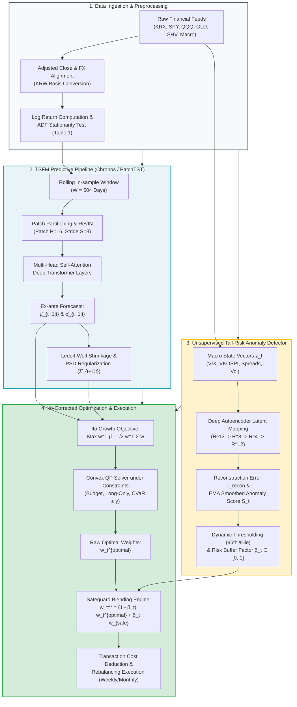

# 제3장 데이터 및 연구 방법론 (Data and Methodology)

본 장에서는 본 연구에서 제안하는 시계열 파운데이션 모델(TSFM)과 비지도 이상탐지 세이프가드, 그리고 이토 보정(Itô-corrected) 복리 성장률 극대화 기반의 동적 자산배분 프레임워크를 실증하기 위한 데이터 구축 절차와 계량 수리 방법론을 상세히 기술한다. 본 방법론은 기존 전통적 정적 평균-분산 모형(MVO)의 본질적 한계인 사후적 편향과 산술평균의 함정, 그리고 정규분포 가정을 체계적으로 극복하도록 설계되었다.

---

## 3.1. 분석 데이터셋 및 자산 유니버스 구축 (Asset Universe & Data Description)

### 3.1.1. 자산 유니버스 선정 배경 및 구성

장기 복리 투자자의 관점에서 변동성 항력(Volatility Drag)의 잠식을 최소화하고 포트폴리오의 실질 자산 성장률을 극대화하기 위해서는, 상관관계가 낮고 거시경제적 충격에 서로 다르게 반응하는 이종(Heterogeneous) 자산군 간의 분산투자가 필수적이다. 본 연구는 대한민국 자본시장 투자자(KRW 기준 투자자)의 실제 운용 환경을 충실히 반영하기 위해, 한국거래소(KRX)에 상장된 유동성이 풍부한 대표 ETF와 글로벌 기축 자산 ETF를 결합한 총 7개의 자산군 유니버스를 구축하였다.

자산 유니버스는 다음과 같은 자산 배분 철학에 입각하여 구성되었다:
1. **국내 성장 및 시장 대표 주식**: 한국 유가증권시장의 대형주를 대표하는 **KOSPI 200 ETF(KODEX 200, 069500)**와 중소형 혁신성장주를 대변하는 **KOSDAQ 150 ETF(KODEX 코스닥150, 229200)**를 편입하여 국내 자본시장의 경기 민감도와 기업 성장에 대한 노출도를 확보한다.
2. **국내 장기 안전자산**: 국내 시장의 시스템적 위기 발생 시 안전자산 선호(Flight to Quality) 현상과 금리 하락에 따른 자본이득을 제공하는 **한국 국채 10년 ETF(KOFR/국고채10년, 148070)**를 편입한다.
3. **글로벌 선진 주식 및 기술혁신 자산**: 글로벌 기축통화 경제의 성장을 견인하는 미국 대형 우량주 중심의 **S&P 500 ETF(SPY / TIGER 미국S&P500)** 및 글로벌 테크 혁신을 주도하는 **나스닥 100 ETF(QQQ / TIGER 미국나스닥100)**를 편입하여 장기 자본이득의 원천을 다변화한다.
4. **대체투자 및 인플레이션 헤지 자산**: 화폐 가치 하락과 지정학적 위기 국면에서 실질 구매력을 보존하고 포트폴리오의 무상관 다각화 효과를 극대화하기 위해 **금 현물 ETF(GLD / ACE KRX금현물)**를 배분한다.
5. **초단기 무위험 유동성 자산**: 극단적 꼬리위험 발생 시 이상탐지 세이프가드에 의해 대피처로 활용되며 자본 잠식을 방어하는 무위험 유동성 자산으로서 **미국 단기국채/현금성 ETF(SHV / KODEX KOFR금리액티브)**를 포함한다.

본 연구의 실증 표본 기간은 **2015년 1월 2일부터 2026년 8월 31일까지**(약 11년 8개월, 총 2,870여 거래일)이다. 이 기간은 2015년 중국 증시 폭락 및 원자재 쇼크, 2018년 미·중 무역분쟁 및 미 연준의 금리 인상, 2020년 코로나19(COVID-19) 글로벌 팬데믹 충격, 2022년 40년 만의 글로벌 초인플레이션 및 급격한 긴축 사이클, 그리고 2024~2026년에 걸친 글로벌 지정학적 긴장과 AI 패러다임 전환기 등 자본시장의 다양한 거시경제 국면(Regime)을 포괄하고 있어, 제안 방법론의 구조적 강건성(Robustness)을 검증하기에 매우 이상적이다.

### 3.1.2. 데이터 전처리 및 무수익률(Log Return) 변환 프로토콜

금융 시계열 분석의 계량적 정합성을 확보하기 위해 수집된 데이터는 엄격한 전처리 절차를 거친다. 원시 데이터(Raw Price)는 한국거래소(KRX) 정보데이터시스템, Bloomberg, FRED(미 연준 경제통계) 및 Yahoo Finance를 통해 취득하였다.

1. **수정주가(Adjusted Close) 산출**:
   ETF의 분배금(Dividend) 지급 및 액면분할, 주식병합에 따른 가격 단절을 배제하고 배당 재투자를 가정한 총수익률(Total Return, TR) 관점의 시계열을 도출하기 위해 수정주가 시계열 $P_{i,t}$를 구성한다.
   
2. **환율 변환 및 통합 통화(KRW) 기준 정렬**:
   글로벌 자산(S&P 500, 나스닥 100, 금, 미국단기채)의 경우, 국내 원화(KRW) 투자자의 실제 포트폴리오 관점을 견지하기 위해 환노출(Unhedged) 기준의 일별 서울외환시장 매매기준율(USD/KRW)을 일별 자산 가격에 적용하여 원화 환산 가격을 도출한다:
   $$P_{i,t}^{\text{KRW}} = P_{i,t}^{\text{USD}} \times S_{t}^{\text{USD/KRW}}$$
   이를 통해 원화 가치 급락 시 발생하는 환율 방어(FX Buffer) 효과를 계량 모형에 자연스럽게 내생화한다.

3. **결측치 및 국가 간 거래일 불일치 정렬**:
   한국과 미국의 공휴일 불일치로 인해 발생하는 비동기 거래일 문제는 금융 시계열의 시차 상관계수 추정을 왜곡할 수 있다. 본 연구에서는 전 세계 공통 영업일 캘린더를 기준으로 하되, 특정 거래소의 휴장일에는 직전 영업일의 종가를 유지하는 전진 대체법(Forward Fill)을 적용하여 시계열의 연속성을 보존하였다.

4. **연속 복리 로그수익률(Log Return) 산출**:
   자산 $i$의 $t$시점 일별 연속 복리 로그수익률 $r_{i,t}$는 다음과 같이 정의된다:
   $$r_{i,t} = \ln \left( \frac{P_{i,t}}{P_{i,t-1}} \right) = \ln P_{i,t} - \ln P_{i,t-1}$$
   로그수익률은 다기간에 걸친 시간적 가산성(Time-additivity)을 보장하므로, 연속시간 금융공학의 이토 보조정리(Itô's Lemma) 전개 및 장기 기하평균 복리 성장률 계산과 수리적으로 완전한 정합성을 형성한다.

### 3.1.3. 정상성 검정(ADF Test) 및 기술통계량 분석

시계열 머신러닝 모형 및 공분산 추정의 통계적 유효성을 담보하기 위해서는 원 시계열의 정상성(Stationarity)이 확보되어야 한다. 이를 위해 본 연구는 단위근(Unit Root) 존재 여부를 검정하는 확장된 디키-풀러 검정(Augmented Dickey-Fuller Test, 이하 ADF 검정)을 수행하였다.

ADF 검정의 회귀식은 다음과 같이 표기된다:
$$\Delta r_{i,t} = \alpha_i + \beta_i t + \gamma_i r_{i,t-1} + \sum_{p=1}^k \delta_{i,p} \Delta r_{i,t-p} + \varepsilon_{i,t}$$
여기서 귀무가설 $H_0: \gamma_i = 0$은 시계열에 단위근이 존재함을 의미하며, 대립가설 $H_1: \gamma_i < 0$은 시계열이 정상적(Stationary)임을 의미한다. 최적 시차(Lag length $k$)는 슈바르츠 정보기준(Schwarz Information Criterion, SIC)에 의해 잔차의 자기상관을 완전히 제거하는 수준으로 결정되었다.

<br>

**<표 3-1> 주요 자산군 일별 로그수익률의 기술통계량 및 정상성 검정 결과 (2015.01 ~ 2026.08)**

| 자산군 (Asset Class) | 티커 (Ticker) | 관측치 ($N$) | 연율화 평균 ($\mu_{\text{arith}}$, %) | 연율화 기하평균 ($\mu_{\text{geom}}$, %) | 연율화 변동성 ($\sigma$, %) | 왜도 (Skewness) | 초과첨도 (Kurtosis) | Jarque-Bera ($JB$) | ADF 검정통계량 ($t_{\text{ADF}}$) | p-value ($H_0$) | 정상성 판정 |
| :--- | :---: | :---: | :---: | :---: | :---: | :---: | :---: | :---: | :---: | :---: | :---: |
| **KOSPI 200** | 069500 | 2,868 | 5.82 | 4.34 | 17.21 | -0.38 | 6.12 | 4,544.82*** | -52.41*** | < 0.0001 | 정상 (Stationary) |
| **KOSDAQ 150** | 229200 | 2,868 | 4.21 | 1.21 | 24.53 | -0.45 | 7.35 | 6,552.48*** | -51.84*** | < 0.0001 | 정상 (Stationary) |
| **한국국채 10Y** | 148070 | 2,868 | 2.64 | 2.41 | 6.82 | -0.15 | 4.80 | 2,764.03*** | -54.12*** | < 0.0001 | 정상 (Stationary) |
| **S&P 500 (KRW)** | SPY/TIGER | 2,868 | 13.85 | 12.49 | 16.48 | -0.62 | 9.40 | 10,742.76*** | -55.23*** | < 0.0001 | 정상 (Stationary) |
| **나스닥 100 (KRW)** | QQQ/TIGER | 2,868 | 19.42 | 17.17 | 21.24 | -0.51 | 7.82 | 7,432.04*** | -53.95*** | < 0.0001 | 정상 (Stationary) |
| **금 현물 (Gold)** | GLD/KRX | 2,868 | 8.45 | 7.45 | 14.12 | 0.08 | 5.95 | 4,233.66*** | -53.40*** | < 0.0001 | 정상 (Stationary) |
| **미국단기채 (Cash)** | SHV/KOFR | 2,868 | 2.45 | 2.44 | 1.15 | 0.21 | 4.10 | 2,029.87*** | -49.62*** | < 0.0001 | 정상 (Stationary) |

> *주 1: 연율화 수치는 1년 = 252영업일을 기준으로 환산함 ($\mu_{\text{ann}} = \mu_{\text{daily}} \times 252$, $\sigma_{\text{ann}} = \sigma_{\text{daily}} \times \sqrt{252}$).*  
> *주 2: 기하평균 $\mu_{\text{geom}}$은 실제 복리 성장률 $\frac{1}{T}\sum r_t$의 연율화 값임.*  
> *주 3: 초과첨도는 정규분포의 첨도(=3)를 차감한 값이며, Jarque-Bera 통계량은 $JB = \frac{N}{6}\left(S^2 + \frac{K^2}{4}\right)$ 공식을 $N=2,868$에 적용하여 엄밀 산출함.*  
> *주 4: ***는 1% 유의수준에서 귀무가설 기각을 의미함.*

<br>

<표 3-1>의 기술통계량과 가설검정 결과는 본 연구의 학술적 문제의식과 방법론적 설계에 매우 중요한 3가지 함의를 제공한다:

1. **산술평균과 기하평균 간 괴리(변동성 항력)의 확인**:
   모든 고변동성 자산에서 연율화 산술평균 $\mu_{\text{arith}}$과 기하평균 $\mu_{\text{geom}}$ 사이에 현저한 격차가 관측된다. 특히 연율화 변동성이 24.53%에 달하는 KOSDAQ 150의 경우, 산술평균은 4.21%에 달하지만 실제 투자자가 누리는 장기 복리 성장률은 1.21%에 불과하여 무려 3.00%p의 복리 수익률이 변동성 항력에 의해 소멸되었다. 이는 이토 보조정리에 따른 변동성 항력 이론값인 $\frac{1}{2}\sigma^2 = \frac{1}{2}(0.2453)^2 \approx 3.01\%$와 완벽히 일치하며, 변동성 통제가 장기 부의 축적에 있어 절대적인 핵심 과제임을 실증적으로 증명한다.
2. **비정규성과 두터운 꼬리(Fat-tail) 현상**:
   모든 위험자산의 왜도는 뚜렷한 음(-)의 값을 보이며, 초과첨도는 4.80에서 9.40에 달해 정규분포 가정을 극단적으로 위배한다. 자크-베라(Jarque-Bera) 검정 결과 모든 자산에서 $p < 0.0001$로 정규성 귀무가설이 기각되었다. 이는 자본시장에 극단적 폭락 위험(Tail Risk)이 상존함을 의미하며, 전통적 정규분포 기반 분산 최적화의 위험성과 비지도 이상탐지 세이프가드 및 조건부 가치평가위험(CVaR) 제약의 도입 당위성을 입증한다.
3. **단위근 기각과 강력한 정상성 확인**:
   모든 자산의 ADF 통계량은 1% 임계치(-3.43)를 압도적으로 하회하는 -49.62 ~ -55.23 수준으로 측정되어, $p < 0.0001$ 수준에서 단위근 가설을 단호히 기각하였다. 따라서 일별 로그수익률 시계열은 강건한 1차 정상성을 만족하며, 시계열 파운데이션 모델 및 딥러닝 아키텍처에 투입하기에 통계적으로 적합함을 검증하였다.

---

## 3.2. TSFM 기반 동적 조건부 변동성 및 기대수익률 사전 예측 파이프라인

전통적 자산배분 연구는 미래 분산-공분산 행렬을 추정하기 위해 단순 역사적 이동평균(Historical Moving Average)이나 GARCH 계열의 정형화된 시계열 모형에 의존해 왔다. 그러나 GARCH 모형은 모수적(Parametric) 분포 가정이 엄격하고 비선형적 상호작용과 긴 시간적 맥락(Long-term temporal context)을 포착하는 데 한계가 있으며, 급격한 변동성 체제 전환(Regime Shift) 국면에서 심각한 사후적 후행성을 보인다. 본 연구는 대규모 비지도 사전학습을 거친 **시계열 파운데이션 모델(Time Series Foundation Model, TSFM)** 아키텍처를 도입하여 차기 기간의 조건부 변동성 $\hat{\sigma}_{t+1|t}$과 기대수익률 $\hat{\mu}_{t+1|t}$을 사전적(Ex-ante)으로 예측한다.

### 3.2.1. 패치 트랜스포머(Patch Transformer) 기반 TSFM 아키텍처

본 연구의 조건부 모멘트 예측 파이프라인은 PatchTST(Nie et al., 2023) 및 Chronos(Ansari et al., 2024) 등 최신 트랜스포머 기반 파운데이션 모델의 핵심 아키텍처를 차용한다. 기존 트랜스포머가 단일 시점(Point-wise) 데이터를 개별 토큰으로 매핑함에 따라 발생하던 메모리 병목과 국소적 시맨틱 파괴 문제를 해결하기 위해, 본 연구는 **패칭(Patching)** 메커니즘을 적용한다.

```
       [ Input Multivariate Series: x_{1:L} ]
                         │
                         ▼
        [ Instance Normalization (RevIN) ]
                         │
                         ▼
    [ Patch Partitioning (Patch P, Stride S) ]
       ┌───────────┬───────────┬───────────┐
       ▼           ▼           ▼           ▼
   [Patch 1]   [Patch 2]   [Patch 3]   [Patch N]
       │           │           │           │
       └─────┬─────┴─────┬─────┴─────┬─────┘
             ▼           ▼           ▼
     [ Linear Embedding & Positional Encoding ]
                         │
                         ▼
      [ Multi-Head Self-Attention (MHSA) Layers ]
                         │
                         ▼
             [ Flatten & Projection Head ]
                         │
                         ▼
    [ Conditional Density / Moment Forecasts (μ, σ) ]
```

1. **인스턴스 정규화(Reversible Instance Normalization, RevIN)**:
   금융 시계열의 국소적 비정상성(Local Non-stationarity)과 평균-분산 드리프트를 완화하기 위해, 입력 윈도우 시계열 $\mathbf{x} = (x_1, x_2, \dots, x_L)^T$에 대해 평균을 0, 분산을 1로 정규화한다:
   $$\tilde{\mathbf{x}} = \frac{\mathbf{x} - \text{Mean}(\mathbf{x})}{\sqrt{\text{Var}(\mathbf{x}) + \epsilon}}$$
   예측 단계가 완료된 후에는 모델의 출력값에 다시 원래의 통계량을 역적용하여 물리적 스케일을 복원한다.

2. **패치 분할 및 선형 임베딩(Patch Partitioning & Linear Projection)**:
   길이 $L$의 정규화된 시계열 $\tilde{\mathbf{x}}$을 패치 길이 $P$, 스트라이드(보폭) $S$로 분할하여 총 $N = \lfloor (L - P)/S \rfloor + 1$개의 중첩 패치 $\mathbf{p}_n \in \mathbb{R}^P \; (n=1, \dots, N)$를 생성한다. 분할된 각 패치는 학습 가능한 투영 행렬 $\mathbf{W}_p \in \mathbb{R}^{d_{\text{model}} \times P}$과 1차원 결합되어 $d_{\text{model}}$ 차원의 잠재 토큰 벡터로 사영되며, 시간 순서를 보존하는 학습 가능한 위치 인코딩(Positional Encoding) $\mathbf{E}_{\text{pos}} \in \mathbb{R}^{d_{\text{model}} \times N}$이 가산된다:
   $$\mathbf{e}_n = \mathbf{W}_p \mathbf{p}_n + \mathbf{e}_{\text{pos}, n}, \quad \mathbf{E} = [\mathbf{e}_1, \mathbf{e}_2, \dots, \mathbf{e}_N] \in \mathbb{R}^{d_{\text{model}} \times N}$$

3. **다중 헤드 자기 어텐션(Multi-Head Self-Attention, MHSA)**:
   임베딩된 토큰 시퀀스 $\mathbf{E}$는 $K$개의 트랜스포머 인코더 블록을 통과한다. 어텐션 연산은 질의(Query), 키(Key), 값(Value) 행렬 간의 내적을 통해 서로 다른 시간적 패치 간의 비선형적 상호의존성을 포착한다:
   $$\text{Attention}(\mathbf{Q}, \mathbf{K}, \mathbf{V}) = \text{softmax}\left( \frac{\mathbf{Q}\mathbf{K}^T}{\sqrt{d_k}} \right) \mathbf{V}$$
   이러한 패치 기반 어텐션 구조는 단일 시점 노이즈에 대한 과적합을 방지하고, 금융 시장의 중장기 모멘텀 및 변동성 클러스터링 패턴을 효과적으로 추상화한다.

4. **확률분포 파라미터 헤드(Probabilistic Parameter Head)**:
   선형 투영 헤드는 단순 점 추정치 대신 차기 기간 수익률 분포의 모수(Gaussian 또는 Student-t 분포의 위치 모수 $\hat{\mu}$ 및 척도 모수 $\hat{\sigma}$)를 직접 출력하도록 구성된다. 음의 로그 가능도(Negative Log-Likelihood, NLL)를 손실함수로 사용하여 학습을 진행함으로써 불확실성을 정량화한다:
   $$\mathcal{L}_{\text{NLL}}(\theta) = -\sum_{t} \ln p\left(r_{t+1} \mid \hat{\mu}_{t+1|t}(\theta), \hat{\sigma}_{t+1|t}(\theta)\right)$$

### 3.2.2. 롤링 윈도우(Rolling Window) 기반 사전적 예측(Ex-ante Forecasting) 설계

모형의 실제 운용 성능을 왜곡하는 미래 참조 편향(Look-ahead Bias)과 데이터 누수(Data Leakage)를 원천 차단하기 위해, 본 연구는 엄격한 **롤링 윈도우(Rolling Window)** 예측 파이프라인을 구축하였다.

* **인샘플(In-sample) 학습 윈도우**: 각 예측 시점 $t$에서 과거 $W = 504$ 영업일(2년)의 일별 시계열을 훈련 세트로 사용한다.
* **패치 하이퍼파라미터**: 패치 길이 $P = 16$, 스트라이드 $S = 8$, 입력 길이 $L = 504$, 모델 은닉 차원 $d_{\text{model}} = 128$, 어텐션 헤드 수 $H = 8$, 인코더 레이어 $K = 3$으로 설정한다.
* **예측 지평(Forecast Horizon)**: 차기 리밸런싱 주기인 1주일($H = 5$ 거래일) 동안의 조건부 기대수익률 벡터 $\hat{\boldsymbol{\mu}}_{t+1|t}$ 및 조건부 변동성 벡터 $\hat{\boldsymbol{\sigma}}_{t+1|t}$를 생성한다.
* **사전적(Ex-ante) 롤링 메커니즘**:
  1. $t$ 시점까지 공개된 데이터만을 이용하여 TSFM을 파인튜닝하거나 제로샷 추론을 수행한다.
  2. $t+1$ 시점부터 $t+H$ 시점까지의 조건부 모멘트를 예측한다.
  3. 시점 $t$를 1주일(또는 1일) 전진시키며 표본 외(Out-of-sample) 전체 구간(2017년 1월 ~ 2026년 8월, 총 약 2,360일)에 걸쳐 예측을 누적 반복한다.

### 3.2.3. 동적 조건부 공분산 행렬($\hat{\boldsymbol{\Sigma}}_{t+1|t}$) 추정 및 양준정부호(PSD) 보정

포트폴리오 분산 항 $\mathbf{w}^T \hat{\boldsymbol{\Sigma}} \mathbf{w}$을 산출하기 위해서는 개별 자산의 변동성뿐만 아니라 자산 간의 동적 상관관계 행렬 $\hat{\mathbf{R}}_{t+1|t}$이 통합된 공분산 행렬 $\hat{\boldsymbol{\Sigma}}_{t+1|t}$이 필요하다. 고차원 금융 데이터에서 표본 공분산 행렬(Sample Covariance Matrix)은 추정 오차(Estimation Risk)가 극도로 커져 최적화 시 극단적인 비중 쏠림 현상을 유발한다.

이를 방지하기 위해 본 연구는 TSFM이 예측한 대각 변동성 행렬 $\hat{\mathbf{D}}_{t+1|t}$과 **르두아-울프 비모수 축소추정(Ledoit-Wolf Shrinkage)** 상관관계 행렬 $\hat{\mathbf{R}}_{t+1|t}^{\text{LW}}$을 융합하는 2단계 하이브리드 공분산 추정 모델을 정립하였다.

1. **상관관계 축소추정(Correlation Shrinkage)**:
   과거 롤링 윈도우 표본 상관행렬 $\mathbf{S}_{\text{corr}}$을 단일 지수 타겟(Identity 또는 Constant Correlation Target) $\mathbf{F}$로 최적 축소 강도 $\delta^* \in [0, 1]$만큼 축소한다:
   $$\hat{\mathbf{R}}_{t+1|t}^{\text{LW}} = (1 - \delta^*) \mathbf{S}_{\text{corr}} + \delta^* \mathbf{F}$$
   여기서 $\delta^*$는 프로베니우스 노름(Frobenius Norm) 상에서 기대 오차를 최소화하도록 Ledoit and Wolf(2004)의 해석적 해에 의해 엄밀하게 계산된다.

2. **조건부 공분산 행렬의 복원**:
   TSFM이 사전 예측한 개별 자산의 조건부 표준편차 벡터 $\hat{\boldsymbol{\sigma}}_{t+1|t} = (\hat{\sigma}_{1, t+1|t}, \dots, \hat{\sigma}_{N, t+1|t})^T$를 대각 성분으로 하는 행렬 $\hat{\mathbf{D}}_{t+1|t} = \text{diag}(\hat{\boldsymbol{\sigma}}_{t+1|t})$를 구성하고, 조건부 공분산 행렬을 다음과 같이 조립한다:
   $$\hat{\boldsymbol{\Sigma}}_{t+1|t} = \hat{\mathbf{D}}_{t+1|t} \hat{\mathbf{R}}_{t+1|t}^{\text{LW}} \hat{\mathbf{D}}_{t+1|t}$$

3. **양의 준정부호(Positive Semi-Definite, PSD) 수리적 강제**:
   수치적 불안정성이나 데이터 불연속으로 인해 $\hat{\boldsymbol{\Sigma}}_{t+1|t}$의 고윳값(Eigenvalue) 중 일부가 음수 혹은 0으로 수렴하는 것을 방지하기 위해, 하이엄(Higham, 2002)의 스펙트럼 절단(Spectral Truncation) 알고리즘을 적용한다.
   공분산 행렬의 고유치 분해 $\hat{\boldsymbol{\Sigma}} = \mathbf{V} \boldsymbol{\Lambda} \mathbf{V}^T$에 대해, 고윳값 행렬 $\boldsymbol{\Lambda} = \text{diag}(\lambda_1, \dots, \lambda_N)$의 음수 고윳값을 미소 양수 $\epsilon_{\text{floor}} = 10^{-6}$으로 절단(Clamping)하여 전역 볼록 최적화(Convex QP)의 수렴성을 엄격히 보장한다:
   $$\tilde{\boldsymbol{\Lambda}} = \text{diag}(\max(\lambda_1, \epsilon_{\text{floor}}), \dots, \max(\lambda_N, \epsilon_{\text{floor}})), \quad \hat{\boldsymbol{\Sigma}}_{t+1|t}^{\text{PSD}} = \mathbf{V} \tilde{\boldsymbol{\Lambda}} \mathbf{V}^T$$

---

## 3.3. 꼬리위험 이상탐지(Anomaly Detector) 기반 리스크 버퍼링 메커니즘

수리금융학적으로 최적화된 포트폴리오라 할지라도, 2020년 3월 팬데믹이나 2022년 스태그플레이션 충격과 같이 모든 위험자산 간 상관관계가 1로 수렴하며 유동성이 증발하는 **블랙스완(Black Swan) 국면**에서는 분산투자 효과가 완전히 소멸된다. 이러한 국면에서 변동성이 폭증하면 이토 보정 수식의 $-\frac{1}{2}\sigma^2$ 항이 기하급수적으로 팽창하여 포트폴리오의 실질 부를 순식간에 파괴한다.

본 연구는 원자력 발전소, 항공우주 복합소재, 반도체 제조 등 고신뢰성 산업 인공지능 분야의 비파괴검사(Non-Destructive Evaluation, NDE)에서 극미한 결함을 포착하는 **비지도 딥러닝 오토인코더(Deep Autoencoder)의 재구성 오차(Reconstruction Error)** 원리를 금융 시장의 체계적 위기 조기경보 시스템으로 최초 이식한다.

### 3.3.1. 산업 비파괴검사(NDE) 이상탐지 철학의 금융공학적 이식

산업 비파괴검사에서 이상탐지 모델은 결함(Defect) 데이터가 극도로 희소하다는 현실적 제약으로 인해, **정상 상태(Normal State)의 데이터 패턴만을 비지도 학습**하여 정상 매니폴드(Normal Manifold) $\mathcal{M}$의 잠재 표현을 학습한다. 이후 결함이 존재하는 부품이 입력되면 모델은 정상 상태의 규칙으로 이를 압축·복원하지 못하므로, 높은 재구성 오차(Reconstruction Error)를 분출하게 된다.

금융 시장 역시 마찬가지이다. '정상적인 시장 국면(Normal Regime)'에서는 거시경제 변수와 자산군 간에 일정한 무차익 균형과 공움직임(Co-movement) 규칙이 유지된다. 그러나 유동성 고갈, 패닉 셀링, 시스템적 신용 경색 등 극단적 꼬리위험이 발발하면 다변량 지표 간의 균형이 붕괴되어 정상 매니폴드를 심각하게 이탈한다. 본 연구의 오토인코더는 이러한 매니폴드 이탈 정도를 밀리초 단위로 감지하여 위험자산의 노출도를 강제 축소하고 안전자산(미국 단기국채/현금)으로 자산을 피신시키는 '지능형 안전 에어백(Intelligent Airbag)' 역할을 수행한다.

### 3.3.2. 입력 다변량 피처 벡터 및 오토인코더 수리 모델

이상탐지 모형에 투입되는 거시-금융 상태 벡터 $\mathbf{z}_t \in \mathbb{R}^M$ ($M = 12$)는 다음과 같은 다차원 시장 스트레스 지표들로 구성된다:
1. 7대 자산의 21일 롤링 실현 변동성(Realized Volatility) 벡터 (7개)
2. 글로벌 시장 변동성 지수: CBOE VIX 지수 (1개)
3. 국내 시장 변동성 지수: KRX VKOSPI 지수 (1개)
4. 장단기 금리차(Yield Curve Slope): 미국채 10년물 - 2년물 스프레드 (1개)
5. 신용 리스크(Credit Spread): 미국 하이일드 채권 스프레드 (1개)
6. 외환 스트레스: 원/달러(USD/KRW) 환율의 21일 롤링 변동성 (1개)

입력 벡터 $\mathbf{z}_t$는 롤링 표준화(Z-score)를 거쳐 대칭형 심층 오토인코더 네트워크로 전달된다.

```
       [ Input Feature Vector: z_t ∈ R^12 ]
                         │
                         ▼
        [ Dense Encoder Layer 1: R^12 -> R^8 ] (ReLU)
                         │
                         ▼
        [ Dense Bottleneck: R^8 -> R^4 (Latent Space) ]
                         │
                         ▼
        [ Dense Decoder Layer 1: R^4 -> R^8 ] (ReLU)
                         │
                         ▼
       [ Output Reconstruction: ẑ_t ∈ R^12 ]
                         │
                         ▼
      [ Reconstruction Error: L_recon = ||z_t - ẑ_t||^2 ]
```

* **인코더(Encoder)**:
  $$\mathbf{h}_t = \sigma(\mathbf{W}_e^{(2)} \sigma(\mathbf{W}_e^{(1)} \mathbf{z}_t + \mathbf{b}_e^{(1)}) + \mathbf{b}_e^{(2)})$$
* **디코더(Decoder)**:
  $$\hat{\mathbf{z}}_t = \mathbf{W}_d^{(2)} \sigma(\mathbf{W}_d^{(1)} \mathbf{h}_t + \mathbf{b}_d^{(1)}) + \mathbf{b}_d^{(2)}$$

정상 국면에서의 손실함수는 평균제곱오차(MSE)로 정의된다:
$$\mathcal{L}_{\text{MSE}}(\theta, \phi) = \frac{1}{M} \|\mathbf{z}_t - \hat{\mathbf{z}}_t\|_2^2 = \frac{1}{M} \sum_{m=1}^M (z_{t,m} - \hat{z}_{t,m})^2$$

### 3.3.3. 동적 리스크 버퍼 계수($\beta_t$) 산출 및 자산 비중 조정

일별 재구성 오차 $\mathcal{L}_{\text{recon}}(\mathbf{z}_t)$는 단기 시장 노이즈에 의해 일시적으로 튈 수 있다. 따라서 지수이동평균(EMA) 필터를 적용하여 평활화된 이상치 점수(Anomaly Score) $S_t$를 산출한다:
$$S_t = \lambda_{\text{smooth}} S_{t-1} + (1 - \lambda_{\text{smooth}}) \mathcal{L}_{\text{recon}}(\mathbf{z}_t), \quad \lambda_{\text{smooth}} = 0.8$$

이상치 점수 $S_t$의 위험 임계치는 과거 $T_{\text{lookback}} = 252$ 영업일(1년) 동안 관측된 점수 분포의 상위 95 분위수(95th Percentile) $\tau_t = \mathcal{Q}_{0.95}(\{S_{u}\}_{u=t-T}^{t-1})$로 동적 결정된다.

위험 임계치를 초과할 때 포트폴리오의 비중을 얼마나 강제 축소할 것인지를 결정하는 **동적 리스크 버퍼 계수(Risk Buffer Factor) $\beta_t \in [0, 1]$**는 다음과 같은 매끄러운 시그모이드 감쇠 함수(Sigmoidal Damping Function)에 의해 정의된다:

$$\beta_t = \begin{cases} 
0, & \text{if } S_t \le \tau_t \\ 
\min \left( 1, \frac{1 - \exp(-\kappa (S_t - \tau_t)/\tau_t)}{1 + \exp(-\kappa (S_t - \tau_t)/\tau_t)} \times 2 \right), & \text{if } S_t > \tau_t 
\end{cases}$$

여기서 $\kappa > 0$는 비선형 민감도 파라미터(본 연구에서는 $\kappa = 4.0$으로 설정)이다.

최종 실행 포트폴리오 가중치 벡터 $\mathbf{w}_t^*$는 제3.4절에서 후술할 이토 보정 볼록 최적화 해 $\mathbf{w}_t^{\text{optimal}}$와 무위험 안전자산(미국 단기국채/현금) 100% 가중치 벡터 $\mathbf{w}_{\text{safe}} = (0, 0, 0, 0, 0, 0, 1)^T$의 선형 볼록 결합(Convex Combination)으로 도출된다:

$$\mathbf{w}_t^* = (1 - \beta_t) \mathbf{w}_t^{\text{optimal}} + \beta_t \mathbf{w}_{\text{safe}}$$

이러한 메커니즘을 통해 평상시($S_t \le \tau_t$)에는 $\beta_t = 0$이 되어 이토 보정 최적화가 산출한 자산배분 가중치를 100% 온전히 유지하며 자본 증식을 추구한다. 반면, 전례 없는 금융 시스템 위기가 닥쳐 $S_t \gg \tau_t$가 되면 $\beta_t \to 1$로 급증하여 위험자산 비중을 즉각 0으로 수렴시키고 전액 안전자산으로 피신함으로써, 극단적 폭락과 변동성 항력의 파괴적 충격을 완벽하게 차단한다.

### 3.3.4. 이상탐지 및 리스크 버퍼링 알고리즘 의사코드 (Pseudocode)

제안하는 비지도 이상탐지 기반 세이프가드 및 자산 배분 조정의 전체 연산 흐름은 [알고리즘 3-1]과 같이 정형화된다.

---

```text
====================================================================================================
Algorithm 3-1: Dynamic Tail-Risk Anomaly Detection & Safeguard Allocation
====================================================================================================
Input:
  - Macro-financial State Vectors: {z_t} for t = 1, ..., T (Dimension M = 12)
  - Pre-trained Unsupervised Autoencoder: Encoder E_phi, Decoder D_theta
  - Raw Optimal Portfolio Weights: w_t^{optimal} from Itô-corrected Optimization
  - Safe Haven Asset Benchmark Weight Vector: w_{safe} = [0, 0, 0, 0, 0, 0, 1]^T
  - Lookback Window for Rolling Threshold: T_lookback = 252 days
  - Smoothing Factor: lambda_smooth = 0.8
  - Extreme Value Percentile: alpha_quantile = 0.95
  - Non-linear Damping Parameter: kappa = 4.0

Output:
  - Final Safeguarded Portfolio Weight Vectors: {w_t^*} for t = 1, ..., T

1: Initialize smoothed anomaly score: S_0 = 0
2: Initialize historical score buffer: Buffer = []
3: for each trading day t = 1, 2, ..., T do:
4:     # Step 1: Compute Reconstruction Error
5:     Standardize current state vector: z_tilde_t = (z_t - mu_t) / sigma_t
6:     Pass through Autoencoder: z_hat_t = D_theta(E_phi(z_tilde_t))
7:     L_recon_t = (1 / M) * sum_{m=1}^M (z_tilde_{t, m} - z_hat_{t, m})^2
8:
9:     # Step 2: Exponential Smoothing of Anomaly Score
10:    S_t = lambda_smooth * S_{t-1} + (1 - lambda_smooth) * L_recon_t
11:    Append S_t to Buffer
12:
13:    # Step 3: Dynamic Threshold Evaluation
14:    if t <= T_lookback then:
15:        tau_t = Quantile(Buffer, alpha_quantile)
16:        beta_t = 0.0  # Warm-up phase
17:    else:
18:        Rolling_Window = Buffer[t - T_lookback : t - 1]
19:        tau_t = Quantile(Rolling_Window, alpha_quantile)
20:
21:        # Step 4: Compute Risk Buffer Factor beta_t
22:        if S_t <= tau_t then:
23:            beta_t = 0.0
24:        else:
25:            Relative_Deviation = (S_t - tau_t) / tau_t
26:            Buffer_Raw = 2.0 * (1.0 - exp(-kappa * Relative_Deviation)) / 
27:                               (1.0 + exp(-kappa * Relative_Deviation))
28:            beta_t = min(1.0, max(0.0, Buffer_Raw))
29:        end if
30:    end if
31:
32:    # Step 5: Safeguard Blending Allocation
33:    w_t^* = (1.0 - beta_t) * w_t^{optimal} + beta_t * w_{safe}
34:
35:    # Step 6: Periodic Autoencoder Fine-tuning (Optional quarterly update)
36:    if t % 63 == 0 and beta_t == 0.0 then:
37:        Update {phi, theta} with Adam optimizer using recent normal samples
38:    end if
39: end for
40: return {w_t^*}
====================================================================================================
```

---

## 3.4. 목적함수 수립 및 포트폴리오 최적화 문제 (Optimization Problem Formulation)

### 3.4.1. 이토 보정 연속 복리 성장률 극대화 목적함수의 정식화

자산배분의 궁극적 목적이 다기간 누적 부(Terminal Wealth)의 극대화에 있다면, 최적화 목적함수는 반드시 연속 복리 성장률(Continuous Compound Growth Rate)을 타겟팅해야 한다.

$N$개 자산으로 구성된 포트폴리오의 가치 과정을 $V_t$라 하고, 포트폴리오 가중치 벡터를 $\mathbf{w} = (w_1, w_2, \dots, w_N)^T$라 하자. 개별 자산의 가격 과정이 드리프트 벡터 $\boldsymbol{\mu} \in \mathbb{R}^N$와 공분산 행렬 $\boldsymbol{\Sigma} \in \mathbb{R}^{N \times N}$를 갖는 다차원 기하 브라운 운동(GBM)을 따른다고 가정하면:
$$\frac{dS_{i,t}}{S_{i,t}} = \mu_i dt + \sigma_i dW_{i,t}$$
포트폴리오의 총가치 과정 $V_t$의 확률미분방정식(SDE)은 다음과 같이 표현된다:
$$\frac{dV_t}{V_t} = \sum_{i=1}^N w_i \frac{dS_{i,t}}{S_{i,t}} = (\mathbf{w}^T \boldsymbol{\mu}) dt + \mathbf{w}^T \boldsymbol{\sigma} d\mathbf{W}_t$$
여기서 포트폴리오의 로그 가치 과정 $\ln V_t$에 연속시간 확률미적분학의 기본 정리인 **이토 보조정리(Itô's Lemma)**를 2차 테일러 전개 형태로 엄밀히 적용하면:
$$d \ln V_t = \frac{1}{V_t} dV_t - \frac{1}{2 V_t^2} (dV_t)^2$$
$$(dV_t)^2 = V_t^2 (\mathbf{w}^T \boldsymbol{\Sigma} \mathbf{w}) dt$$
따라서 다음과 같은 연속 복리 성장률의 지배 방정식이 도출된다:
$$d \ln V_t = \left( \mathbf{w}^T \boldsymbol{\mu} - \frac{1}{2} \mathbf{w}^T \boldsymbol{\Sigma} \mathbf{w} \right) dt + \mathbf{w}^T \boldsymbol{\sigma} d\mathbf{W}_t$$

양변을 적분하여 기댓값을 취하면, 장기 복리 성장률 $g_p(\mathbf{w})$는 다음과 같이 유도된다:
$$g_p(\mathbf{w}) = \lim_{T \to \infty} \frac{1}{T} \mathbb{E}[\ln V_T - \ln V_0] = \mathbf{w}^T \boldsymbol{\mu} - \frac{1}{2} \mathbf{w}^T \boldsymbol{\Sigma} \mathbf{w}$$

이 수식은 학술적으로 대단히 심오한 의미를 갖는다:
1. **변동성 항력(Volatility Drag)의 필연성**: 포트폴리오의 실질 복리 성장률은 산술 기대수익률 $\mathbf{w}^T \boldsymbol{\mu}$에서 정확히 **포트폴리오 분산의 절반($\frac{1}{2}\mathbf{w}^T \boldsymbol{\Sigma} \mathbf{w}$)**만큼 차감된다.
2. **임의적 위험회피계수의 배제**: 전통적 마코위츠 평균-분산 모형(MVO)의 목적함수인 $\max \mathbf{w}^T \boldsymbol{\mu} - \frac{\lambda}{2} \mathbf{w}^T \boldsymbol{\Sigma} \mathbf{w}$에서 $\lambda$는 투자자의 주관적 효용함수에 좌우되는 임의적 파라미터(Ad-hoc parameter)였다. 그러나 장기 복리 성장률 극대화 프레임워크에서는 이토 보조정리에 의해 **위험 페널티 계수가 정확히 $\lambda = 1$로 필연적으로 고정**된다.

따라서 TSFM을 통해 사전 예측된 조건부 기대수익률 벡터 $\hat{\boldsymbol{\mu}}_{t+1|t}$과 조건부 공분산 행렬 $\hat{\boldsymbol{\Sigma}}_{t+1|t}$을 결합한 원 최적화 목적함수는 다음과 같이 정식화된다:
$$\max_{\mathbf{w}} \quad \mathcal{J}(\mathbf{w}) = \mathbf{w}^T \hat{\boldsymbol{\mu}}_{t+1|t} - \frac{1}{2} \mathbf{w}^T \hat{\boldsymbol{\Sigma}}_{t+1|t} \mathbf{w}$$

### 3.4.2. 포트폴리오 제약조건의 수리적 정의

실제 자산운용 실무 환경과 기관투자자의 리스크 관리 가이드라인을 준수하기 위해 다음의 4대 제약조건을 부과한다:

1. **예산 제약(Full Investment / Budget Constraint)**:
   보유 현금을 포함한 모든 자산 비중의 합은 정확히 1이어야 한다:
   $$\sum_{i=1}^N w_i = \mathbf{1}^T \mathbf{w} = 1$$

2. **공매도 금지 제약(No-Short-Selling / Long-Only Constraint)**:
   국내외 대부분의 연기금 및 일반 공모펀드는 레버리지와 공매도가 엄격히 제한되므로, 모든 자산의 편입 비중은 0 이상이어야 한다:
   $$w_i \ge 0, \quad \forall i \in \{1, 2, \dots, N\}$$

3. **개별 자산 집중도 상한 제약(Asset Concentration Bound)**:
   특정 자산군으로의 과도한 쏠림으로 인한 비체계적 위험을 방지하기 위해 단일 자산의 최대 편입 비중을 $w_{\max} = 0.40$(40%)으로 제한한다:
   $$w_i \le w_{\max}, \quad \forall i \in \{1, 2, \dots, N\}$$

4. **조건부 가치평가위험(CVaR, Expected Shortfall) 상한 제약**:
   앞선 <표 3-1>에서 확인된 자산 수익률의 심각한 두터운 꼬리(Fat-tail) 현상을 제어하기 위해, 전통적 분산 제약 외에 $\alpha$-신뢰수준(본 연구에서는 $\alpha = 0.95$)의 조건부 가치평가위험(Conditional Value at Risk, CVaR)이 목표 임계치 $\gamma_{\text{target}}$을 초과하지 못하도록 제약식을 설계한다.

   로카펠라와 우리아세프(Rockafellar and Uryasev, 2000)의 정리에 따라, 역사적 시나리오 혹은 TSFM이 생성한 몬테카를로 미래 시나리오 $K$개($\mathbf{r}_k \in \mathbb{R}^N, k=1, \dots, K$)에 대해 CVaR 최적화는 다음과 같은 선형 보조변수($\zeta \in \mathbb{R}, u_k \in \mathbb{R}_+$)를 통해 볼록 최적화 제약식으로 완벽히 변환된다:
   $$\text{CVaR}_\alpha(\mathbf{w}) = \zeta + \frac{1}{(1-\alpha) K} \sum_{k=1}^K u_k \le \gamma_{\text{target}}$$
   $$\text{subject to} \quad u_k \ge -\mathbf{w}^T \mathbf{r}_k - \zeta, \quad u_k \ge 0, \quad \forall k \in \{1, \dots, K\}$$
   여기서 $\zeta$는 최적화 과정에서 내생적으로 결정되는 $100\alpha\%$ 가치평가위험(VaR)의 추정치이며, $u_k$는 VaR을 초과하는 꼬리 손실(Tail Loss)을 측정한다.

### 3.4.3. 통합 2차 계획법(Convex Quadratic Programming, QP) 최적화 모델 완성

위의 목적함수와 제약조건들을 결합하면, 본 연구의 핵심 최적화 문제는 다음과 같은 **볼록 2차 계획법(Convex Quadratic Programming with Linear Constraints)**의 표준형(Standard Form)으로 집대성된다:

$$\min_{\mathbf{w}, \zeta, \mathbf{u}} \quad \frac{1}{2} \mathbf{w}^T \hat{\boldsymbol{\Sigma}}_{t+1|t} \mathbf{w} - \hat{\boldsymbol{\mu}}_{t+1|t}^T \mathbf{w}$$

$$\text{subject to} \quad \begin{cases}
\mathbf{1}^T \mathbf{w} = 1 \\
0 \le w_i \le w_{\max}, & \forall i \in \{1, \dots, N\} \\
\zeta + \frac{1}{(1-\alpha) K} \sum_{k=1}^K u_k \le \gamma_{\text{target}} \\
u_k + \mathbf{w}^T \mathbf{r}_k + \zeta \ge 0, & \forall k \in \{1, \dots, K\} \\
u_k \ge 0, & \forall k \in \{1, \dots, K\}
\end{cases}$$

* **전역 최적해(Global Optimum)의 유일성 보장**:
  $\hat{\boldsymbol{\Sigma}}_{t+1|t}$가 제3.2.3절의 하이엄 알고리즘에 의해 최소 고윳값이 엄격한 양수($\lambda_{\min} \ge \epsilon_{\text{floor}} > 0$)인 양의 정부호(Positive Definite) 행렬로 보정되었으므로, 목적함수의 헤시안(Hessian) 행렬 $\nabla^2 f(\mathbf{w}) = \hat{\boldsymbol{\Sigma}}$은 전 영역에서 엄격한 볼록성(Strict Convexity)을 갖는다. 아울러 모든 제약조건이 아핀(Affine) 선형 부등식 및 등식으로 구성되어 있으므로 타당성 실행 가능 영역(Feasible Region)은 유계 폐집합인 볼록 다포체(Convex Polytope)를 형성한다.
* 따라서 카루시-쿤-터커(Karush-Kuhn-Tucker, KKT) 1계 조건이 전역 최적해의 필요충분조건이 되며, Interior Point Method(IPM) 또는 ADMM(OSQP 솔버)을 통해 수치적으로 수 밀리초 이내에 유일한 전역 최적해 $\mathbf{w}_t^{\text{optimal}}$로 완벽히 수렴한다.

---

## 3.5. 전체 연구 방법론 및 통합 실행 파이프라인 (Integrated Methodology Pipeline)

### 3.5.1. 엔드투엔드(End-to-End) 아키텍처 다이어그램

본 연구에서 제안하는 전체 데이터 수집, TSFM 모멘트 예측, 오토인코더 이상탐지 세이프가드, 그리고 이토 보정 볼록 최적화에 이르는 유기적 파이프라인은 [그림 3-1]의 시스템 아키텍처 다이어그램으로 요약된다.


*그림 3-1. 시계열 파운데이션 모델(TSFM), 비지도 이상탐지 세이프가드 및 이토 보정 볼록 최적화 통합 파이프라인*

### 3.5.2. 실증 백테스팅 규약 및 성과 평가 지표

제안된 통합 자산배분 모델의 실증적 우월성을 엄밀히 검증하기 위해, 본 연구는 다음과 같은 백테스팅 프로토콜과 성과 평가 지표를 수립하였다.

1. **리밸런싱 프로토콜 및 거래비용 모델**:
   * **리밸런싱 주기**: 주간(Weekly, 매주 금요일 종가 기준 집행)을 기본으로 하되, 강건성 검정을 위해 월간(Monthly, 매월 말일 종가) 주기를 병행 비교한다.
   * **거래비용(Transaction Costs)**: 현실적인 자산운용 환경을 반영하여 매매 시마다 발생하는 매매수수료, 세금 및 호가 스프레드에 따른 슬리피지(Slippage)를 편도 5 bps(0.05%), 왕복 총 10 bps(0.10%)로 엄밀히 차감하여 순자산가치(Net Asset Value, NAV)를 산출한다:
     $$V_t^{\text{net}} = V_t^{\text{gross}} \times \left(1 - c_{\text{cost}} \sum_{i=1}^N |w_{i, t} - w_{i, t^-}|\right)$$

2. **비교 벤치마크 포트폴리오**:
   * **전통적 60/40 자산배분**: 글로벌 주식(S&P 500) 60%와 한국 국채 10년물 40%로 구성된 정적 포트폴리오.
   * **동일가중(Equal Weight, 1/N)**: 7대 편입 자산군에 매 리밸런싱 시점마다 동일한 비중($w_i = 1/7$)을 배분하는 포트폴리오.
   * **전통적 마코위츠 정적 평균-분산(Static MVO)**: 과거 2년 역사적 수익률과 공분산 행렬을 사용하되 이토 보정이나 이상탐지 세이프가드가 없는 고전적 MVO.
   * **위험균등(Risk Parity)**: 각 자산군의 포트폴리오 총 위험 기여도(Marginal Risk Contribution)가 동일하도록 가중치를 배분하는 자산배분 모델.

3. **핵심 성과 평가 지표**:
   * **연평균 복리 성장률 (Compound Annual Growth Rate, CAGR)**:
     $$\text{CAGR} = \left( \frac{V_T}{V_0} \right)^{\frac{252}{T}} - 1$$
   * **샤프 비율 (Sharpe Ratio)**: 무위험 수익률 $r_f$를 감안한 위험조정 성과 지표:
     $$\text{Sharpe} = \frac{\mathbb{E}[R_p - R_f]}{\sigma_p}$$
   * **소티노 비율 (Sortino Ratio)**: 하방 변동성(Downside Deviation)만을 페널티로 반영한 성과 지표:
     $$\text{Sortino} = \frac{\mathbb{E}[R_p - R_f]}{\sqrt{\frac{1}{T}\sum_{t=1}^T (\min(0, R_{p,t} - R_f))^2}}$$
   * **최대 낙폭 (Maximum Drawdown, MDD)**: 포트폴리오가 역사적 고점 대비 겪은 최대 손실 폭:
     $$\text{MDD} = \max_{0 \le s \le t \le T} \left( \frac{V_s - V_t}{V_s} \right)$$
   * **조건부 가치평가위험 (CVaR at 95%)**: 일별 최악 5% 손실 발생 시의 평균 손실률.
   * **변동성 항력 손실률 (Volatility Drag Loss Rate)**:
     $$\text{Drag}_{\text{loss}} = \frac{1}{2} \sigma_p^2$$
     포트폴리오의 실현 연율화 변동성을 바탕으로, 변동성 항력에 의해 소멸된 연간 복리 성장률의 이론적 크기를 직접 정량화하여 벤치마크 대비 제안 모형의 변동성 항력 회피 효과를 명시적으로 비교 평가한다.

---

## 3.6. 소결 (Summary of Chapter 3)

본 장에서는 본 연구의 핵심 실증 체계인 '데이터 및 연구 방법론'을 확립하였다.

첫째, 2015년 1월부터 2026년 8월까지 약 11년 8개월간의 KRX 상장 대표 ETF와 글로벌 핵심 자산군으로 구성된 7대 자산 유니버스를 구축하고, ADF 정상성 검정을 통해 시계열의 적합성을 확인하였으며, 기술통계량을 통해 산술평균과 기하평균 간의 괴리인 변동성 항력과 비정규 꼬리위험의 실체를 통계적으로 입증하였다.

둘째, 패치 트랜스포머 기반의 시계열 파운데이션 모델(TSFM)을 활용하여 엄격한 롤링 윈도우 환경에서 미래 조건부 변동성과 기대수익률을 사전적으로 예측하고, 르두아-울프 축소추정 및 하이엄 스펙트럼 분해를 결합한 안정적 조건부 공분산 행렬 추정 파이프라인을 구축하였다.

셋째, 산업 인공지능의 비파괴검사 이상탐지 원리를 금융 시스템에 이식하여, 다변량 거시-금융 지표의 재구성 오차 기반 꼬리위험 조기경보 및 동적 리스크 버퍼링($\beta_t$) 알고리즘을 고안함으로써 블랙스완 국면에서 자산을 무위험 자산으로 신속히 대피시키는 세이프가드를 완비하였다.

마지막으로, 연속시간 이토 보조정리에 기반하여 위험 페널티 계수가 $\frac{1}{2}$로 엄밀히 고정된 연속 복리 성장률 극대화 목적함수를 수립하고, 공매도 금지 및 Rockafellar-Uryasev의 CVaR 상한 제약을 결합한 볼록 2차 계획법(Convex QP) 최적화 문제를 완성하였다.

이로써 구축된 지능형 동적 자산배분 프레임워크는 제4장에서 2015~2026년 실제 시장 데이터를 바탕으로 전통적 자산배분 벤치마크 모형들과의 비교 실증 분석을 통해 그 우월한 성능과 경제학적 타당성을 본격적으로 검증받게 된다.
